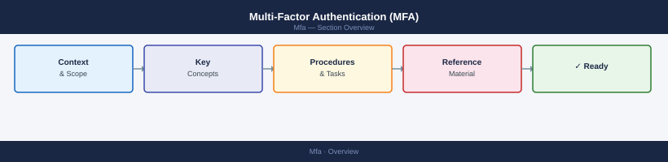

# Multi-Factor Authentication (MFA)


<div class="kb-summary">
Multi-Factor Authentication (MFA) reference covering Overview, MFA Authentication Flow, TOTP vs Push Comparison, Daily Checks, Health Commands and 1 more sections.
</div>



```text
  User                  Identity Provider (IdP)          MFA Service           Application
    │                            │                            │                     │
    │── Username + Password ────►│                            │                     │
    │                            │── Validate credentials ───►│                     │
    │                            │◄── Primary auth OK ────────│                     │
    │                            │                            │                     │
    │                            │── Trigger MFA challenge ──►│                     │
    │◄── MFA challenge sent ─────│   (push / OTP / hardware)  │                     │
    │                            │                            │                     │
    │── OTP / Approve push ─────────────────────────────────►│                     │
    │                            │◄── Factor confirmed ───────│                     │
    │                            │                            │                     │
    │◄── Auth token (SAML/OIDC) ─│                            │                     │
    │                            │                            │                     │
    │── Present token ────────────────────────────────────────────────────────────►│
    │◄── Access granted ──────────────────────────────────────────────────────────│
    │                            │                            │                     │
    │                    [Session established — token TTL enforced]                │
```

```text
  TOTP (Time-based OTP)                Push Notification
  ──────────────────────────────────   ─────────────────────────────────────────
  User generates 6-digit code          IdP sends push to registered device
  Code derived from shared secret      User taps Approve / Deny
  Valid for 30-second window           Out-of-band — does not traverse browser
  Works offline (no network needed)    Requires network on mobile device
  Phishing-resistant if typed once     Vulnerable to MFA fatigue (auto-accept)
  Hardware token: highest assurance    Number-matching mitigates fatigue attacks
```

<div class="kb-grid">
  <a class="kb-card" href="operations/">
    <div class="kb-card-icon">⚙️</div>
    <div class="kb-card-title">Operations</div>
    <div class="kb-card-desc">Authentication flows, MFA method management, health checks, enrollment</div>
  </a>
</div>

## Overview

MFA adds an additional authentication factor beyond passwords to protect accounts and systems from unauthorized access.

## Daily Checks


| Check | Command | Notes |
|---|---|---|
| Review authentication failures |  |  |
| Validate MFA service availability |  |  |
| Confirm token synchronization |  |  |
| Review access logs |  |  |

## Health Commands

```bash
Get-MsolUser
Get-MsolCompanyInformation
```

## Upgrade Workflow

1. Backup configuration
2. Validate identity provider connectivity
3. Apply updates
4. Test user authentication flows
