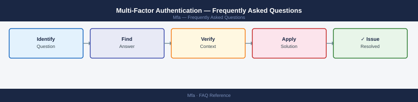

---
tags:
  - mfa
  - faq
  - operations
---
# Multi-Factor Authentication — Frequently Asked Questions

<div class="kb-summary">
Common questions about Multi-Factor Authentication operations, configuration, and troubleshooting. For step-by-step procedures, see the <a href="index.md">Operations</a> section.
</div>



```d2
direction: right

hub: "Operations\nOperations" {shape: hexagon}
general: "General" {shape: rectangle}
configuration: "Configuration" {shape: rectangle}
operations: "Operations" {shape: rectangle}
troubleshooting: "Troubleshooting" {shape: rectangle}
backup_and_recovery: "Backup and Recovery" {shape: rectangle}

hub -> general
hub -> configuration
hub -> operations
hub -> troubleshooting
hub -> backup_and_recovery
```

## General

**Q: How do I check MFA coverage across all users and applications?**
A: Run an MFA coverage report from your IdP (Azure AD: Sign-in logs → filter by MFA status; Okta: Reports → MFA Usage). Aim for 100% coverage on privileged accounts and 95%+ on all users.

**Q: How do I check the current Multi-Factor Authentication version?**
A: `Azure AD: Get-MgUser -All | Select DisplayName,StrongAuthenticationRequirements`

## Configuration

**Q: What is the recommended default MFA method?**
A: TOTP (authenticator app) or hardware FIDO2/WebAuthn keys for privileged accounts. Push notification (Duo, Microsoft Authenticator) for standard users. Avoid SMS OTP — it is phishable (SIM-swap attacks) and not acceptable for high-assurance requirements.

**Q: How do I enable phishing-resistant MFA (FIDO2) in Azure AD?**
A: Register FIDO2 keys: Azure AD → Security → Authentication Methods → FIDO2 Security Key → Enable. Create a Conditional Access policy requiring FIDO2 for admin roles. Users register keys at `aka.ms/mfasetup`.

## Operations

**Q: How do I migrate users from SMS OTP to authenticator app MFA?**
A: Enable the authenticator app method alongside SMS. Run an awareness campaign. Set a deprecation date for SMS. Use Conditional Access to block SMS-only users after the deadline. Provide a helpdesk escalation path for users who cannot enrol.

**Q: What is the correct procedure to enrol a new user in MFA?**
A: Send the user to `aka.ms/mfasetup` (Azure) or the Okta enrolment portal. Require at least two methods (app + backup). For hardware tokens, register the token serial number in the MFA platform. Verify enrolment before disabling bypass.

## Troubleshooting

**Q: MFA shows many 'Unexpected MFA prompt' user complaints. What does it mean?**
A: Users are receiving MFA challenges they did not initiate — potential MFA fatigue attack. Audit sign-in logs for the affected accounts. Enable 'Number Matching' or 'Additional Context' in Authenticator to prevent fatigue approvals. Check for suspicious IPs.

**Q: MFA prompts are causing user friction and reducing productivity — where do I start?**
A: Configure risk-based Conditional Access: only prompt MFA when risk is elevated (unfamiliar location, new device). Enable session persistence for low-risk scenarios (14-day remembered devices). Reduce MFA frequency for trusted networks.

## Backup and Recovery

**Q: How do I ensure users don't lose MFA access if they lose their device?**
A: Require users to register at least two MFA methods. Provide a recovery code (stored securely) or TAP (Temporary Access Pass) process. Document the identity verification process for MFA reset in your helpdesk procedures.

**Q: Can I bypass MFA temporarily for a locked-out admin?**
A: Yes — use a Temporary Access Pass (TAP) in Azure AD: `New-MgUserAuthenticationTemporaryAccessPassMethod`. Or break-glass admin accounts with FIDO2 keys stored in a physical safe should be pre-configured. Audit all bypass events.

## See Also

- [Multi-Factor Authentication Operations](index.md)
- [Multi-Factor Authentication Troubleshooting](../../troubleshooting/index.md)
