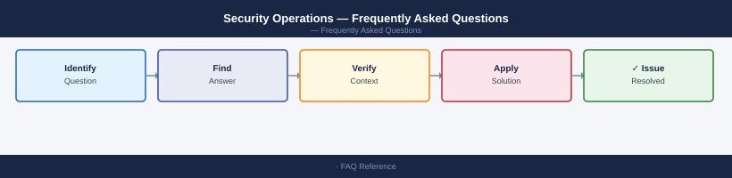

---
tags:
  - security
  - faq
  - operations
---
# Security Operations — Frequently Asked Questions

Common questions about Security Operations operations, configuration, and troubleshooting. For step-by-step procedures, see the <a href="index.md">Operations</a> section.

## General

**Q: How do I check the version and health of core security tooling?**
A: Check SIEM version in the platform admin UI. Verify EDR agent versions on endpoints via your EDR console (target: 100% of managed endpoints on current version). Check firewall firmware versions against vendor advisories.

**Q: How do I check the current Security Operations version?**
A: `Check SIEM → Admin → System Health; EDR console → Endpoints → Agent Version`

## Configuration

**Q: What is the default log retention period and when should it change?**
A: 90 days hot storage is a common default. Increase to 12 months for PCI-DSS, SOX, or GDPR compliance. Archive to cold storage (S3 Glacier) for 3-7 years. Define retention per log type in your data classification policy.

**Q: How do I enable UEBA (User and Entity Behaviour Analytics) in the SIEM?**
A: Most modern SIEMs (Splunk UBA, Microsoft Sentinel) include UEBA. Enable via Admin → Settings → Analytics. Requires minimum 30 days of baseline data before generating meaningful anomaly alerts. Tune initial alert thresholds to reduce noise.

## Operations

**Q: How do I upgrade SIEM infrastructure without losing log ingestion?**
A: Deploy the new SIEM version in parallel. Redirect log sources incrementally (10% at a time). Monitor ingestion gaps. Once validated, redirect all sources. Decommission the old SIEM after 2 weeks of parallel run.

**Q: What is the correct procedure to add a new log source to the SIEM?**
A: Identify the log format (syslog, CEF, JSON). Configure the source to forward logs to the SIEM collector. Create a parsing rule for the log format. Build detection rules for the source's key events. Test with sample log injection.

## Troubleshooting

**Q: SIEM alert volume spiked 10x overnight. What does it mean?**
A: Either a real security event or a detection rule producing false positives (misconfigured threshold, new system added). Check the alert source — if a single rule is generating all alerts, tune the rule. If multiple rules, investigate as potential incident.

**Q: SIEM search queries are timing out — where do I start?**
A: Optimise queries: narrow time range, use indexed fields, avoid wildcards at the start of search terms. Check ingestion rate — if above capacity, scale out indexers. Review dashboard queries — auto-refreshing wide-range searches are common culprits.

## Backup and Recovery

**Q: How often should I back up SIEM configuration?**
A: Export SIEM configuration (detection rules, dashboards, saved searches) weekly via API or config-as-code (Splunk: `.conf` files in Git; Sentinel: ARM templates). Log data itself is protected by the SIEM's storage replication.

**Q: Can I restore deleted detection rules without a full SIEM restore?**
A: Yes — if rules are version-controlled in Git, restore with `git checkout`. For Splunk, rules in `$SPLUNK_HOME/etc/apps/` can be restored from backup. Microsoft Sentinel rules can be redeployed from exported ARM/Bicep templates.

## See Also

- [Security Operations Operations](index.md)
- [Security Operations Troubleshooting](../troubleshooting/index.md)
