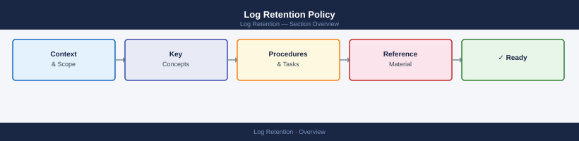

---
tags:
  - operations
  - security
---
# Log Retention Policy


<div class="kb-summary">
Log Retention Policy reference covering journald Retention, Centralised Log Retention (SIEM / Graylog / Splunk), Archive to Object Storage, Validation Checklist.
</div>



## Before you begin

- **Access:** Admin credentials on all affected systems
- **Timing:** safe to run during business hours unless a step is marked ⚠ (causes interruption)
- **Dependencies:** no active upgrades or migrations on the same infrastructure
- **Logging:** capture command output — paste into the change record on completion

---

## Centralised Log Retention (SIEM / Graylog / Splunk)

**Graylog:**
- Set index retention policy: Admin → System → Indices → Index set → Max retention
- Configure message TTL per stream for fine-grained control

**Splunk:**
```bash
# Set retention per index in indexes.conf
[main]
frozenTimePeriodInSecs = 7776000   # 90 days
maxTotalDataSizeMB = 500000
```

**Elasticsearch (ELK):**
```bash
# Index Lifecycle Management (ILM) — set delete phase
PUT _ilm/policy/infra-logs-policy
{
  "policy": {
    "phases": {
      "delete": {
        "min_age": "90d",
        "actions": { "delete": {} }
      }
    }
  }
}
```

## Archive to Object Storage

```bash
# Compress and upload old logs (AWS S3 example)
tar czf /tmp/logs-$(date +%Y%m).tar.gz /var/log/archive/$(date +%Y%m)/
aws s3 cp /tmp/logs-$(date +%Y%m).tar.gz s3://<bucket>/logs/$(hostname)/

# Verify
aws s3 ls s3://<bucket>/logs/$(hostname)/
```

## Validation Checklist

- [ ] Log rotation running and not producing errors (`logrotate -d`)
- [ ] journald staying within configured size limit
- [ ] SIEM index retention policies set per standard
- [ ] Archive jobs completing successfully (check last run timestamp)
- [ ] Disk space on log server/index <80% used
- [ ] Security logs accessible for at least 365 days
- [ ] Retention policy document reviewed and approved within last 12 months

---

## Verify

- SIEM retention policy is set to the required minimum (e.g., 365 days for security logs)
- Archive job last-run timestamp is within the scheduled window
- Log server/index disk utilisation is below 80%
- A spot test — querying logs from 12 months ago — returns results, confirming retention is active

## See also

- [Security Operations — Event Correlation](../event-correlation/)
- [Security Operations — Runbooks](../runbooks/)
- [Security Monitoring Overview](../../security-monitoring/)
