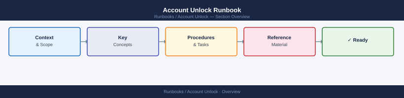

---
tags:
  - operations
  - security
---
# Account Unlock Runbook


<div class="kb-summary">
| Field | Value | |---|---| | Risk | Low | | Approval | Verify requester identity — no change ticket required for standard user accounts | | Estimated time | 5–15 minutes | | Impact | User regains access; no service disruption |
</div>



| Field | Value |
|---|---|
| Risk | Low |
| Approval | Verify requester identity — no change ticket required for standard user accounts |
| Estimated time | 5–15 minutes |
| Impact | User regains access; no service disruption |

## Before you begin

- **Access:** Admin credentials on all affected systems
- **Timing:** safe to run during business hours unless a step is marked ⚠ (causes interruption)
- **Dependencies:** no active upgrades or migrations on the same infrastructure
- **Logging:** capture command output — paste into the change record on completion

---

## Process Flow


Key fields in Event ID 4740:

| Field | Meaning |
|---|---|
| Caller Computer Name | Machine generating bad password attempts |
| Account Name | Locked account |
| Failure Reason | Usually "bad password" |

## Step 3 — Fix Root Cause

| Cause | Where to look | Fix |
|---|---|---|
| Stale cached credentials | Mobile device, Remote Desktop saved creds | Clear saved credentials on device |
| Scheduled task | Task Scheduler on caller machine | Update task credentials |
| Service with old password | Services console / `sc qc <svc>` | Update service account password |
| Mapped drive | `net use` output | Remove and re-add drive mapping |
| Repeated MFA failure | Azure AD Sign-In logs | Investigate for unauthorised attempts |

## Step 4 — Unlock the Account

```powershell
# Unlock single account
Unlock-ADAccount -Identity <username>

# Confirm unlocked
Get-ADUser -Identity <username> -Properties LockedOut | Select-Object Name, LockedOut
```

**Reset password and unlock (if password is also compromised):**
```powershell
Set-ADAccountPassword -Identity <username> -Reset `
    -NewPassword (ConvertTo-SecureString "<NewPass>" -AsPlainText -Force)
Unlock-ADAccount -Identity <username>
```

## Step 5 — Validate Authentication

```powershell
Get-ADUser -Identity <username> -Properties LockedOut, BadLogonCount |
    Select-Object Name, LockedOut, BadLogonCount
# LockedOut should be False; BadLogonCount should be 0
```

## Linux / SSSD (if applicable)

```bash
# Check lock state (RHEL 7 / pam_tally2)
pam_tally2 --user <username>
pam_tally2 --user <username> --reset

# RHEL 8+ (faillock)
faillock --user <username>
faillock --user <username> --reset
```

## Checklist

- [ ] Requester identity confirmed
- [ ] Account ownership verified (not an unattended service account)
- [ ] Lockout source identified and documented
- [ ] Root cause fixed or noted if deferred
- [ ] Account unlocked
- [ ] User confirmed able to authenticate
- [ ] Ticket updated with lockout source and fix applied

---

## Verify

- Confirm the operation completed without errors in the log or management UI
- Verify the expected state change is visible (service running, object created, config applied)
- Document the outcome in the change record

## See also

- [Certificate Renewal](../certificate-renewal/)
- [Chris Kb — Overview](../)
