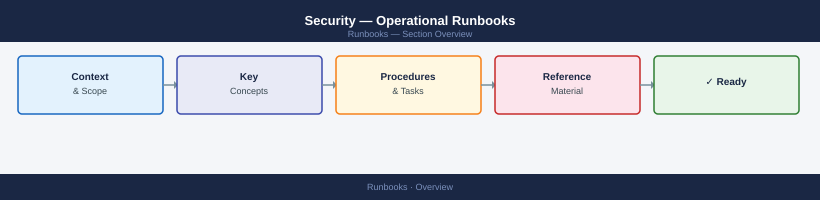

---
tags:
  - operations
  - security
---
# Security — Operational Runbooks

<div class="kb-summary">
Security operational runbooks — certificate renewal, PAM credential rotation, firewall rule review, access recertification, and hardening check schedule.
</div>



<div class="kb-grid kb-grid-2">
<a class="kb-card" href="account-unlock/"><strong>Account Unlock</strong><span>Account unlock runbook for AD and CyberArk PAM accounts — verification, unlock steps, and audit trail.</span></a>
<a class="kb-card" href="certificate-renewal/"><strong>Certificate Renewal</strong><span>Certificate renewal runbook — expiry scanning, CSR generation, CA submission, and deployment validation.</span></a>
</div>

## Certificate Renewal Runbook

```bash
# 1. Check expiry of all monitored certs (30-day advance warning)
for host in host1.corp host2.corp; do
  echo -n "$host: "
  echo | openssl s_client -connect $host:443 2>/dev/null | \
    openssl x509 -noout -enddate
done

# 2. Generate new CSR
openssl req -new -key /etc/ssl/private/server.key \
  -out /etc/ssl/certs/server.csr \
  -subj "/CN=host.corp.local/O=Corp/C=AU"

# 3. Submit to CA (internal PKI or public CA)

# 4. Install new cert
cp new-cert.crt /etc/ssl/certs/server.crt
systemctl restart nginx   # or haproxy, apache

# 5. Verify
openssl s_client -connect host.corp.local:443 2>/dev/null | \
  openssl x509 -noout -enddate
```

**Expected output (step 5):** `notAfter` shows the new expiry date (≥ 1 year from today). Service responds normally — test with `curl -sk https://host.corp.local/health` returning HTTP 200.

## CyberArk Password Rotation Check

```bash
# Verify CPM rotation completed successfully
# In CyberArk PVWA: Policies → Safe Management → select safe
# Check Last Modified date for each account matches expected rotation interval

# Test that rotated credential works
mysql -u app_user -p$(cyberark-cli get-password --safe AppSafe --account AppDB)
```

## Monthly Access Recertification

1. Export user list from AD: `Get-ADGroupMember -Identity "SQL_DBA" | Select Name, SamAccountName`
2. Cross-reference against HR offboarding list
3. Identify accounts not logged in for 90 days: `Search-ADAccount -AccountInactive -TimeSpan 90`
4. Disable dormant accounts; schedule for removal after 30 days

## Weekly Firewall Rule Review

```bash
# Review recently added rules (last 7 days from change log)
# Check for any "any any" or overly broad rules
iptables -L -n -v | grep -v "state RELATED,ESTABLISHED"  # Linux
Get-NetFirewallRule | Where-Object { $_.Enabled -eq 'True' -and $_.Direction -eq 'Inbound' } | Format-Table
```

## Hardening Check Schedule

| Frequency | Check | Tool |
|---|---|---|
| Daily | Privileged account login review | SIEM/CyberArk audit |
| Weekly | Failed auth events > threshold | SIEM alert |
| Monthly | CIS benchmark scan | Lynis / CIS-CAT |
| Quarterly | Penetration test (internal) | Internal red team |
| Annually | Full security audit | External assessor |
