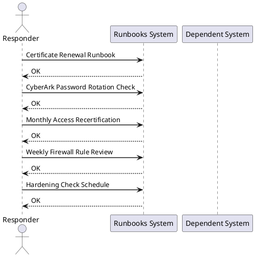

---
tags:
  - operations
  - security
---
# Security — Operational Runbooks

<div class="kb-summary">
Security operational runbooks — certificate renewal, PAM credential rotation, firewall rule review, access recertification, and hardening check schedule.
</div>

<div class="kb-grid kb-grid-2">
<a class="kb-card" href="account-unlock/"><strong>Account Unlock</strong><span>Account unlock runbook for AD and CyberArk PAM accounts — verification, unlock steps, and audit trail.</span></a>
<a class="kb-card" href="certificate-renewal/"><strong>Certificate Renewal</strong><span>Certificate renewal runbook — expiry scanning, CSR generation, CA submission, and deployment validation.</span></a>
</div>



## Certificate Renewal Runbook

```bash
# 1. Check expiry of all monitored certs (30-day advance warning)
for host in host1.corp host2.corp; do
  echo -n "$host: "
  echo | openssl s_client -connect $host:443 2>/dev/null | \
    openssl x509 -noout -enddate
done

# 2. Generate new CSR
openssl req -new -key /etc/ssl/private/server.key \
  -out /etc/ssl/certs/server.csr \
  -subj "/CN=host.corp.local/O=Corp/C=AU"

# 3. Submit to CA (internal PKI or public CA)

# 4. Install new cert
cp new-cert.crt /etc/ssl/certs/server.crt
systemctl restart nginx   # or haproxy, apache

# 5. Verify
openssl s_client -connect host.corp.local:443 2>/dev/null | \
  openssl x509 -noout -enddate
```


```text title="Expected output"
host1.corp: notAfter=Jan 15 10:23:45 2025 GMT
host2.corp: notAfter=Feb 28 14:17:22 2025 GMT
You are about to be asked to enter information that will be incorporated
into your certificate request.
-----
Country Name (2 letter code) [AU]:
State or Province Name (full name) []:
Locality Name (locality name) []:
Organization Name (organization name) [Corp]:
Organizational Unit Name (organizational unit name) []:
Common Name (common name) [host.corp.local]:
Email Address []:
(no output — command completes silently)
(no output — command completes silently)
(no output — command completes silently)
notAfter=Dec 10 09:45:33 2026 GMT
```

!!! warning "Common errors"
    **`unable to load Private Key`** — Verify the private key path is correct and readable by the current user with `ls -l /etc/ssl/private/server.key`.
    **`Connection refused`** — Ensure the target host is reachable and the service is listening on port 443 with `nc -zv host.corp.local 443`.
    **`No such file or directory`** — Confirm the new certificate file exists at the specified path before running the `cp` command with `ls -l new-cert.crt`.
**Expected output (step 5):** `notAfter` shows the new expiry date (≥ 1 year from today). Service responds normally — test with `curl -sk https://host.corp.local/health` returning HTTP 200.

## CyberArk Password Rotation Check

```bash
# Verify CPM rotation completed successfully
# In CyberArk PVWA: Policies → Safe Management → select safe
# Check Last Modified date for each account matches expected rotation interval

# Test that rotated credential works
mysql -u app_user -p$(cyberark-cli get-password --safe AppSafe --account AppDB)
```


```text title="Expected output"
Enter password: 
Welcome to the MySQL monitor.  Commands end with ; or \g.
Your MySQL connection id is 47382
Server version: 5.7.32-0ubuntu0.18.04.1-log (Ubuntu)

Copyright (c) 2000, 2023, Oracle and/or its affiliates. All rights reserved.

Oracle is a registered trademark of the Oracle Corporation and/or its
affiliates. Other trademarks are the property of their respective owners.

Type 'help;' or '\h' for help. Type '\c' to clear the current connection.

mysql>
```

!!! warning "Common errors"
    **`cyberark-cli: command not found`** — Install the CyberArk CLI tool or ensure it is in your PATH environment variable.
    **`ERROR 1045 (28000): Access denied for user 'app_user'@'localhost'`** — Verify the rotated password was successfully retrieved from CyberArk and that the database user permissions have not changed.
    **`ERROR 2003 (HY000): Can't connect to MySQL server on 'localhost' (111)`** — Confirm the database host is reachable and the MySQL service is running on the expected port.
## Monthly Access Recertification

1. Export user list from AD: `Get-ADGroupMember -Identity "SQL_DBA" | Select Name, SamAccountName`
2. Cross-reference against HR offboarding list
3. Identify accounts not logged in for 90 days: `Search-ADAccount -AccountInactive -TimeSpan 90`
4. Disable dormant accounts; schedule for removal after 30 days

## Weekly Firewall Rule Review

```bash
# Review recently added rules (last 7 days from change log)
# Check for any "any any" or overly broad rules
iptables -L -n -v | grep -v "state RELATED,ESTABLISHED"  # Linux
Get-NetFirewallRule | Where-Object { $_.Enabled -eq 'True' -and $_.Direction -eq 'Inbound' } | Format-Table
```


```text title="Expected output"
Chain INPUT (policy ACCEPT 0 packets, 0 bytes)
 pkts bytes target     prot opt in     out     source               destination
 1250  89K ACCEPT     tcp  --  eth0   *       0.0.0.0/0            0.0.0.0/0            tcp dpt:22
  892  45K ACCEPT     tcp  --  eth0   *       0.0.0.0/0            0.0.0.0/0            tcp dpt:443
  156  12K ACCEPT     tcp  --  eth0   *       10.0.0.0/8           0.0.0.0/0            tcp dpt:3306
   45   2K DROP       all  --  eth0   *       0.0.0.0/0            0.0.0.0/0
Chain FORWARD (policy DROP 0 packets, 0 bytes)
Chain OUTPUT (policy ACCEPT 1089 packets, 67K bytes)

Name                             : AllowRDP
Enabled                          : True
Direction                        : Inbound
Action                           : Allow
DisplayName                      : Remote Desktop - User Mode (TCP-In)
```

!!! warning "Common errors"
    **`bash: iptables: command not found`** — Install iptables with `sudo apt-get install iptables` on Linux or verify you're running on a Linux system, not Windows.
    **`Get-NetFirewallRule : The term 'Get-NetFirewallRule' is not recognized`** — Run PowerShell as Administrator and ensure you're on Windows; this cmdlet is not available on Linux.
## Hardening Check Schedule

| Frequency | Check | Tool |
|---|---|---|
| Daily | Privileged account login review | SIEM/CyberArk audit |
| Weekly | Failed auth events > threshold | SIEM alert |
| Monthly | CIS benchmark scan | Lynis / CIS-CAT |
| Quarterly | Penetration test (internal) | Internal red team |
| Annually | Full security audit | External assessor |
