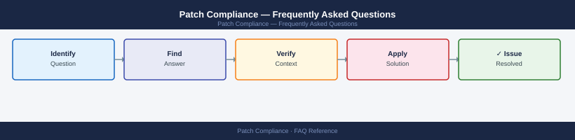

---
tags:
  - patch-compliance
  - faq
  - operations
description: "Common questions about Patch Compliance operations, configuration, and troubleshooting. For step-by-step procedures, see the Operations section."
---
# Patch Compliance — Frequently Asked Questions

*Applies to: All products (Security)*

Common questions about Patch Compliance operations, configuration, and troubleshooting. For step-by-step procedures, see the <a href="index.md">Operations</a> section.

## General

**Q: How do I determine the current patch compliance status across my fleet?**
A: Run a compliance report from WSUS, SCCM, Ansible, or your vulnerability scanner (Tenable, Qualys). Target: critical patches applied within 72 hours, high within 7 days, medium within 30 days per standard patching SLAs.

**Q: How do I check the current Patch Compliance version?**
A: `SCCM: Run 'Compliance 1 - Overall Compliance' report`

## Configuration

**Q: What is the recommended default patch deployment schedule?**
A: Weekly Patch Tuesday cycle for Windows. Monthly patching window for Linux. Emergency patch process (24-48 hours) for critical/exploited CVEs. Use deployment rings: dev → test → prod with 1-week gap between rings.

**Q: How do I enable automatic patching for critical security updates?**
A: WSUS/SCCM: create an ADR (Automatic Deployment Rule) for Critical severity, auto-approve and deploy to test collection, then prod 7 days later. For Linux: configure `unattended-upgrades` (Ubuntu) or `dnf-automatic` (RHEL) for security-only updates.

## Operations

**Q: How do I patch a fleet of 500+ servers without disrupting production?**
A: Group servers into maintenance windows by role (e.g., web tier Monday, app tier Tuesday, DB tier Wednesday). Use SCCM deployment rings. Exclude clustered nodes from simultaneous patching — patch one node at a time, verify, proceed.

**Q: What is the correct procedure to add a new server to the patching programme?**
A: Enrol in WSUS/SCCM. Assign to the correct collection (based on OS and role). Include in the appropriate maintenance window. Run an initial compliance scan to establish baseline. Schedule first patch cycle within 30 days.

## Troubleshooting

**Q: Patch compliance report shows a server at 0% compliance for 30+ days. What does it mean?**
A: The server is either offline, not enrolled in patch management, or has a broken patch agent. Verify the server is reachable, the SCCM/WSUS agent is running, and the server is assigned to a collection. Investigate immediately for security risk.

**Q: Patch deployment is taking too long and missing maintenance windows — where do I start?**
A: Check SCCM distribution point reachability from target servers. Verify content pre-staged to branch DPs. Review client settings — download bandwidth limits may be too restrictive. Check SMSTS.log on clients for failure details.

## Backup and Recovery

**Q: How long should I retain patch compliance records?**
A: Retain compliance reports for 12 months for standard audits, 3 years for SOX/PCI-DSS. Export SCCM compliance reports monthly. Store in your GRC tool with evidence timestamps. Provide to auditors on request.

**Q: Can I roll back a problematic patch without rebuilding the server?**
A: For Windows: `wusa /uninstall /kb:<KB_number>` or via Programs and Features. For SCCM: create a task sequence with the uninstall step. For Linux: `yum history undo <transaction_id>` or `apt-get remove --purge`. Test rollback in dev first.

## See Also

- [Patch Compliance Operations](index.md)
- [Patch Compliance Troubleshooting](../../troubleshooting/index.md)
