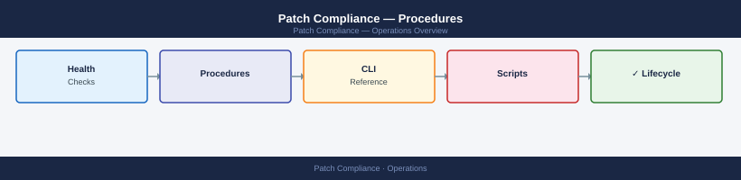

---
tags:
  - operations
  - security
---
# Patch Compliance — Procedures

<div class="kb-summary">
Step-by-step procedures for generating patch compliance reports, deploying patches, handling exceptions, and responding to zero-day vulnerabilities.
  <a class="kb-card" href="faq/"><strong>FAQ</strong><span>Frequently asked questions, common issues, and quick answers for day-to-day operations.</span></a>
</div>



```d2
direction: right

hub: "Operations\nOperations" {shape: hexagon}
run_monthly_patch_compliance_report: "Run Monthly Patch Compliance Report" {shape: rectangle}
identify_unpatched_systems: "Identify Unpatched Systems" {shape: rectangle}
approve_patches_in_wsussccm: "Approve Patches in WSUS/SCCM" {shape: rectangle}
deploy_patch_to_production_group: "Deploy Patch to Production Group" {shape: rectangle}
handle_a_patch_exception: "Handle a Patch Exception" {shape: rectangle}
track_patch_sla_compliance: "Track Patch SLA Compliance" {shape: rectangle}

hub -> run_monthly_patch_compliance_report
hub -> identify_unpatched_systems
hub -> approve_patches_in_wsussccm
hub -> deploy_patch_to_production_group
hub -> handle_a_patch_exception
hub -> track_patch_sla_compliance
```

## Before you begin

- **Access:** Admin credentials on all affected systems
- **Timing:** safe to run during business hours unless a step is marked ⚠ (causes interruption)
- **Dependencies:** no active upgrades or migrations on the same infrastructure
- **Logging:** capture command output — paste into the change record on completion

---

## Run Monthly Patch Compliance Report

Generate a current-state report showing patch coverage and outstanding missing patches across all managed systems.

1. In WSUS, open the **Reports** node and select **Computer Compliance**; set the scope to `All Computers` and the date range to the current month.
2. For SCCM/Intune environments, run the built-in **Software Update Compliance** report: `Monitoring > Reporting > Reports > Software Updates - A Compliance`.
3. Export the report as CSV:
   ```powershell
   # WSUS PowerShell example
   $wsus = Get-WsusServer -Name wsus.corp.local -PortNumber 8530
   $computers = $wsus.GetComputerTargets()
   $computers | Select-Object FullDomainName,LastSyncTime,RequestedTargetGroupName |
     Export-Csv C:\Reporting\patch-compliance-$(Get-Date -Format yyyyMM).csv -NoTypeInformation
   ```
4. Calculate the compliance percentage: `(Patched Systems / Total Systems) * 100`.
5. Produce a per-group summary highlighting any group below the 95% target and distribute to the operations team leads.
6. Archive the report in `\\fileserver\Audit\Patching\` with the month-year prefix.

---

## Identify Unpatched Systems

Find specific systems that are missing one or more approved patches so remediation can be targeted.

1. In WSUS, navigate to **Updates > All Updates** and filter by `Approval: Approved` and `Status: Failed or Needed`.
2. Right-click the update and select **Status Report** to see which computers are non-compliant for that patch.
3. Cross-reference against the CMDB to determine the system owner and criticality tier.
4. For Intune-managed devices, run:
   ```powershell
   # Microsoft Graph — requires DeviceManagementManagedDevices.Read.All
   Connect-MgGraph -Scopes "DeviceManagementManagedDevices.Read.All"
   Get-MgDeviceManagementManagedDevice -Filter "complianceState eq 'noncompliant'" |
     Select-Object DeviceName,OperatingSystem,ComplianceState | Export-Csv C:\Reporting\noncompliant-devices.csv
   ```
5. Sort the non-compliant list by criticality (Production > Pre-prod > Dev) and generate a prioritised remediation ticket for each group.

---

## Approve Patches in WSUS/SCCM

Review and formally approve patches before they are deployed to production systems.

1. In WSUS, open **Updates > All Updates** and filter by `Approval: Unapproved`.
2. Review each update's KB article for known issues; check the Microsoft Update Catalog and relevant vendor advisories.
3. Right-click the update and select **Approve**; choose the target group (e.g., `Test Servers`) for initial staged approval.
4. Monitor the test group for 48–72 hours; check for application compatibility issues by reviewing event logs on test servers:
   ```powershell
   Get-WinEvent -LogName Application -ComputerName testserver01 |
     Where-Object { $_.LevelDisplayName -in "Error","Critical" } | Select-Object -First 20
   ```
5. If the test phase is clean, extend approval to `Production Servers` within the change window.
6. Record the approval decision, approver name, and date in the patch management log for audit purposes.

---

## Deploy Patch to Production Group

Push approved patches to production systems in a controlled change window.

1. Confirm the change request is approved and the maintenance window is open.
2. In WSUS, set the deployment deadline for the production group:
   ```powershell
   $update = Get-WsusUpdate -UpdateId <GUID>
   Approve-WsusUpdate -Update $update -Action Install -TargetGroupName "Production Servers" `
     -Deadline (Get-Date).AddHours(4)
   ```
3. In SCCM, deploy the Software Update Group to the production device collection with a required deadline matching the change window.
4. Monitor the deployment status in real time: **Monitoring > Deployments > select deployment > view status**.
5. After the deadline passes, check for failed installations and collect the Windows Update log from failing systems:
   ```powershell
   Get-WindowsUpdateLog -LogPath C:\Logs\WindowsUpdate.log -ComputerName failingserver01
   ```
6. Reboot systems as required within the change window and confirm services restart cleanly.
7. Close the change request with a deployment summary including compliance percentage achieved.

---

## Handle a Patch Exception

Formally record and manage a system that cannot be patched within the standard SLA.

1. Confirm the business reason the system cannot be patched (e.g., application vendor does not support the patch, testing period required, system in active incident response).
2. Raise a patch exception request in the GRC platform or ITSM tool with:
   - Affected system(s)
   - Missing patch / CVE reference
   - Risk severity (CVSS score)
   - Business justification
   - Compensating controls (e.g., network isolation, IDS rule, additional monitoring)
   - Exception expiry date (maximum 90 days for High; 30 days for Critical)
3. Route the exception for approval: Patch Owner → Security Manager → CISO (for Critical severity).
4. Implement the agreed compensating controls and document them in the exception record.
5. Set a calendar reminder 1 week before expiry to either remediate the patch or formally renew the exception.
6. If the exception expires without renewal, escalate immediately to the CISO and consider emergency network isolation of the affected system.

---

## Track Patch SLA Compliance

Monitor patch deployment against the organisation's defined SLA tiers to ensure timely remediation.

1. Define or confirm the patch SLA tiers in the policy document:
   - Critical (CVSS ≥ 9.0): 72 hours
   - High (CVSS 7.0–8.9): 14 days
   - Medium (CVSS 4.0–6.9): 30 days
   - Low (CVSS < 4.0): 90 days
2. Pull the current unpatched list with the patch release date and calculate days outstanding:
   ```powershell
   $report = Import-Csv C:\Reporting\patch-compliance.csv
   $report | Select-Object *, @{n='DaysOutstanding';e={(Get-Date) - [datetime]$_.PatchReleaseDate | Select-Object -ExpandProperty Days}}
   ```
3. Flag any patch exceeding its SLA tier threshold and raise a breach notification to the system owner.
4. Record SLA breach metrics monthly: number of breaches per tier, average days to patch, and top offending systems.
5. Present the SLA compliance trend to the Security steering committee; target ≥ 95% on-time for Critical and High.

---

## Respond to Zero-Day Vulnerability

Manage an actively exploited vulnerability where no vendor patch is yet available.

1. Upon receiving the zero-day advisory (from vendor, CISA KEV, or threat intel feed), assess whether the organisation's environment is affected by inventorying exposed systems: `Get-ADComputer -Filter * -Properties OperatingSystem | Where-Object {$_.OperatingSystem -match "Windows Server 2016"}`.
2. Immediately apply vendor-recommended mitigations (registry workarounds, firewall rules, feature disablement):
   ```powershell
   # Example: disable a vulnerable Windows feature
   Disable-WindowsOptionalFeature -Online -FeatureName <FeatureName> -NoRestart
   ```
3. Isolate the highest-risk internet-facing systems if exploitation is confirmed in the wild: add firewall rules to block the vulnerable service port at the perimeter.
4. Enable enhanced logging on affected systems to detect exploitation attempts: `wevtutil sl Security /ms:104857600`.
5. Monitor threat intel sources (CISA, NVD, vendor advisories) for patch release; track the CVE in the vulnerability management platform.
6. When the vendor patch is released, treat it as a Critical patch (72-hour SLA) and expedite through the approval and deployment process.
7. Post-patch, review logs for any indicators of compromise from the window of exposure.

---

## Generate Compliance Evidence for Audit

Produce patch compliance evidence in the format required by auditors or regulatory assessors.

1. Run the monthly compliance report for the audit period (see "Run Monthly Patch Compliance Report").
2. Export a detailed patch history showing each system, each patch, and the installation date:
   ```powershell
   Get-HotFix -ComputerName (Get-ADComputer -Filter * | Select-Object -ExpandProperty Name) |
     Select-Object PSComputerName,HotFixID,InstalledOn | Export-Csv C:\Audit\hotfix-history.csv
   ```
3. For each Critical and High CVE patched in the period, document: CVE ID, CVSS score, patch release date, deployment date, and days to patch.
4. Produce an exceptions report listing all open exceptions with their risk owner sign-off.
5. Hash all evidence files for integrity: `Get-FileHash C:\Audit\* | Export-Csv C:\Audit\manifest.csv`.
6. Upload the evidence package to the GRC platform linked to the relevant patch management control record.

---

## Verify

- Confirm the operation completed without errors in the log or management UI
- Verify the expected state change is visible (service running, object created, config applied)
- Document the outcome in the change record

## See also

- [Security — Overview](../)
