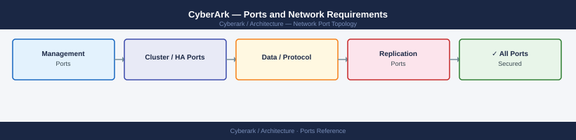

---
tags:
  - cyberark
  - pam
  - networking
  - firewall
  - ports
  - security
description: "Firewall port reference for CyberArk Privileged Access Manager (PAM). Covers the Digital Vault, PVWA, Central Policy Manager (CPM), Privileged Session..."
---
# CyberArk — Ports and Network Requirements

<div class="kb-summary">
Firewall port reference for CyberArk Privileged Access Manager (PAM). Covers the Digital Vault, PVWA, Central Policy Manager (CPM), Privileged Session Manager (PSM), and PSM/SSH Proxy. CyberArk uses a hub-and-spoke topology — all components connect to the Vault, never to each other directly.

*Applies to: CyberArk PAM 13.x+*
</div>


## Before you begin

- The CyberArk Vault only accepts **outbound-initiated** connections from its components — never open inbound from the Vault to external zones
- All PVWA, CPM, and PSM servers connect to the Vault on TCP 1858
- PSM acts as a bastion: users connect to PSM, and PSM proxies the session to the target — the target only sees PSM's IP, never the user's
- Plan the network so that PSM is the only host with network access to managed target systems (RDP, SSH, database ports)

---

## Inbound — Users to PVWA

| Port | Protocol | Source | Purpose |
|---|---|---|---|
| 443 | TCP | Admin workstations, users | PVWA web UI — account lookup, password retrieval, session launch |
| 80 | TCP | Users | HTTP — redirects to 443 |

---

## PVWA to Vault

| Port | Protocol | Source | Destination | Purpose |
|---|---|---|---|---|
| 1858 | TCP | PVWA | Vault (isolated network) | PVWA → Vault proprietary protocol — all credential operations |

---

## CPM to Vault and Targets

CPM has no inbound ports — it initiates all connections outbound.

| Port | Protocol | Source | Destination | Purpose |
|---|---|---|---|---|
| 1858 | TCP | CPM | Vault | CPM → Vault for policy retrieval and credential updates |
| 22 | TCP | CPM | Linux/Unix managed accounts | SSH — verify and change Linux passwords |
| 3389 | TCP | CPM | Windows managed accounts | RDP — verify and change Windows local accounts (some platforms) |
| 135 | TCP | CPM | Windows managed accounts | RPC endpoint mapper (domain account password changes) |
| 49152–65535 | TCP | CPM | Windows managed accounts | Dynamic RPC (Windows password change) |
| 443 | TCP | CPM | VMware vCenter, REST APIs | REST-based platform connectors (vCenter, AWS, Azure) |
| 1433 | TCP | CPM | SQL Server managed accounts | SQL Server service account management |
| 1521 | TCP | CPM | Oracle managed accounts | Oracle database account management |

---

## PSM — Users to PSM (Session Launch)

| Port | Protocol | Source | Destination | Purpose |
|---|---|---|---|---|
| 3389 | TCP | User workstation or PVWA | PSM | RDP — launch RDP session (user connects to PSM, PSM proxies to target) |
| 443 | TCP | User browser | PSM | HTML5 Web Sessions (modern Privilege Cloud / PSM for HTML5) |
| 22 | TCP | User SSH client | PSM/SSH Proxy | SSH session launch through PSM |

---

## PSM — PSM to Target Systems (Session Proxy)

PSM connects to the target on behalf of the user. PSM's IP must have access to all managed target systems.

| Port | Protocol | Source | Destination | Purpose |
|---|---|---|---|---|
| 3389 | TCP | PSM | Windows servers, workstations | RDP target sessions |
| 22 | TCP | PSM | Linux/Unix servers | SSH target sessions |
| 443 | TCP | PSM | Web targets (PVWA-proxied) | HTTPS web application sessions |
| 1433 | TCP | PSM | SQL Server targets | SQL Server sessions |
| 1521 | TCP | PSM | Oracle targets | Oracle database sessions |
| 3306 | TCP | PSM | MySQL targets | MySQL sessions |
| 5432 | TCP | PSM | PostgreSQL targets | PostgreSQL sessions |
| 23 | TCP | PSM | Network device targets | Telnet (network equipment — only if required) |

---

## PSM to Vault

| Port | Protocol | Source | Destination | Purpose |
|---|---|---|---|---|
| 1858 | TCP | PSM | Vault | PSM → Vault for session credential retrieval and recording storage |

---

## Vault Cluster and DR Replication

| Port | Protocol | Between | Purpose |
|---|---|---|---|
| 1858 | TCP | Primary Vault → DR Vault | Vault replication — disaster recovery vault synchronisation |
| 18923 | TCP | Primary Vault ↔ DR Vault | Vault cluster HA heartbeat (if Vault cluster configured) |
| 1433 | TCP | Vault | SQL Server (external DB if used) | Vault database connection (on-prem Vault using external MSSQL) |

---

## PVWA / PSM to Active Directory

| Port | Protocol | Destination | Purpose |
|---|---|---|---|
| 389 | TCP | Active Directory DCs | LDAP — user authentication and group lookup |
| 636 | TCP | Active Directory DCs | LDAPS (recommended) |
| 88 | TCP/UDP | Active Directory DCs | Kerberos |
| 3268 | TCP | Active Directory DCs | Global Catalog (multi-domain) |

---

## Outbound — Vault / PVWA to External Services

| Port | Protocol | Destination | Purpose |
|---|---|---|---|
| 443 | TCP | *.cyberark.com | License validation, CyberArk Marketplace connectors, Privilege Cloud (SaaS) |
| 25 | TCP | SMTP relay | Email alerts and notifications |
| 514 | UDP/TCP | Syslog server | CyberArk audit event forwarding |
| 162 | UDP | SNMP trap receiver | SNMP traps for monitoring |

---

## Firewall Zone Summary

| From | To | Ports | Notes |
|---|---|---|---|
| Users | PVWA | 443 | Web UI — SSL only |
| Users | PSM | 3389, 22 | Session launch via RDP or SSH |
| PVWA | Vault | 1858 | Core — Vault in isolated segment |
| CPM | Vault | 1858 | Policy fetch and credential updates |
| PSM | Vault | 1858 | Session credential retrieval |
| CPM | Managed targets | 22, 3389, 135, 443 | Platform-dependent |
| PSM | Managed targets | 3389, 22, 1433 | PSM as proxy — restrict all target access to PSM IP only |
| Primary Vault | DR Vault | 1858 | DR replication |
| PVWA / PSM | Active Directory | 389/636, 88 | Auth |

---

## Verify

```bash
# From admin workstation — test PVWA web
curl -sk -o /dev/null -w "%{http_code}" https://<pvwa-ip>/PasswordVault/

# From PVWA — test Vault connectivity (1858)
nc -zv <vault-ip> 1858

# From CPM — test Vault connectivity
nc -zv <vault-ip> 1858

# From PSM — test Vault connectivity
nc -zv <vault-ip> 1858

# From PSM — test target system reachability
nc -zv <target-windows-server> 3389
nc -zv <target-linux-server> 22

# From PVWA — test AD connectivity
nc -zv <dc-ip> 636
```


```text title="Expected output"
200
Connection to 10.50.20.15 1858 (vault) succeeded!
Connection to 10.50.20.15 1858 (vault) succeeded!
Connection to 10.50.20.15 1858 (vault) succeeded!
Connection to 192.168.100.45 3389 (ms-wbt-server) succeeded!
Connection to 192.168.100.67 22 (ssh) succeeded!
Connection to 10.40.10.8 636 (ldapssl) succeeded!
```

!!! warning "Common errors"
    **`curl: (60) SSL certificate problem: self signed certificate`** — Add `-k` flag to curl command to skip certificate verification, or use `--cacert` with your organization's CA bundle.
    **`nc: connect to <vault-ip> port 1858 (tcp) failed: Connection refused`** — Verify the Vault service is running on the target system with `systemctl status vault` and confirm the port is listening with `netstat -tlnp | grep 1858`.
    **`nc: getaddrinfo failed: Name or service not known`** — Replace the placeholder variables (e.g., `<vault-ip>`, `<dc-ip>`) with actual IP addresses or resolvable hostnames, or check DNS resolution with `nslookup <hostname>`.
---

## See also

- [CyberArk — Architecture](../how-it-works/)
- [CyberArk — Deploy](../../deploy/)
- [CyberArk — Operations](../../operations/)
- [CyberArk — Security](../../security/)
