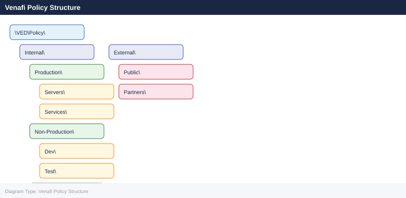

---
tags:
  - architecture
  - security
description: "Venafi Trust Protection Platform (TPP) is the enterprise certificate lifecycle management system. It enforces certificate policy, integrates with multiple..."
---
# Venafi — How It Works

<div class="kb-summary">
Venafi Trust Protection Platform (TPP) is the enterprise certificate lifecycle management system. It enforces certificate policy, integrates with multiple CA backends, automates renewal, and provides visibility across all managed certificates.

*Applies to: Venafi TLS Protect*
</div>

 The SaaS equivalent is Venafi as a Service (VaaS / TLS Protect Cloud).

---

## Before you begin

- **Access:** Admin credentials on all affected systems
- **Change management:** security changes require CAB approval in most environments
- **Rollback plan:** document current state before any security control change
- **Testing:** validate in a non-production environment first where possible

---

## Component Overview

| Component | Role | Deployment |
|---|---|---|
| Policy Server | Lifecycle management, CA integration, policy enforcement | On-prem VM (primary + secondary) |
| Edge Proxy | Certificate discovery across segmented networks | Lightweight on-prem agent |
| Log Server | Audit event aggregation and SIEM forwarding | On-prem VM or syslog target |
| VaaS / TLS Protect Cloud | SaaS alternative to TPP | Hosted by Venafi |
| CA Connectors | Integration adapters for ADCS, DigiCert, Entrust | Configured on Policy Server |
| Venafi SDK / REST API | Automation and integration interface | Consumed by CI/CD and scripts |

---

## Trust Protection Platform Topology

```d2
direction: right

TPP: "Venafi Trust Protection Platform" {shape: rectangle}
DISC: "Discovery Engine\n(network scan / agent" {shape: rectangle}
CA1: "CA Connector — ADCS" {shape: rectangle}
CA2: "CA Connector — DigiCert / Entrust" {shape: rectangle}
AUTO: "Automation\n(renewal / provisioning" {shape: rectangle}
ADMIN: "Security Admin" {shape: rectangle}
SIEM: "SIEM / Monitoring" {shape: rectangle}

TPP -> DISC
TPP -> CA1
TPP -> CA2
TPP -> AUTO
DISC -> TPP
ADMIN -> TPP
TPP -> SIEM
```

---

## Policy Tree Structure

The Venafi policy tree (`\VED\Policy\`) organises certificates into folders that apply inheritance-based policy. Certificates inherit policy settings from parent folders unless explicitly overridden.



Policy folder settings:

- CA template / connector to use for issuance
- Validity period and renewal window
- Key algorithm and minimum key size
- Required SANs and prohibited wildcard usage
- Approval workflow (auto-issue vs. manual approval)
- Notification contacts for expiry alerts

---

## CA Connectors

| CA Type | Connector | Notes |
|---|---|---|
| Microsoft ADCS | ADCS connector (built-in) | Requires CES/CEP or direct RPC access to CA |
| DigiCert | DigiCert connector | Requires DigiCert API key; supports OV/EV/DV |
| Entrust | Entrust connector | Requires Entrust API key and client credentials |
| Let's Encrypt | ACME connector | HTTP-01 or DNS-01 challenge; requires accessible validation endpoint |
| Internal standalone CA | Generic PKCS#10 / SCEP | For CAs without a native connector |

```d2
direction: right

tpp: "Venafi Trust Protection Platform" {shape: rectangle}
adcs: "CA Connector: ADCS\n(Microsoft Active Directory CS" {shape: rectangle}
digicert: "CA Connector: DigiCert\n(public OV / EV / DV" {shape: rectangle}
entrust: "CA Connector: Entrust\n(public / OV" {shape: rectangle}
acme: "ACME Connector\n(Let" {shape: rectangle}
vault: "HashiCorp Vault PKI\n(short-lived / service mesh" {shape: rectangle}
adcsServer: "ADCS Issuing CA Server" {shape: rectangle}
digicertCloud: "DigiCert API Cloud" {shape: rectangle}
entrustCloud: "Entrust API Cloud" {shape: rectangle}
leCloud: "Let" {shape: rectangle}
vaultPKI: "Vault PKI Engine" {shape: rectangle}

tpp -> adcs
tpp -> digicert
tpp -> entrust
tpp -> acme
tpp -> vault
adcs -> adcsServer
digicert -> digicertCloud
entrust -> entrustCloud
acme -> leCloud
vault -> vaultPKI
```

---

## Certificate Lifecycle Flow

```d2
direction: right

request: "Certificate Request\n(UI / API / vcert CLI / CI-CD" {shape: rectangle}
policyCheck: "Policy engine\nvalidation" {shape: rectangle}
reject: "Reject with\nviolation message" {shape: rectangle}
submitCA: "Submit CSR to\nconfigured CA connector" {shape: rectangle}
approvalQ: "Enter Approval Queue\n(Security team review" {shape: rectangle}
caIssue: "CA issues certificate" {shape: rectangle}
tppStore: "Venafi stores certificate\n+ notifies owner" {shape: rectangle}
monitor: "Expiry monitoring begins\n(30-day alert window" {shape: rectangle}
autoRenew: "Auto-renew triggered\n(new CSR generated" {shape: rectangle}
revoke: "Revoke via CA connector\n+ update CRL / OCSP" {shape: rectangle}

request -> policyCheck
policyCheck -> reject
policyCheck -> submitCA
policyCheck -> approvalQ
approvalQ -> submitCA
approvalQ -> reject
submitCA -> caIssue
caIssue -> tppStore
tppStore -> monitor
monitor -> autoRenew
autoRenew -> submitCA
monitor -> revoke
```

---

## High Availability

Venafi TPP is deployed as a primary + secondary pair sharing a common Microsoft SQL Server backend.

```d2
direction: right

client: "API Consumers\n(CI-CD / scripts / UI" {shape: rectangle}
lb: "Load Balancer / VIP\n(venafi.corp.example.com" {shape: rectangle}
tppPrimary: "TPP Primary Node\n(active" {shape: rectangle}
tppSecondary: "TPP Secondary Node\n(active" {shape: rectangle}
sqlAG: "SQL Server\n(Always On AG preferred" {shape: rectangle}
edgeProxy: "Edge Proxy\n(segmented network" {shape: rectangle}
admin: "Security Admin\n(portal" {shape: rectangle}

client -> lb
lb -> tppPrimary
lb -> tppSecondary
tppPrimary -> sqlAG
tppSecondary -> sqlAG
edgeProxy -> lb
admin -> lb
```

Both nodes are active; the load balancer distributes requests. SQL Server is the single source of truth — both nodes are stateless with respect to certificate data. If one node fails, the load balancer routes all traffic to the remaining node.

```powershell
Get-Service -Name "Venafi*" | Select-Object Name, Status
Test-NetConnection -ComputerName sql01.corp.example.com -Port 1433
```

---

## Network Requirements

| Source | Destination | Port | Purpose |
|---|---|---|---|
| TPP Policy Server | ADCS (CES endpoint) | TCP 443 | Certificate enrolment |
| TPP Policy Server | DigiCert / Entrust APIs | TCP 443 | External CA issuance |
| TPP Policy Server | SQL Server | TCP 1433 | Database backend |
| Edge Proxy | TPP Policy Server | TCP 443 | Proxy registration and data sync |
| Admin / CI-CD | TPP Policy Server | TCP 443 | REST API and web UI |
| TPP Log Server | Splunk / SIEM | TCP 514 / 6514 | Syslog event forwarding |

---

## REST API Access

Venafi TPP exposes a REST API at `https://<tpp-fqdn>/vedsdk/`.

```powershell
# Authenticate and get API key
$body = @{ Username = "svc-venafi-api"; Password = "password" } | ConvertTo-Json
$response = Invoke-RestMethod -Uri "https://venafi.corp.example.com/vedauth/authorize" `
  -Method Post -ContentType "application/json" -Body $body
$apiKey = $response.APIKey

# Request a certificate
$certRequest = @{
    PolicyDN = "\\VED\\Policy\\Internal\\Production\\Servers"
    Subject  = "app01.corp.example.com"
    SubjectAltNames = @(
        @{ TypedName = "dns:app01.corp.example.com" },
        @{ TypedName = "dns:app01-internal.corp.example.com" }
    )
} | ConvertTo-Json -Depth 5

Invoke-RestMethod -Uri "https://venafi.corp.example.com/vedsdk/Certificates/Request" `
  -Headers @{ "X-Venafi-API-Key" = $apiKey } `
  -Method Post -ContentType "application/json" -Body $certRequest
```
