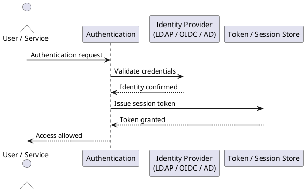

---
tags:
  - security
description: "Venafi RBAC is managed through built-in roles: Policy Master (full policy tree control), Certificate Manager (issue, renew, revoke within assigned..."
---
# Venafi — Authentication

Venafi RBAC is managed through built-in roles: Policy Master (full policy tree control), Certificate Manager (issue, renew, revoke within assigned folders), and Approver (approve or reject certificate requests without issuing).

*Applies to: Venafi TLS Protect*

 API keys must be rotated on a defined schedule and immediately upon personnel change.

| Control | Detail |
|---|---|
| RBAC roles | Policy Master, Certificate Manager, Approver — scoped to policy folders |
| API key rotation | Rotate on schedule and on personnel change; store in secrets manager |
| Admin account review | Quarterly review of Venafi admin and service accounts |

## Before you begin

- **Access:** Admin credentials on all affected systems
- **Change management:** security changes require CAB approval in most environments
- **Rollback plan:** document current state before any security control change
- **Testing:** validate in a non-production environment first where possible

---

## See also

- [Venafi — Access Control](../access-control/)
- [Venafi — Encryption](../encryption/)
- [Venafi — Security Hardening](../hardening/)
- [Venafi — Common Issues](../../troubleshooting/common-issues/)
