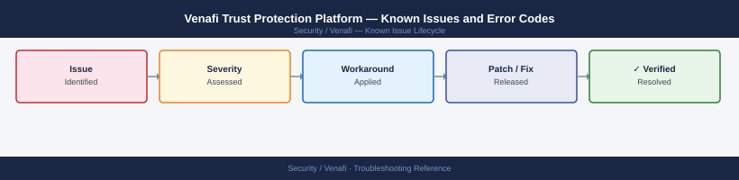

---
tags:
  - troubleshooting
  - venafi
  - certificates
  - known-issues
---
# Venafi Trust Protection Platform — Known Issues and Error Codes

<div class="kb-summary">
Catalog of known Venafi TPP bugs, error codes, and workarounds covering certificate discovery, ADCS integration, and policy engine issues.

*Applies to: Venafi TPP 22.x / 23.x*
</div>



```d2
direction: down

symptom: Identify Symptom {shape: diamond}
certificate_issuance: "Certificate Issuance" {shape: rectangle}
discovery: "Discovery" {shape: rectangle}
satellite_and_agents: "Satellite and Agents" {shape: rectangle}
resolution: Resolve or Escalate {shape: oval}

symptom -> certificate_issuance: investigate
symptom -> discovery: investigate
symptom -> satellite_and_agents: investigate
certificate_issuance -> resolution
discovery -> resolution
satellite_and_agents -> resolution
```

## Before you begin

- Venafi errors appear in TPP UI → Monitor → Log.
- Venafi support logs: collected via `VenafiLog.ps1` or TPP Diagnostic → Log Collection.
- DCOM issues (port 135 + dynamic) are the most common ADCS CA integration problem.

## Certificate Issuance

| Error / Symptom | Affected Versions | Cause | Workaround / Fix | Fixed In |
|---|---|---|---|---|
| Certificate request fails: `CA unavailable` | TPP 22.x | TPP cannot reach ADCS CA on port 135 | Verify TCP 135 + dynamic RPC (49152-65535) from TPP to CA server | N/A |
| `Policy violation — key length too short` | TPP 22.x | Certificate template requesting 1024-bit RSA vs policy minimum | Update certificate request to use 2048/4096 RSA or P-256 ECC | N/A |
| `Certificate already exists in CA` | TPP 22.x | Duplicate CN in CA; TPP trying to re-issue without revoke | Revoke existing certificate in CA before re-issuing; or use `Force Reissue` option | N/A |

## Discovery

| Error / Symptom | Affected Versions | Cause | Workaround / Fix | Fixed In |
|---|---|---|---|---|
| Network discovery not finding certificates on hosts | TPP 22.x | Discovery engine cannot connect to target on 443 | Ensure discovery engine has network access to target hosts on 443 | N/A |
| `SSH key scan failed` for Linux hosts | TPP 22.x | TPP discovery account lacks SSH access | Verify TPP discovery account has SSH key configured; test SSH from TPP server | N/A |

## Satellite and Agents

| Error / Symptom | Affected Versions | Cause | Workaround / Fix | Fixed In |
|---|---|---|---|---|
| Venafi Satellite `Offline` in TPP | TPP 22.x | TCP 443 from Satellite to TPP Management UI blocked | Verify TCP 443 from Satellite host to TPP server | N/A |
| `Venafi agent not responding` on Windows host | TPP 22.x | VenafiAgent Windows service stopped | Restart: `Get-Service VenafiAgent | Start-Service` | N/A |

## See also

- [Venafi TPP — Common Issues](../common-issues/)
- [Certificates — Known Issues](../../../certificates/troubleshooting/known-issues.md)
- [Active Directory — Known Issues](../../../../compute/windows-server/active-directory/troubleshooting/known-issues.md)
