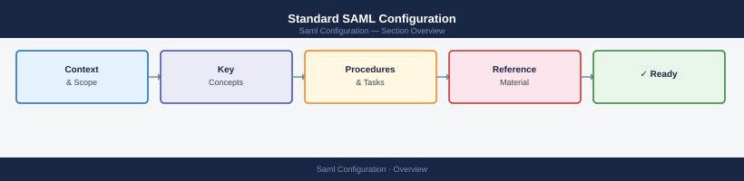

# Standard SAML Configuration

<div class="kb-summary">
Canonical SAML 2.0 SSO reference for all KB-covered products. Covers SP/IdP concepts, attribute mapping, Azure AD (Entra ID) and Okta setup, security requirements, and troubleshooting. Product authentication pages link here for the shared baseline and document only their product-specific ACS URLs and entity IDs.
</div>



<div class="kb-grid">
  <a class="kb-card" href="operations/">
    <div class="kb-card-icon">⚙️</div>
    <div class="kb-card-title">Operations</div>
    <div class="kb-card-desc">Azure AD and Okta setup, attribute mapping, certificate lifecycle, SSO troubleshooting</div>
  </a>
</div>

---

```d2
direction: right

center: "Saml Configuration" {shape: hexagon}
standard_field_reference: "Standard Field Reference" {shape: rectangle}
azure_ad_entra_id_setup: "Azure AD (Entra ID) Setup" {shape: rectangle}
okta_setup: "Okta Setup" {shape: rectangle}
security_requirements: "Security Requirements" {shape: rectangle}
certificate_lifecycle: "Certificate Lifecycle" {shape: rectangle}
common_issues: "Common Issues" {shape: rectangle}

center -> standard_field_reference
center -> azure_ad_entra_id_setup
center -> okta_setup
center -> security_requirements
center -> certificate_lifecycle
center -> common_issues
```

## Standard Field Reference

These fields are configured on both sides — the IdP and the SP. Collect all values before starting configuration on either end.

### SP-Side Fields (configured in the product)

| Field | Description | Example |
|---|---|---|
| Entity ID (SP) | Unique URI identifying this SP to the IdP | `https://jira.corp.local` |
| ACS URL | Where the IdP POSTs the SAML assertion after auth | `https://jira.corp.local/plugins/servlet/saml/auth` |
| Name ID Format | Format for the user identifier in the assertion | `urn:oasis:names:tc:SAML:2.0:nameid-format:emailAddress` |
| IdP Entity ID | Unique URI of the IdP — from IdP metadata | `https://sts.windows.net/{tenant-id}/` |
| IdP SSO URL | IdP's login endpoint — from IdP metadata | `https://login.microsoftonline.com/{tenant-id}/saml2` |
| IdP Certificate | X.509 cert used to sign assertions — from IdP metadata | Download from IdP metadata XML |
| Sign requests | Whether the SP signs AuthnRequests sent to IdP | Enable (RSA-SHA256) |
| Require signed assertions | Whether the SP requires the IdP to sign assertions | Enable |

### Standard Attribute Mapping

All products map the same core SAML attributes. The attribute names vary slightly by IdP — use the table below to locate the correct value.

| SP Field | Azure AD (Entra ID) | Okta | ADFS |
|---|---|---|---|
| Username / Name ID | `user.mail` or `user.userprincipalname` | `user.login` | `SAMAccountName` |
| Display name | `user.displayname` | `user.displayName` | `displayName` |
| Email | `user.mail` | `user.email` | `mail` |
| Groups | `user.groups` (group object IDs) | `user.groups` | `memberOf` |
| First name | `user.givenname` | `user.firstName` | `givenName` |
| Last name | `user.surname` | `user.lastName` | `sn` |

> **Group sync note**: Azure AD sends group Object IDs in the `groups` claim by default, not group names. Either configure group name claims in the Enterprise App, or map Object IDs to group names in the product.

---

## Azure AD (Entra ID) Setup

The most common IdP across the estate. Follow this sequence for any new product integration.

### 1. Create the Enterprise Application

```text
Azure Portal → Entra ID → Enterprise Applications
→ New Application → Create your own application
→ Name: "<Product> SAML SSO"  (e.g. "Jira SAML SSO")
→ "Integrate any other application you don't find in the gallery"
→ Create
```

### 2. Configure Single Sign-On

```text
Enterprise App → Single sign-on → SAML
```

**Basic SAML Configuration:**

| Field | Value |
|---|---|
| Identifier (Entity ID) | SP Entity ID from the product |
| Reply URL (ACS URL) | ACS URL from the product |
| Sign on URL | Product's login URL (optional but recommended) |
| Relay State | Leave blank unless product requires it |
| Logout URL | Product's SLO endpoint if supported |

### 3. Configure Attributes and Claims

Default claims to configure:

```text
Unique User Identifier (Name ID):  user.mail
                                   (format: emailAddress)

Additional claims:
  displayName  →  user.displayname
  mail         →  user.mail
  groups       →  user.groups  (select "Groups assigned to application")
```

> Restrict group claims to **"Groups assigned to the application"** — sending all user groups inflates assertion size and may cause 413 errors on the ACS endpoint.

### 4. Download Metadata and Upload to Product

```text
Certificate (Base64) → Download
Federation Metadata XML → Download URL (copy, don't download)
```

Import either the certificate or the full metadata XML into the product's SAML configuration.

### 5. Assign Users and Groups

```text
Enterprise App → Users and Groups → Add user/group
```

Assign the relevant AD groups (not individual users). Only assigned users/groups can authenticate through this app.

---

## Okta Setup

### 1. Create Application

```text
Okta Admin → Applications → Create App Integration
→ SAML 2.0 → Next
```

### 2. Configure SAML Settings

| Field | Value |
|---|---|
| Single sign-on URL (ACS) | ACS URL from the product |
| Audience URI (Entity ID) | SP Entity ID from the product |
| Name ID format | EmailAddress |
| Application username | Email |

### 3. Attribute Statements

| Name | Value |
|---|---|
| `displayName` | `user.displayName` |
| `mail` | `user.email` |
| `firstName` | `user.firstName` |
| `lastName` | `user.lastName` |

**Group Attribute Statement:**

| Name | Filter |
|---|---|
| `groups` | Matches regex: `.*` (or restrict to specific groups) |

### 4. Finish and Assign

Download the IdP metadata or certificate from the **Sign On** tab, import into the product. Assign Okta groups in the **Assignments** tab.

---

## Security Requirements

All SAML integrations must meet these minimum standards before production use.

| Requirement | Standard | Reason |
|---|---|---|
| Sign AuthnRequests | Required | Prevents assertion injection from other SPs |
| Sign Assertions | Required | Integrity — confirms assertion is from trusted IdP |
| Encrypt Assertions | Recommended | Confidentiality — prevents assertion interception |
| Signature algorithm | RSA-SHA256 minimum | SHA-1 is deprecated and broken |
| Certificate expiry monitoring | Alert at 60 days | SAML breaks instantly when signing cert expires |
| Enforce SSO (disable local login) | Required for admin accounts | Prevents SSO bypass via local credentials |
| Session timeout alignment | Match IdP session (typically 8h) | Prevents session mismatch issues |

---

## Certificate Lifecycle

SAML signing certificates expire — this is the most common cause of sudden SAML outages.

```bash
# Check the IdP certificate expiry (from the downloaded cert file)
openssl x509 -noout -dates -in idp-signing.crt

# Check an SP signing certificate (if the SP uses one)
openssl x509 -noout -dates -in sp-signing.crt
```

**Rotation procedure:**
1. Get new certificate from IdP (for IdP cert rotation) or generate new SP cert
2. Add the new certificate alongside the existing one in both SP and IdP config
3. Test with a non-admin user account
4. Remove the old certificate after confirming all sessions use the new cert
5. Update the monitoring alert with the new expiry date

---

## Common Issues

| Symptom | Likely Cause | Resolution |
|---|---|---|
| `Signature validation failed` | IdP cert in product is stale / expired | Re-download and update the IdP certificate |
| `Invalid ACS URL` | ACS URL in IdP doesn't match SP exactly | Confirm URL including trailing slash; must be exact match |
| `Audience restriction failed` | Entity ID mismatch between SP and IdP | Ensure SP Entity ID configured in IdP matches exactly |
| `Name ID not found` | Attribute claim not mapping to a valid user | Confirm Name ID format and attribute value; check user exists in SP |
| `Groups not syncing` | Group claim missing or sending Object IDs | Configure group name claim in Azure AD; or map Object IDs in product |
| `413 Request Entity Too Large` | Too many group claims in assertion | Restrict group claim to groups assigned to the application |
| Login loop (redirect bouncing) | SP doesn't recognise valid session after assertion | Clear browser cookies; check SP session configuration |
| `Clock skew` error | Server time drift > 5 minutes | Sync NTP on SP server; SAML assertions have short validity windows |

---

## Product-Specific SAML Pages

Each product documents its exact ACS URL, Entity ID format, and any quirks:

- [Jira — Authentication](../../tools/jira/security/authentication/index.md)
- [Confluence — Authentication](../../tools/confluence/security/authentication/index.md)
- [ServiceNow — Authentication](../../tools/servicenow/security/authentication/index.md)
- [vCenter — Authentication](../../virtualization/vmware/vcenter/security/authentication/index.md)
- [VCF — Authentication](../../virtualization/vmware/vmware-cloud-foundation/security/authentication/index.md)
- [ONTAP System Manager — Authentication](../../storage/netapp/ontap/security/authentication/index.md)
- [CyberArk — Authentication](../../security/cyberark/security/authentication/index.md)

---

## Related Pages

- [Standard LDAP Integration](../ldap-integration/index.md)
- [MFA](../mfa/index.md)
- [Active Directory](../../compute/windows-server/active-directory/index.md)
- [TLS and HTTPS](../../protocols/tls/index.md)
- [PKI](../pki/index.md)
