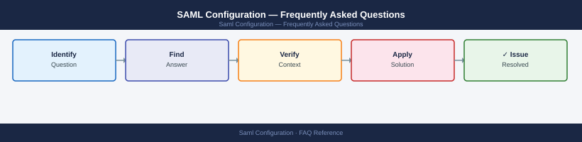

---
tags:
  - saml-configuration
  - faq
  - operations
---
# SAML Configuration — Frequently Asked Questions

Common questions about SAML Configuration operations, configuration, and troubleshooting. For step-by-step procedures, see the <a href="index.md">Operations</a> section.

## General

**Q: How do I verify the SAML metadata version and validity?**
A: Check `validUntil` attribute in IdP metadata XML. Download fresh metadata from your IdP (e.g., Azure AD: `https://login.microsoftonline.com/<tenantid>/federationmetadata/2007-06/federationmetadata.xml`). Verify SP metadata is current in the IdP.

**Q: How do I check the current SAML Configuration version?**
A: `curl -s <idp-metadata-url> | grep validUntil`

## Configuration

**Q: What is the default SAML assertion lifetime and when should it change?**
A: Default is typically 1 hour (3600 seconds) for the assertion validity period. Reduce to 5-15 minutes for high-security applications. Extend to 8 hours for low-sensitivity internal apps where user experience is the priority.

**Q: How do I enable SAML attribute mapping for role-based access?**
A: In the IdP, configure claim rules to include group membership in the SAML assertion (e.g., `http://schemas.microsoft.com/ws/2008/06/identity/claims/groups`). In the SP, map the group claim to the application's role attribute. Test with a SAML tracer.

## Operations

**Q: How do I rotate SAML signing certificates without breaking SSO?**
A: Add the new certificate to the IdP as a secondary signing cert. Update the SP's metadata with both certificates. Verify SSO works with both. Remove the old certificate from the IdP after the SP's certificate cache has expired (usually 24-48 hours).

**Q: What is the correct procedure to add a new SP to an existing SAML IdP?**
A: Obtain the SP's metadata XML. Add as an Enterprise Application (Azure AD) or SAML SP (ADFS/Okta). Configure ACS URL, Entity ID, and attribute mapping. Test with SAML tracer (Chrome extension). Verify NameID format matches SP expectations.

## Troubleshooting

**Q: SAML SSO fails with 'Response has wrong InResponseTo'. What does it mean?**
A: The SP received a SAML response for a different request (replay or session mismatch). Usually caused by load balancers breaking sticky sessions. Ensure session affinity is configured, or the SP uses a distributed session store. Check clock skew (must be <5 minutes).

**Q: SAML SSO login takes >5 seconds — where do I start?**
A: Check IdP response time. Verify SP-to-IdP network latency. Review SAML assertion size (large group claims inflate assertion and parsing time). Check if SP is doing synchronous LDAP lookup on each SSO event.

## Backup and Recovery

**Q: How often should I back up SAML configuration?**
A: Export SP metadata and IdP configuration weekly. Store in version control. Include claim rules, attribute mappings, and certificate thumbprints. Before rotating certificates, always back up the current IdP/SP configuration.

**Q: Can I restore a broken SAML integration without affecting other SP integrations?**
A: Yes — each SP integration is independent in Azure AD/Okta/ADFS. Remove the broken app registration and re-add it using the backed-up SP metadata. Other SP integrations are not affected.

## See Also

- [SAML Configuration Operations](index.md)
- [SAML Configuration Troubleshooting](../../troubleshooting/index.md)
