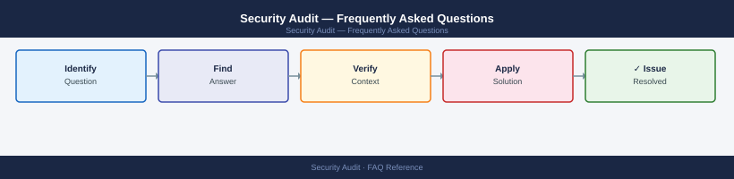

---
tags:
  - security-audit
  - faq
  - operations
description: "Common questions about Security Audit operations, configuration, and troubleshooting. For step-by-step procedures, see the Operations section."
---
# Security Audit — Frequently Asked Questions

*Applies to: All products (Security)*

Common questions about Security Audit operations, configuration, and troubleshooting. For step-by-step procedures, see the <a href="index.md">Operations</a> section.

## General

**Q: How do I determine which security audit was most recently completed?**
A: Check your GRC tool audit log or audit register. For ISO 27001, the last surveillance audit date is on the certificate. Internal audit schedule should be in the GRC tool under Audit Management → Audit Calendar.

**Q: How do I check the current Security Audit version?**
A: `GRC tool → Audit Management → Completed Audits`

## Configuration

**Q: What is the standard security audit frequency?**
A: ISO 27001: annual external surveillance + 3-year recertification. SOC 2: annual Type II audit (12-month observation period). Internal audits: quarterly for high-risk areas, annual for standard controls. Penetration testing: annual minimum, after significant changes.

**Q: How do I enable continuous audit evidence collection?**
A: Integrate your SIEM, vulnerability scanner, and ITSM tool with your GRC platform via API. Configure automated evidence collection for technical controls (patch compliance, access reviews, firewall rules). Reduces manual evidence gathering by 60-70%.

## Operations

**Q: How do I expand the audit scope to include a newly acquired business unit?**
A: Conduct a gap assessment of the new unit's controls against your existing framework. Assign control owners. Include the unit in the next internal audit cycle. Notify your external auditor of scope change before the next audit engagement starts.

**Q: What is the correct procedure to track a new audit finding?**
A: Log in GRC tool: finding description, severity, affected control, root cause, remediation owner, and target date. Link to evidence. Track remediation progress weekly for critical findings. Close only when evidence of remediation is accepted by the audit team.

## Troubleshooting

**Q: External auditor raises a 'Repeat Finding'. What does it mean?**
A: The same deficiency was identified in a previous audit and not fully remediated. Repeat findings are serious — they indicate inadequate remediation or systemic process weakness. Root cause analysis is mandatory; escalate to CISO.

**Q: Audit preparation is consuming too much team time — where do I start?**
A: Implement continuous control monitoring (CCM) to pre-collect evidence. Create an audit request portal in ServiceNow/Jira for auditors. Standardise evidence formats. Designate a single audit coordinator per business unit.

## Backup and Recovery

**Q: How long should I retain audit records?**
A: Audit reports: indefinitely (legal record). Evidence: per framework requirement (SOX: 7 years, PCI-DSS: 12 months online + 12 months offline). Store in an audit repository with access controls and tamper protection.

**Q: Can I dispute an audit finding if I believe the evidence is incorrect?**
A: Yes — submit a formal management response with counter-evidence during the draft report review period. Auditors must consider management responses before issuing the final report. Document the dispute in your GRC tool regardless of outcome.

## See Also

- [Security Audit Operations](index.md)
- [Security Audit Troubleshooting](../../troubleshooting/index.md)
