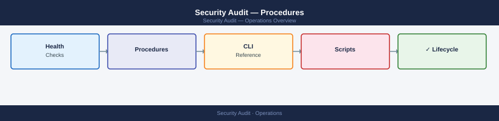

---
tags:
  - operations
  - security
---
# Security Audit — Procedures

<div class="kb-summary">
Step-by-step procedures for conducting infrastructure security audits, reviewing firewall rules, auditing privileged accounts, checking certificates, and tracking findings to closure.
  <a class="kb-card" href="faq/"><strong>FAQ</strong><span>Frequently asked questions, common issues, and quick answers for day-to-day operations.</span></a>
</div>



## Before you begin

- **Access:** Admin credentials on all affected systems
- **Timing:** safe to run during business hours unless a step is marked ⚠ (causes interruption)
- **Dependencies:** no active upgrades or migrations on the same infrastructure
- **Logging:** capture command output — paste into the change record on completion

---

## Conduct Infrastructure Security Audit

Perform a structured technical audit of the infrastructure estate to identify security weaknesses and configuration drift.

1. Define the audit scope: list all in-scope systems (servers, network devices, hypervisors, storage) using the CMDB and confirm with the asset owner.
2. Run a CIS Benchmark assessment against each system category (see Compliance Standards — Procedures for the CIS-CAT process).
3. Perform a network port scan against in-scope hosts to identify unexpected open services:
   ```bash
   nmap -sV -p 1-65535 -oN /tmp/portscan-$(date +%Y%m%d).txt 10.0.0.0/24
   ```
4. Review security configuration baselines for hypervisors:
   - vCenter: **Menu > Security > vSphere Security Configuration Guide** compliance check.
   - ESXi: `esxcli system settings advanced list | grep -i ssh` — confirm SSH is disabled on all production hosts.
5. Collect output from each check into the audit working paper, noting the finding, evidence, and risk rating.
6. Compile the draft audit report with findings classified by severity (Critical/High/Medium/Low/Informational).
7. Hold a findings walkthrough with the system owners before issuing the final report.

---

## Review Firewall Rule Effectiveness

Audit existing firewall rules to remove stale, overly permissive, or undocumented entries.

1. Export the current firewall rule set from each firewall (Palo Alto, Fortinet, NSX-T, etc.):
   ```bash
   # Palo Alto via CLI
   show security policies zone-lookup from trust to untrust | match "allow"
   ```
2. For each rule, confirm it is linked to an approved change ticket; flag any rule with no ticket reference.
3. Identify rules with `Any` as the source or destination — these should be replaced with specific IP ranges or groups.
4. Check for rules that have had zero hits in the last 90 days (using the firewall's traffic statistics or SIEM data); these are candidates for removal:
   ```bash
   # Palo Alto hit count
   show rule-hit-count vsys vsys1 security pre-rulebase security rules <rule-name>
   ```
5. For each overly permissive or stale rule, raise a change request to restrict or remove it, and get sign-off from the network security team.
6. After changes are implemented, run a re-scan of the affected network segments to confirm the rule changes are effective.
7. Document the final approved rule set and schedule the next review in 6 months.

---

## Audit Privileged Access Accounts

Review all accounts with elevated rights to ensure they are still required, properly controlled, and within policy.

1. Export all members of privileged groups:
   ```powershell
   foreach ($g in @("Domain Admins","Administrators","Backup Operators","Schema Admins")) {
     Get-ADGroupMember -Identity $g -Recursive |
       Select-Object @{n='Group';e={$g}}, Name, SamAccountName |
       Export-Csv "C:\Audit\$g.csv" -NoTypeInformation
   }
   ```
2. Cross-reference the exported list against the approved Privileged Access Register; flag any account not in the register.
3. Confirm that each privileged account is a dedicated admin account (not a shared account or a primary daily-use account).
4. Check that all privileged accounts require MFA: query the Entra ID authentication methods report filtered to admin role members.
5. Verify that CyberArk or another PAM solution is managing credentials for all Tier 0 and Tier 1 accounts; manually managed credentials are a finding.
6. For each finding, raise a remediation task with a 14-day deadline and track to closure.

---

## Review Certificate Expiry

Identify TLS/SSL certificates approaching expiry to prevent service outages caused by expired certificates.

1. Scan all known HTTPS endpoints for certificate expiry:
   ```bash
   for host in vcenter.corp.local aria.corp.local idm.corp.local; do
     echo -n "$host: "
     openssl s_client -connect $host:443 -servername $host 2>/dev/null | \
       openssl x509 -noout -enddate
   done
   ```
2. For certificates managed by Venafi or ADCS, run the platform's expiry report:
   ```powershell
   # ADCS — certificates expiring within 60 days
   Get-CATemplate | ForEach-Object {
     certutil -view -restrict "NotAfter<=$(Get-Date).AddDays(60).ToString('MM/dd/yyyy')" -out "Subject,NotAfter,Revocation Date"
   }
   ```
3. Flag any certificate expiring within 60 days as a medium finding; within 30 days as high; within 7 days as critical.
4. For each expiring certificate, initiate the renewal process via Venafi auto-enrolment or submit a manual CSR to the issuing CA.
5. After renewal, verify the new certificate is deployed and the old certificate is revoked if necessary.
6. Update the certificate inventory in the asset register with the new expiry dates.

---

## Check for Unauthorised Changes (FIM)

Use File Integrity Monitoring to detect unexpected changes to critical system files and configurations.

1. In the FIM tool (OSSEC, Tripwire, Microsoft Defender for Endpoint, or Wazuh), run an on-demand scan of the monitored directories:
   ```bash
   # Wazuh — trigger FIM scan
   /var/ossec/bin/agent_control -r -u <agent_id>
   ```
2. Review the FIM alert dashboard for new or modified files in critical paths: `/etc/`, `/boot/`, `C:\Windows\System32\`, and application configuration directories.
3. For each detected change, determine whether it corresponds to an approved change ticket:
   - If an approved ticket exists, acknowledge the alert and mark it as expected.
   - If no ticket exists, raise an incident and investigate the source of the change.
4. Pull the modified file content and compare it against the known-good baseline:
   ```bash
   diff /var/ossec/queue/fim/db/<agent_id>.db.bak /var/ossec/queue/fim/db/<agent_id>.db
   ```
5. Escalate any unauthorised changes to the incident response team if the modification affects a sensitive file (SSH config, sudoers, PAM, firewall ruleset).
6. Document all findings and outcomes in the audit working paper.

---

## Generate Audit Report

Compile all audit findings into a formal report for distribution to management and control owners.

1. Collate all findings from the audit working papers into a master findings list with: finding ID, title, severity, affected system, root cause, and recommendation.
2. Assign each finding a risk rating based on the organisation's risk matrix (Likelihood × Impact).
3. Write an executive summary (1 page) covering: audit objective, scope, overall risk posture, number of findings by severity, and top 3 critical risks.
4. For each finding, document: observation, evidence references, risk, and recommended remediation with a suggested timeline.
5. Send the draft report to system owners for factual accuracy review; allow 5 business days for responses.
6. Incorporate factual corrections, finalise the report, and obtain the CISO's sign-off.
7. Distribute the final report to the appropriate stakeholders and store in `\\fileserver\Audit\Reports\`.

---

## Respond to Audit Findings

Process findings raised by internal or external auditors and drive them to closure within the agreed timeframe.

1. Log each finding in the GRC platform with: finding ID, severity, audit reference, assigned owner, and SLA date.
2. For each Critical and High finding, schedule a dedicated remediation meeting with the system owner within 5 business days.
3. Implement the remediation action and collect evidence of completion (screenshot, log export, configuration export).
4. Submit the evidence to the audit team or GRC platform for verification; update the finding status to `Pending Verification`.
5. Once verified, update the status to `Closed` with the closure date and evidence reference.
6. Produce a monthly remediation status report showing: total findings, closed, in progress, overdue, and average days to close.

---

## Track Remediation to Closure

Monitor the lifecycle of all open audit findings to ensure none exceed their agreed remediation SLA.

1. Maintain a remediation tracker in the GRC platform or a shared spreadsheet with columns: Finding ID, Severity, Owner, Due Date, Status, Last Update.
2. Run a weekly automated status report query to identify findings approaching or past their SLA:
   ```powershell
   $findings = Import-Csv C:\Audit\remediation-tracker.csv
   $findings | Where-Object {[datetime]$_.DueDate -lt (Get-Date) -and $_.Status -ne "Closed"} |
     Select-Object FindingID,Severity,Owner,DueDate | Format-Table
   ```
3. Send weekly status reminders to owners of in-progress findings.
4. Escalate overdue Critical/High findings to the CISO with a daily status update until closed.
5. Present a closure rate trend to the Security steering committee monthly (target: 90% of Critical findings closed within SLA).

---

## Verify

- Confirm the operation completed without errors in the log or management UI
- Verify the expected state change is visible (service running, object created, config applied)
- Document the outcome in the change record

## See also

- [Security — Overview](../)
