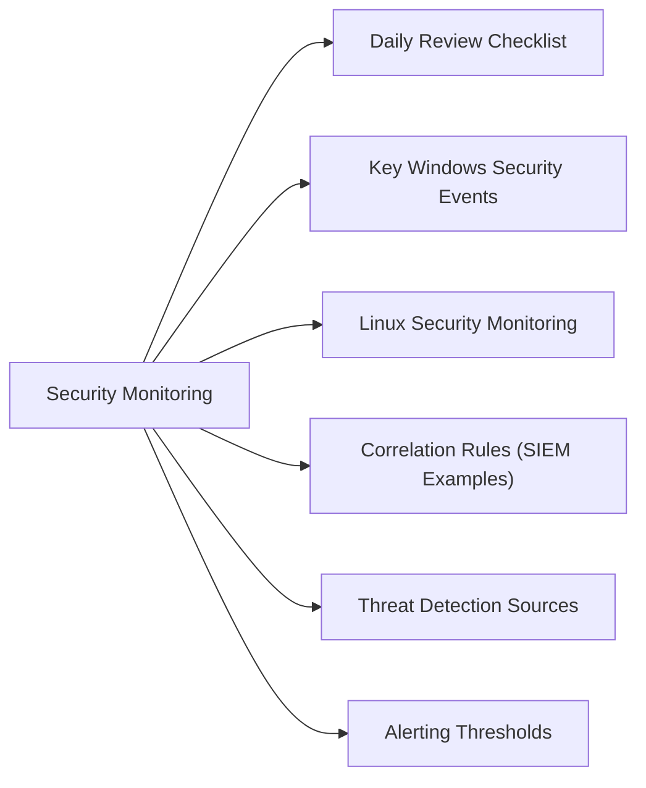

# Security Monitoring



## Daily Review Checklist

| Check | Tool | Expected |
|---|---|---|
| SIEM alert queue | Splunk / Graylog / Sentinel | No unacknowledged High/Critical |
| Failed login spikes | SIEM / AD event log | No unusual spike pattern |
| Privileged account activity | CyberArk / AD event log 4648 | All activity matches known change windows |
| New admin accounts created | AD event log 4720 | Only approved accounts |
| Firewall deny logs | Firewall / SIEM | No unexpected internal→external attempts |
| EDR / AV alert queue | CrowdStrike / Defender | No active threats unacknowledged |

## Key Windows Security Events

| Event ID | Description | Why It Matters |
|---|---|---|
| 4624 | Successful logon | Baseline; flag off-hours or remote logons |
| 4625 | Failed logon | Brute force detection |
| 4648 | Explicit credential logon | Pass-the-hash / lateral movement |
| 4720 | User account created | Persistence mechanism |
| 4728 | Added to global security group | Privilege escalation |
| 4740 | Account locked out | Brute force or stale credential |
| 4776 | NTLM auth attempt | Downgrade attack detection |
| 7045 | New service installed | Malware persistence |
| 4698 | Scheduled task created | Persistence |
| 4663 | Object access | File/folder auditing (if enabled) |

```powershell
# Pull recent high-priority security events
Get-WinEvent -FilterHashtable @{
  LogName = 'Security'
  Id      = @(4720, 4728, 7045, 4698)
  StartTime = (Get-Date).AddHours(-24)
} | Select-Object TimeCreated, Id, Message | Format-List
```

## Linux Security Monitoring

```bash
# Failed SSH attempts in last hour
grep "Failed password" /var/log/auth.log | awk '{print $11}' | sort | uniq -c | sort -rn | head -10

# Successful root logins
grep "session opened for user root" /var/log/auth.log | tail -20

# New users created
grep "useradd\|adduser" /var/log/auth.log | tail -20

# Sudo usage
grep "sudo:" /var/log/auth.log | grep -v "pam_unix" | tail -30

# Check auditd rules
auditctl -l
```

## Correlation Rules (SIEM Examples)

**Brute force detection:**
```
# >10 failed logons from same source in 5 minutes
index=security EventCode=4625
| stats count by src_ip, user
| where count > 10
```

**Lateral movement — new admin account:**
```
# Account created then added to privileged group within 60 minutes
index=security (EventCode=4720 OR EventCode=4728)
| transaction user maxspan=60m
| where eventcount > 1
```

**Off-hours privileged access:**
```
index=security EventCode=4648
| eval hour=strftime(_time,"%H")
| where hour < 6 OR hour > 20
| table _time, user, src_ip, dest
```

## Threat Detection Sources

| Source | What It Monitors |
|---|---|
| Windows Event Log | Logon events, privilege use, object access |
| Linux auditd | Syscall-level audit, file access, exec |
| Firewall deny logs | Blocked traffic, port scans |
| EDR / AV | Process-level threat detection, behavioural |
| DNS logs | C2 domain queries, DNS tunnelling |
| Netflow | Lateral movement, data exfiltration volume |
| AD audit log | Group changes, password resets, account creation |

## Alerting Thresholds

| Metric | Warning | Critical |
|---|---|---|
| Failed logins per host / 5 min | >5 | >20 |
| New admin account created | Any | — |
| External connection from server (unexpected) | Any | — |
| AV/EDR detection | Any | Active threat (not quarantined) |
| Privileged account used outside change window | Any | — |
