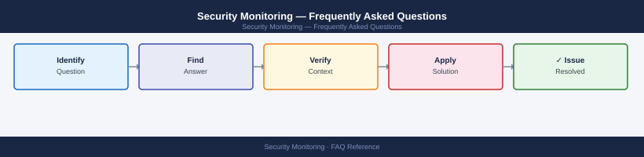

---
tags:
  - security-monitoring
  - faq
  - operations
---
# Security Monitoring — Frequently Asked Questions

*Applies to: All products (Security)*

Common questions about Security Monitoring operations, configuration, and troubleshooting. For step-by-step procedures, see the <a href="index.md">Operations</a> section.

## General

**Q: How do I check the version and coverage of security monitoring tools?**
A: Check SIEM version in admin console. Verify EDR agent coverage: target 100% of managed endpoints. Review log source inventory in SIEM — identify gaps. Check detection rule last-updated dates (stale rules miss new TTPs).

**Q: How do I check the current Security Monitoring version?**
A: `SIEM admin console → System Health → Version`

## Configuration

**Q: What is the default alert severity threshold and when should it change?**
A: Most SIEMs default to alerting on Medium and above. Tune to High/Critical only during initial deployment to reduce noise. Once tuned, lower threshold back to Medium. Never suppress Low severity silently — log them for trend analysis.

**Q: How do I enable threat intelligence feed integration in the SIEM?**
A: Most SIEMs support TAXII/STIX feeds. Configure in SIEM → Threat Intelligence → Add Feed. Use feeds from CISA, ISAC, or commercial providers (Recorded Future, CrowdStrike). Correlate IOCs against log data in detection rules.

## Operations

**Q: How do I upgrade detection rules to cover new MITRE ATT&CK techniques?**
A: Map current rules to ATT&CK framework. Identify coverage gaps. Source new rules from Sigma project or SIEM vendor content packs. Test in a staging SIEM before production deployment. Review for false positive rate before enabling.

**Q: What is the correct procedure to add a new monitored asset?**
A: Install log forwarding agent (Splunk UF, Elastic Agent, Azure Monitor Agent). Configure to forward relevant log sources (security, application, system). Create asset entry in SIEM asset inventory. Verify log ingestion within 24 hours.

## Troubleshooting

**Q: SIEM shows a spike in 'Logon Failure' events from a single source. What does it mean?**
A: Potential brute-force or password spray attack in progress. Immediately check the source IP — if external, block at the firewall. If internal, investigate the source host for malware. Lock the targeted accounts if attack is ongoing.

**Q: SIEM alert queue has thousands of unreviewed alerts — where do I start?**
A: Triage by severity (Critical first). Identify top alert-generating rules and tune false positives. Implement automated enrichment/disposition for known-benign patterns. Consider SOAR for auto-closing low-confidence, high-volume alerts.

## Backup and Recovery

**Q: How often should I back up SIEM detection rules and dashboards?**
A: Export to Git after every rule change. Automate via SIEM API on a weekly schedule. Rules-as-code approach (Sigma, Terraform) provides version history automatically. Test re-import from backup quarterly.

**Q: Can I restore accidentally deleted detection rules without a full SIEM restore?**
A: Yes — from Git: `git checkout HEAD~1 -- rules/`. For Splunk, restore from `$SPLUNK_HOME/etc/apps/` backup. For Sentinel, redeploy ARM template. This is why rules-as-code is essential for any production SIEM.

## See Also

- [Security Monitoring Operations](index.md)
- [Security Monitoring Troubleshooting](../../troubleshooting/index.md)
