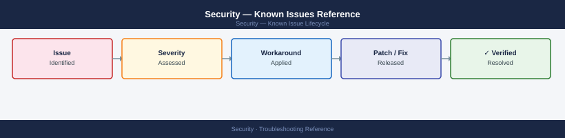

---
tags:
  - troubleshooting
  - security
  - known-issues
description: "Index of security product known issues and error codes. This top-level page links to per-product known-issues catalogs."
---
# Security — Known Issues Reference

<div class="kb-summary">
Index of security product known issues and error codes. This top-level page links to per-product known-issues catalogs.

*Applies to: CyberArk PAM, Venafi TPP, PKI / Certificates*
</div>



```d2
direction: down

symptom: Identify Symptom {shape: diamond}
security_product_knownissues_pages: "Security Product Known-Issues Pages" {shape: rectangle}
resolution: Resolve or Escalate {shape: oval}

symptom -> security_product_knownissues_pages: investigate
security_product_knownissues_pages -> resolution
```

## Before you begin

Security product issues often cascade — a CyberArk CPM failure may stem from an AD authentication issue, which may stem from a certificate expiry. Follow the dependency chain.

## Security Product Known-Issues Pages

| Product | Known Issues |
|---|---|
| CyberArk PAM | [CyberArk — Known Issues](../../products/cyberark/troubleshooting/known-issues/) |
| Venafi TPP | [Venafi — Known Issues](../../products/venafi/troubleshooting/known-issues/) |
| Certificates / PKI | [Certificates — Known Issues](../../certificates/troubleshooting/known-issues/) |

## See also

- [Security — Common Issues](index.md)
