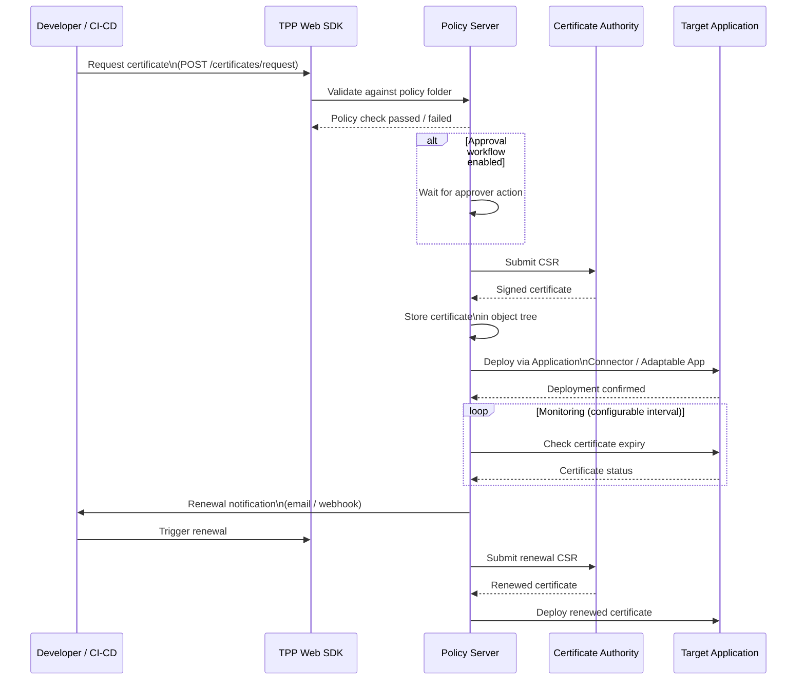

# Venafi — Components

Venafi Trust Protection Platform (TPP) is an enterprise certificate lifecycle management (CLM) solution. It automates the full certificate lifecycle from discovery and request through issuance, deployment, monitoring, and renewal across hybrid and multi-cloud environments.

---

## Platform Architecture Overview

```mermaid
flowchart TB
    subgraph External["External Systems"]
        CA_EXT[("External CAs\n(DigiCert, Entrust,\nSectigo)")]
        CA_INT[("Internal CAs\n(ADCS, EJBCA)")]
        HSM[("HSM / Key\nStorage")]
    end

    subgraph TPP["Venafi TPP Core"]
        PS[Policy Server\n(Engine)]
        SDK[Web SDK / REST API]
        LS[Log Server]

        PS <--> SDK
        PS --> LS
    end

    subgraph Connectors["Connector Framework"]
        CA_CON[CA Connectors]
        APP_CON[Application Drivers\n/ Adaptable Apps]
        DISC[Discovery Engines]
    end

    subgraph Targets["Target Systems"]
        IIS[IIS / Windows]
        F5[F5 / NetScaler]
        K8S[Kubernetes\n(cert-manager)]
        CLOUD[Cloud ACM /\nAzure Key Vault]
    end

    subgraph Clients["Client Interfaces"]
        PVWA_UI[TPP Web UI]
        CLI[VCert CLI]
        API_CLT[REST Clients\n/ CI/CD]
    end

    CA_EXT <--> CA_CON
    CA_INT <--> CA_CON
    HSM <--> PS

    CA_CON --> PS
    APP_CON --> PS
    DISC --> PS

    PS --> APP_CON --> Targets

    Clients --> SDK
```

---

## Core Components

### Policy Server (Engine)

The Policy Server is the central orchestration service of TPP. It enforces certificate policy, manages the object model (Policy Folders, Certificate objects), and coordinates all lifecycle operations.

| Attribute | Detail |
|---|---|
| Service name | `VenafiPolicyServer` (Windows service) |
| Default port | 443 (HTTPS via IIS) |
| Object model | Tree-based Policy Folders → Certificate objects |
| Data store | Microsoft SQL Server (2016 SP2 minimum) |
| Authentication | LDAP/AD, local accounts, OAuth2 (client credentials) |

Key responsibilities:

- Enforcing naming, SAN, validity, and key algorithm policies per Policy Folder
- Routing certificate requests to the appropriate CA
- Triggering renewal workflows based on expiry thresholds
- Evaluating approval workflows before submission to CA

### Web SDK (REST API)

The Web SDK exposes all TPP functionality as a RESTful API. It is the primary integration point for CI/CD pipelines, VCert CLI, and third-party systems.

| Endpoint Base | Purpose |
|---|---|
| `/vedsdk/authorize/` | Obtain OAuth2 token |
| `/vedsdk/certificates/` | Create, retrieve, revoke certificates |
| `/vedsdk/config/` | Read/write policy folder attributes |
| `/vedsdk/discovery/` | Trigger and retrieve discovery results |
| `/vedsdk/credentials/` | Manage CA and application credentials |
| `/vedsdk/log/` | Write and retrieve audit log entries |

API authentication example:

```bash
# Obtain an OAuth2 access token
TOKEN=$(curl -s -X POST https://tpp.corp.example.com/vedauth/authorize/oauth \
  -H "Content-Type: application/json" \
  -d '{
    "client_id": "vcert-ci",
    "username":   "svc-venafi",
    "password":   "VaultPassword",
    "scope":      "certificate:manage,delete"
  }' | jq -r '.access_token')

# Request a certificate
curl -s -X POST https://tpp.corp.example.com/vedsdk/certificates/request \
  -H "Authorization: Bearer $TOKEN" \
  -H "Content-Type: application/json" \
  -d '{
    "PolicyDN": "\\VED\\Policy\\Corp\\Servers",
    "Subject": "server01.corp.example.com",
    "SubjectAltNames": [{"TypeName":"DNS","Name":"server01.corp.example.com"}],
    "KeyLength": 2048
  }'
```

### Log Server

The Log Server aggregates events from all TPP components into a central, searchable audit trail.

- Receives events from the Policy Server, CA connectors, and application drivers
- Stores events in the TPP SQL database
- Feeds into SIEM integrations (Splunk, QRadar) via syslog or REST
- Provides the audit log in the TPP Web UI under **Monitor → Log**

### Adaptable Applications

Adaptable Applications (also called Application Drivers) are PowerShell-based plugins that extend TPP to deploy certificates to target systems that do not have a native connector.

- Written in PowerShell (Adaptable App framework)
- Stored in: `C:\Program Files\Venafi\Scripts\AdaptableApp\`
- Executed by the Policy Server after certificate issuance
- Support pre- and post-issuance hooks for validation and deployment

Example use cases: deploy certificates to custom web servers, update secrets in HashiCorp Vault, push keys to IoT devices.

### Connector Framework

Connectors link TPP to external CAs and target application platforms. There are two connector types:

**CA Connectors** manage the submission and retrieval of certificate requests to CAs:

| CA Type | Connector |
|---|---|
| Microsoft ADCS | Microsoft CA connector (built-in) |
| DigiCert CertCentral | DigiCert connector (built-in) |
| Entrust | Entrust connector (built-in) |
| EJBCA | EJBCA connector (marketplace) |
| HashiCorp Vault PKI | Adaptable CA (PowerShell) |

**Application Connectors** deploy issued certificates to target platforms:

| Platform | Connector |
|---|---|
| IIS (Windows) | IIS connector (built-in) |
| F5 BIG-IP | F5 connector (built-in) |
| NetScaler / ADC | Citrix connector (built-in) |
| Apache / NGINX | Agent-based (VCert) |
| Kubernetes | cert-manager + Venafi issuer or VCert |
| AWS ACM | AWS connector (built-in) |
| Azure Key Vault | Azure connector (built-in) |

---

## Certificate Lifecycle Flow



---

## VCert CLI

VCert is the open-source CLI tool for interacting with TPP (and Venafi as a Service) from workstations and CI/CD pipelines.

```bash
# Authenticate
vcert getcred \
  --url https://tpp.corp.example.com \
  --username svc-venafi \
  --password "VaultPassword" \
  --format json > ~/.vcert/token.json

# Request and retrieve a certificate
vcert enroll \
  --url https://tpp.corp.example.com \
  --token $(jq -r '.access_token' ~/.vcert/token.json) \
  --zone "Corp\\Servers" \
  --cn "server01.corp.example.com" \
  --san-dns "server01.corp.example.com" \
  --key-type rsa \
  --key-size 2048 \
  --format pemfile \
  --file /etc/ssl/server01

# Renew an existing certificate
vcert renew \
  --url https://tpp.corp.example.com \
  --token $(jq -r '.access_token' ~/.vcert/token.json) \
  --id "\VED\Policy\Corp\Servers\server01.corp.example.com"
```

---

## Discovery Engine

The Discovery Engine scans network ranges and endpoints for installed TLS certificates, identifying unmanaged or expiring certificates.

| Discovery Type | Method | Use Case |
|---|---|---|
| Network scan | Port scanning (443, 8443, etc.) | Find unknown certificates on-prem |
| Agent-based | VCert agent on hosts | Precise inventory including non-443 ports |
| Import from CA | API pull from known CAs | Reconcile CA-issued vs TPP-managed |
| Cloud | API scan of ACM, AKV, GCP | Cloud certificate inventory |

---

## Deployment Reference

| Component | Install Location | Typical Server Role |
|---|---|---|
| Policy Server | `C:\Program Files\Venafi\` | Dedicated Windows Server VM |
| SQL Database | SQL Server instance | Dedicated or shared SQL cluster |
| Web SDK | IIS on Policy Server host | Collocated with Policy Server |
| Log Server | Collocated or separate | Part of Policy Server install |
| VCert Agent | Target host | Deployed via configuration mgmt |
| Secondary TPP | Separate VM | Active/passive HA pair |

### Minimum SQL Server Requirements

| Parameter | Requirement |
|---|---|
| SQL Server Version | 2016 SP2 or later (2019 recommended) |
| Collation | SQL_Latin1_General_CP1_CI_AS |
| Authentication | SQL auth or Windows auth (preferred) |
| Database size (initial) | 10 GB (grows with certificate volume) |
| TempDB | 4 files, pre-sized to 4 GB each |
