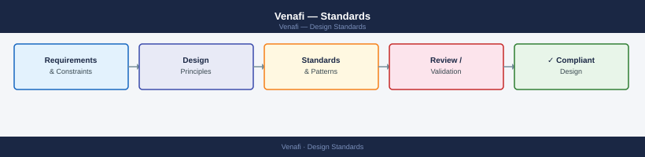
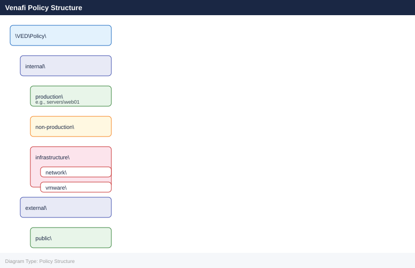
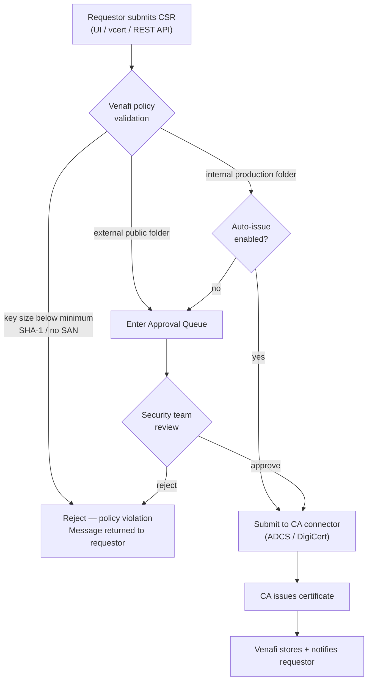

---
tags:
  - architecture
  - security
---
# Venafi — Standards


<div class="kb-summary">
Certificate policy standards enforced through the Venafi policy tree. All certificates issued through Venafi must comply with these standards. Non-compliant requests are rejected at the policy folder level.

*Applies to: Venafi TLS Protect*
</div>



---

```d2
direction: down

policy_tree_naming_conventions: "Policy Tree Naming Conventions" {shape: rectangle}
key_algorithm_standards: "Key Algorithm Standards" {shape: rectangle}
validity_period_standards: "Validity Period Standards" {shape: rectangle}
subject_and_san_requirements: "Subject and SAN Requirements" {shape: rectangle}
wildcard_certificate_policy: "Wildcard Certificate Policy" {shape: rectangle}
certificate_request_workflow: "Certificate Request Workflow" {shape: rectangle}

policy_tree_naming_conventions -> key_algorithm_standards: hardens
key_algorithm_standards -> validity_period_standards: hardens
validity_period_standards -> subject_and_san_requirements: hardens
subject_and_san_requirements -> wildcard_certificate_policy: hardens
wildcard_certificate_policy -> certificate_request_workflow: hardens
```

## Before you begin

- **Access:** Admin credentials on all affected systems
- **Change management:** security changes require CAB approval in most environments
- **Rollback plan:** document current state before any security control change
- **Testing:** validate in a non-production environment first where possible

---

## Policy Tree Naming Conventions

Policy folders use lowercase-hyphenated names. Certificate objects (leaf nodes) use the FQDN as the object name.



Certificate object naming within a folder: `<fqdn>` (e.g., `app01.corp.example.com`). For wildcard certificates: `wildcard.<domain>` (e.g., `wildcard.corp.example.com`). No spaces or special characters in object names.

---

## Key Algorithm Standards

| Usage | Algorithm | Minimum Key Size |
|---|---|---|
| Server / service certificates | RSA | 4096 bits |
| Server / service certificates | ECDSA | P-256 (NIST secp256r1) |
| Code signing | RSA | 4096 bits |
| User / client certificates | RSA | 2048 bits minimum; 4096 preferred |
| CA certificates (Issuing CA) | RSA | 4096 bits |
| CA certificates (Root CA) | RSA | 4096 bits |

RSA-2048 is accepted for user/client certificates only. RSA-2048 server certificates are rejected by Venafi policy for internal production and all external certificates.

SHA-256 is the minimum hash algorithm. SHA-1 certificates are blocked at the policy level.

---

## Validity Period Standards

| Certificate Type | Maximum Validity | Renewal Window |
|---|---|---|
| Internal — Production | 2 years | 30 days before expiry |
| Internal — Non-production | 3 years | 30 days before expiry |
| External / Public-facing | 1 year | 30 days before expiry |
| Internal CA (Issuing) | 10 years | Renew 12 months before expiry |
| Root CA | 20 years | Renew 24 months before expiry |
| Code signing | 1 year | 30 days before expiry |

Note: CA/Browser Forum mandates a maximum 398-day (roughly 13-month) validity for publicly trusted TLS certificates. Venafi policy enforces 365-day maximum for all external certificates to allow headroom.

---

## Subject and SAN Requirements

| Field | Requirement |
|---|---|
| Common Name (CN) | Must be the primary FQDN or service name |
| Subject Alternative Name | Mandatory on all certificates |
| CN must appear in SAN | Yes — CN alone is not accepted by modern browsers/clients |
| IP SANs | Permitted for infrastructure; must be in addition to DNS SAN |
| Email SANs | Only for S/MIME or user certificates |
| Organisation (O) | Required for OV and EV certificates |
| Country (C) | Required for OV and EV certificates |

Venafi policy rejects CSRs where:
- No SAN extension is present
- The CN is not also listed as a DNS SAN
- The SAN contains an internal hostname (`*.local`, `*.internal`) in an external policy folder

---

## Wildcard Certificate Policy

| Scope | Policy |
|---|---|
| Internal production | Permitted with documented justification |
| Internal non-production | Permitted |
| External / public-facing | Restricted — explicit approval required |
| External wildcard for `*.com` TLD | Prohibited |

Wildcard approval process (external):
1. Requestor submits a certificate request with business justification.
2. Security team reviews and approves or rejects within 5 business days.
3. Approved wildcards are subject to annual review.
4. Approved wildcards must be onboarded to CyberArk for private key protection.

---

## Certificate Request Workflow

### Certificate Request Decision Flow



### Internal Production (Auto-Issue)

```text
Requestor submits CSR via Venafi UI or API
         |
         v
Venafi validates against folder policy
  (key size, hash, SAN, validity)
         |
    Pass: auto-submit to ADCS
    Fail: reject with policy violation message
         |
         v
ADCS issues certificate
         |
         v
Venafi stores certificate, notifies requestor
```

### External Public (Manual Approval)

```text
Requestor submits CSR via Venafi UI or API
         |
         v
Venafi validates against folder policy
         |
         v
Certificate request enters Approval Queue
         |
         v
Security team reviews and approves/rejects
         |
    Approved: Venafi submits to DigiCert connector
    Rejected: requestor notified with reason
         |
         v
DigiCert performs DV/OV validation and issues
         |
         v
Venafi stores certificate, notifies requestor
```

---

## Private Key Handling

| Scenario | Standard |
|---|---|
| Key generated by requestor | Private key stays on origin host; only CSR sent to Venafi |
| Key generated by Venafi | Venafi generates key, stores encrypted copy; key exported once to requestor |
| Key export from Venafi | Requires `Safe` permission level in Venafi RBAC; logged as audit event |
| Production server keys | Never exported or stored outside of the origin host and CyberArk (if applicable) |

Keys for high-value services (CA certificates, wildcard certificates, code signing) must be stored in an HSM or managed within CyberArk with controlled retrieval.

---

## Policy Configuration

## Purpose

Use this page for practical Venafi Policy notes, checks, troubleshooting, commands, change notes, and field references.

## Common checks

- Confirm current health
- Review active alerts
- Check recent changes
- Confirm dependencies
- Check logs, events, and monitoring
- Capture current state before changes

## Incident notes

Capture:

- Symptom
- Start time
- Impact
- System or service name
- Error message
- What changed
- What was checked
- Next action

## Change notes

- Confirm change approval
- Confirm maintenance window
- Confirm rollback plan
- Capture current state
- Make one change at a time
- Validate after the change

## Useful commands

Add tested commands here.

## Known issues

Add known issues here as they come up.
