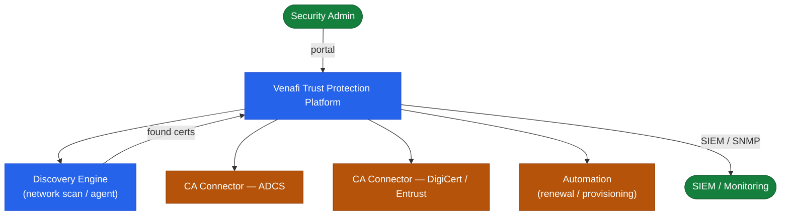
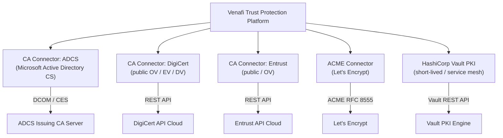
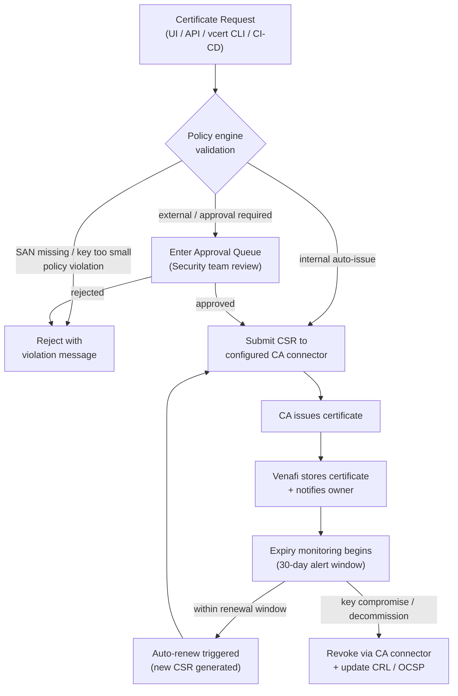
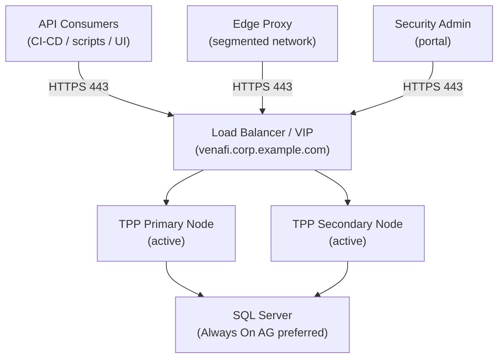

# Venafi — How It Works


<div class="kb-summary">
Venafi Trust Protection Platform (TPP) is the enterprise certificate lifecycle management system. It enforces certificate policy, integrates with multiple CA backends, automates renewal, and provides visibility across all managed certificates.
</div>
```text
┌───────────────────────────── Security Venafi Architecture — How It Works ─────────────────────────────┐
│                                                                                                       │
│   ┌───────────────────────────────────────────────────────────────────────────────────────────────┐   │
│   │      Venafi operational flow: request → controller → data service → host acknowledgement      │   │
│   │           Data path: host I/O → Venafi controller → storage media → persistent write          │   │
│   │ Management: Security Venafi Architecture management console provides unified control for all  │   │
│   │           Protection: snapshots, replication, and redundancy ensure data durability           │   │
│   └───────────────────────────────────────────────────────────────────────────────────────────────┘   │
│                                                                                                       │
│    Host I/O → Venafi controller → storage media → acknowledge → replicate                             │
│                                                                                                       │
│                  ▼                                ▼                                ▼                  │
│                                                                                                       │
│   ┌─────────────────────────────┐  ┌─────────────────────────────┐  ┌─────────────────────────────┐   │
│   │            Layer            │  │          Component          │  │            Notes            │   │
│   │             Core            │  │       Primary service       │  │        Main function        │   │
│   │          Management         │  │        Control plane        │  │         Admin access        │   │
│   │          Monitoring         │  │         Health/perf         │  │      Alerts/dashboards      │   │
│   │           Security          │  │         Auth/encrypt        │  │        Access control       │   │
│   │         Integration         │  │        APIs/plug-ins        │  │         Third-party         │   │
│   └─────────────────────────────┘  └─────────────────────────────┘  └─────────────────────────────┘   │
│                                                                                                       │
│                          ▼                                                 ▼                          │
│                                                                                                       │
│   ┌───────────────────────────────────────────────────────────────────────────────────────────────┐   │
│   │      Layer       │    Component     │      Function     │      Notes       │       Auth       │   │
│   │       Core       │ Primary service  │   Main function   │     See docs     │       RBAC       │   │
│   │    Management    │  Control plane   │    Admin access   │     See docs     │       RBAC       │   │
│   │    Monitoring    │   Health/perf    │  Alerts/dashboard │     See docs     │       RBAC       │   │
│   │     Security     │   Auth/encrypt   │   Access control  │     See docs     │       RBAC       │   │
│   └───────────────────────────────────────────────────────────────────────────────────────────────┘   │
│                                                                                                       │
│    Physical: Security Venafi Architecture infrastructure · management network · monitoring            │
│                                                                                                       │
│    Key terms:                                                                                         │
│                                                                                                       │
│    Venafi             = Security Venafi Architecture platform overview and core concepts              │
│    Management         = management console and command-line interface for administration              │
│    Monitoring         = health and performance monitoring dashboards and alerting                     │
│    Automation         = REST API, scripting, and pipeline integration capabilities                    │
│    Security           = access control, authentication, and encryption configuration                  │
│    Backup             = backup and recovery procedures and schedule configuration                     │
│    Upgrade            = software version upgrades and firmware patching procedures                    │
│    Troubleshooting    = diagnostic procedures and common issue resolution steps                       │
│    Escalation         = vendor support escalation path and severity triage process                    │
│    Documentation      = vendor knowledge base and official product documentation                      │
│    Change management  = change ticket requirements for production modifications                       │
│    Audit log          = admin action logging for compliance and security review                       │
│                                                                                                       │
└───────────────────────────────────────────────────────────────────────────────────────────────────────┘
```


 The SaaS equivalent is Venafi as a Service (VaaS / TLS Protect Cloud).

---

## Component Overview

| Component | Role | Deployment |
|---|---|---|
| Policy Server | Lifecycle management, CA integration, policy enforcement | On-prem VM (primary + secondary) |
| Edge Proxy | Certificate discovery across segmented networks | Lightweight on-prem agent |
| Log Server | Audit event aggregation and SIEM forwarding | On-prem VM or syslog target |
| VaaS / TLS Protect Cloud | SaaS alternative to TPP | Hosted by Venafi |
| CA Connectors | Integration adapters for ADCS, DigiCert, Entrust | Configured on Policy Server |
| Venafi SDK / REST API | Automation and integration interface | Consumed by CI/CD and scripts |

---

## Trust Protection Platform Topology



---

## Policy Tree Structure

The Venafi policy tree (`\VED\Policy\`) organises certificates into folders that apply inheritance-based policy. Certificates inherit policy settings from parent folders unless explicitly overridden.

```text
\VED\Policy\
├── Internal\
│   ├── Production\
│   │   ├── Servers\
│   │   └── Services\
│   ├── Non-Production\
│   │   ├── Dev\
│   │   └── Test\
│   └── Infrastructure\
│       ├── Network\
│       └── VMware\
└── External\
    ├── Public\
    └── Partners\
```

Policy folder settings:

- CA template / connector to use for issuance
- Validity period and renewal window
- Key algorithm and minimum key size
- Required SANs and prohibited wildcard usage
- Approval workflow (auto-issue vs. manual approval)
- Notification contacts for expiry alerts

---

## CA Connectors

| CA Type | Connector | Notes |
|---|---|---|
| Microsoft ADCS | ADCS connector (built-in) | Requires CES/CEP or direct RPC access to CA |
| DigiCert | DigiCert connector | Requires DigiCert API key; supports OV/EV/DV |
| Entrust | Entrust connector | Requires Entrust API key and client credentials |
| Let's Encrypt | ACME connector | HTTP-01 or DNS-01 challenge; requires accessible validation endpoint |
| Internal standalone CA | Generic PKCS#10 / SCEP | For CAs without a native connector |



---

## Certificate Lifecycle Flow



---

## High Availability

Venafi TPP is deployed as a primary + secondary pair sharing a common Microsoft SQL Server backend.



Both nodes are active; the load balancer distributes requests. SQL Server is the single source of truth — both nodes are stateless with respect to certificate data. If one node fails, the load balancer routes all traffic to the remaining node.

```powershell
Get-Service -Name "Venafi*" | Select-Object Name, Status
Test-NetConnection -ComputerName sql01.corp.example.com -Port 1433
```

---

## Network Requirements

| Source | Destination | Port | Purpose |
|---|---|---|---|
| TPP Policy Server | ADCS (CES endpoint) | TCP 443 | Certificate enrolment |
| TPP Policy Server | DigiCert / Entrust APIs | TCP 443 | External CA issuance |
| TPP Policy Server | SQL Server | TCP 1433 | Database backend |
| Edge Proxy | TPP Policy Server | TCP 443 | Proxy registration and data sync |
| Admin / CI-CD | TPP Policy Server | TCP 443 | REST API and web UI |
| TPP Log Server | Splunk / SIEM | TCP 514 / 6514 | Syslog event forwarding |

---

## REST API Access

Venafi TPP exposes a REST API at `https://<tpp-fqdn>/vedsdk/`.

```powershell
# Authenticate and get API key
$body = @{ Username = "svc-venafi-api"; Password = "password" } | ConvertTo-Json
$response = Invoke-RestMethod -Uri "https://venafi.corp.example.com/vedauth/authorize" `
  -Method Post -ContentType "application/json" -Body $body
$apiKey = $response.APIKey

# Request a certificate
$certRequest = @{
    PolicyDN = "\\VED\\Policy\\Internal\\Production\\Servers"
    Subject  = "app01.corp.example.com"
    SubjectAltNames = @(
        @{ TypedName = "dns:app01.corp.example.com" },
        @{ TypedName = "dns:app01-internal.corp.example.com" }
    )
} | ConvertTo-Json -Depth 5

Invoke-RestMethod -Uri "https://venafi.corp.example.com/vedsdk/Certificates/Request" `
  -Headers @{ "X-Venafi-API-Key" = $apiKey } `
  -Method Post -ContentType "application/json" -Body $certRequest
```
