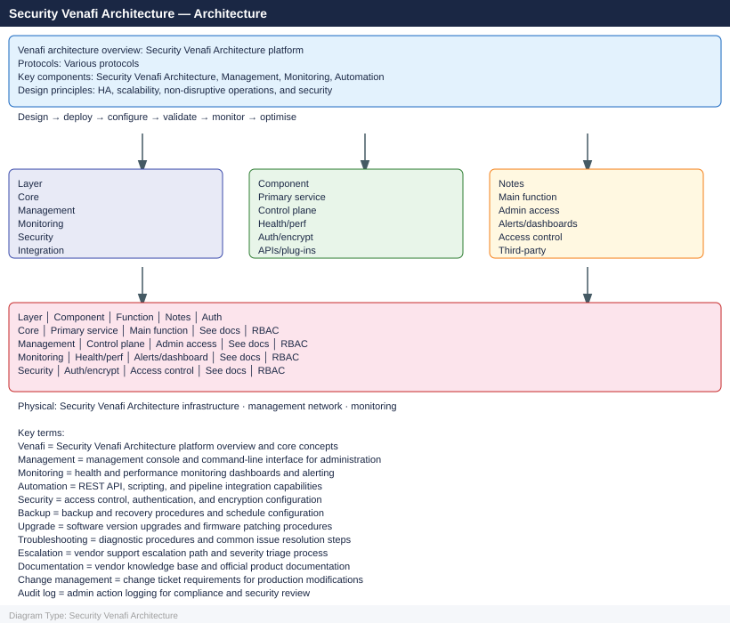
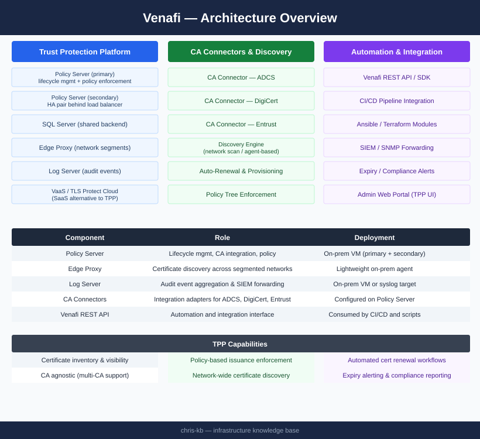
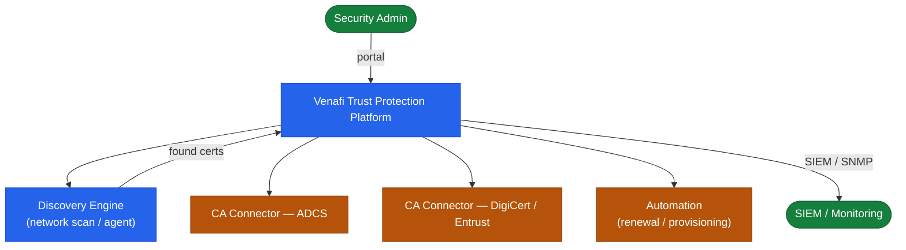

---
tags:
  - architecture
  - security
---
# Venafi — Architecture

Enterprise certificate lifecycle management — TPP enforces policy, integrates with ADCS and commercial CAs, automates renewal via CA connectors, and provides visibility across all managed certificates; SQL Server-backed HA pair behind a load balancer.

*Applies to: Venafi TLS Protect*

<a class="kb-card" href="how-it-works/">
  <strong>How It Works</strong>
  Policy tree, CA connectors, certificate lifecycle, HA topology, and network requirements.
</a>

<a class="kb-card" href="integrations/">
  <strong>Integrations</strong>
  Integration with other platforms and external systems.
</a>

<a class="kb-card" href="design-standards/">
  <strong>Design Standards</strong>
  Sizing guidelines, design standards, and best practices.
</a>

## Component Overview

| Component | Role | Deployment |
|---|---|---|
| Policy Server | Lifecycle management, CA integration, policy enforcement | On-prem VM (primary + secondary) |
| Edge Proxy | Certificate discovery across segmented networks | Lightweight on-prem agent |
| Log Server | Audit event aggregation and SIEM forwarding | On-prem VM or syslog target |
| VaaS / TLS Protect Cloud | SaaS alternative to TPP | Hosted by Venafi |
| CA Connectors | Integration adapters for ADCS, DigiCert, Entrust | Configured on Policy Server |
| Venafi SDK / REST API | Automation and integration interface | Consumed by CI/CD and scripts |

## Trust Protection Platform Topology

