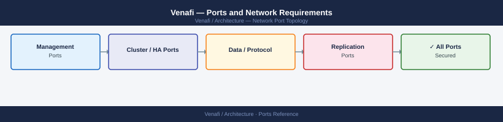

---
tags:
  - venafi
  - certificates
  - pki
  - networking
  - firewall
  - ports
  - security
---
# Venafi — Ports and Network Requirements

<div class="kb-summary">
Firewall port reference for Venafi Trust Protection Platform (TPP). Covers the TPP server, satellite (remote engine), outbound CA integrations, and certificate deployment to managed endpoints.

*Applies to: Venafi Trust Protection Platform 22.x+*
</div>



## Before you begin

- TPP runs as a Windows service; the primary UI and API endpoint is HTTPS/443 (Aperture web console and REST API)
- Satellite (remote engine) reduces the number of outbound firewall holes needed from TPP to remote endpoints — deploy Satellites in remote sites so only Satellite-to-TPP (443 outbound) is needed from the remote site
- CA integration uses either HTTPS (for REST-based CAs and external CAs) or DCOM/RPC (for Microsoft ADCS — hard to firewall through a perimeter)
- Certificate deployment to endpoints is outbound from TPP or Satellite — the endpoint does not connect to TPP

---

## Inbound — Client to TPP

| Port | Protocol | Source | Purpose |
|---|---|---|---|
| 443 | TCP | Admin browsers | Aperture web console — certificate lifecycle management UI |
| 443 | TCP | API clients, automation, DevOps pipelines | Venafi REST API (tokens, certificate requests, renewals) |
| 443 | TCP | Venafi agents on endpoints | Adaptable agents report certificate status back to TPP |

---

## TPP to Microsoft ADCS (Active Directory Certificate Services)

Microsoft CA integration requires DCOM/RPC for the default plugin; REST/HTTPS if using ADCS Web Enrollment.

| Port | Protocol | Source | Destination | Purpose |
|---|---|---|---|---|
| 443 | TCP | TPP | ADCS CA host | ADCS Web Enrollment (if REST enrollment is configured) |
| 135 | TCP | TPP | ADCS CA host | DCOM/RPC endpoint mapper |
| 49152–65535 | TCP | TPP | ADCS CA host | Dynamic RPC (ADCS DCOM channel for certificate issuance) |

---

## TPP to External / Public CAs

| Port | Protocol | Destination | Purpose |
|---|---|---|---|
| 443 | TCP | DigiCert, Entrust, Sectigo, GlobalSign APIs | Public CA REST API — request, download, renew certificates |
| 443 | TCP | OCSP endpoints (*.ocsp.digicert.com, etc.) | OCSP revocation status check |
| 80 | TCP | CRL distribution points | CRL download (HTTP CRL URLs in certificate CDP extensions) |

---

## TPP to Active Directory / LDAP

| Port | Protocol | Destination | Purpose |
|---|---|---|---|
| 389 | TCP | Active Directory DCs | LDAP — admin user authentication and permission sync |
| 636 | TCP | Active Directory DCs | LDAPS (recommended) |
| 88 | TCP/UDP | Active Directory DCs | Kerberos |
| 3268 | TCP | Active Directory DCs | Global Catalog |

---

## TPP / Satellite to Certificate Endpoints (Deployment)

TPP or Satellite pushes renewed certificates to managed endpoints. Open the relevant port from TPP/Satellite IP to each endpoint type.

| Port | Protocol | Source | Destination | Purpose |
|---|---|---|---|---|
| 443 | TCP | TPP / Satellite | F5 BIG-IP, Citrix ADC, A10, NSX | Load balancer REST API — certificate push |
| 443 | TCP | TPP / Satellite | VMware, PAN-OS, Cisco ASA via REST | Network device certificate push |
| 22 | TCP | TPP / Satellite | Linux web servers | SSH — certificate and key file copy (nginx, Apache) |
| 5985/5986 | TCP | TPP / Satellite | Windows web servers | WinRM — certificate import to Windows certificate store |
| 3389 | TCP | TPP / Satellite | Windows servers | RDP (legacy IIS deployments — replaced by WinRM in modern TPP) |

---

## Satellite (Remote Engine) to TPP

Satellites initiate outbound connections to TPP — no inbound to Satellite required from TPP.

| Port | Protocol | Source | Destination | Purpose |
|---|---|---|---|---|
| 443 | TCP | Satellite | TPP primary server | Registration, job polling, result reporting |

---

## TPP Database

| Port | Protocol | Source | Destination | Purpose |
|---|---|---|---|---|
| 1433 | TCP | TPP server | SQL Server (TPP database) | TPP configuration and certificate metadata DB |

---

## Outbound — TPP to External Services

| Port | Protocol | Destination | Purpose |
|---|---|---|---|
| 443 | TCP | *.venafi.com | License check, platform updates |
| 25 | TCP | SMTP relay | Email notifications for expiry alerts, approvals |
| 514 | UDP/TCP | Syslog server | Audit and event log forwarding |

---

## Firewall Zone Summary

| From | To | Ports | Notes |
|---|---|---|---|
| Admin browsers / API clients | TPP server | 443 | Aperture UI and REST API |
| TPP | ADCS CA | 135, 49152-65535 | DCOM for MS CA — restrict range where possible |
| TPP | Public CA APIs | 443 | DigiCert, Entrust, etc. |
| TPP / Satellite | Linux endpoints | 22 | Certificate deployment via SSH |
| TPP / Satellite | Windows endpoints | 5985/5986 | WinRM — preferred for Windows |
| TPP / Satellite | Load balancers | 443 | REST API certificate push |
| Satellite | TPP | 443 | Outbound only — Satellite initiates |
| TPP | SQL Server | 1433 | TPP database |
| TPP | Active Directory | 389/636, 88 | Admin auth |

---

## Verify

```bash
# From admin workstation — test TPP Aperture UI
curl -sk -o /dev/null -w "%{http_code}" https://<tpp-server>/aperture/

# From TPP server — test AD connectivity
nc -zv <dc-ip> 636

# From TPP / Satellite — test ADCS CA connectivity
Test-NetConnection -ComputerName <adcs-ca-hostname> -Port 443

# From TPP / Satellite — test Linux endpoint SSH
nc -zv <linux-web-server> 22

# From Satellite — test TPP connectivity (443)
curl -sk -o /dev/null -w "%{http_code}" https://<tpp-server>/vedauth/authorize/

# From TPP server — test SQL DB
Test-NetConnection -ComputerName <sql-server> -Port 1433
```

---

## See also

- [Venafi — Architecture](how-it-works/)
- [Venafi — Operations](../operations/)
- [Certificates — Architecture](../../certificates/architecture/)
- [Active Directory — Ports](../../../compute/windows-server/active-directory/architecture/ports.md)
