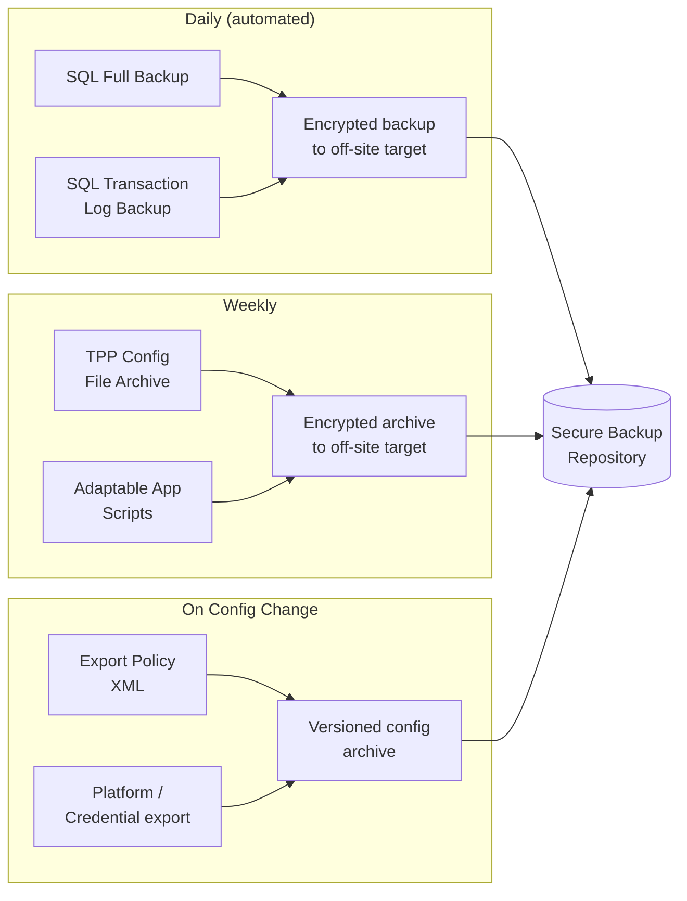
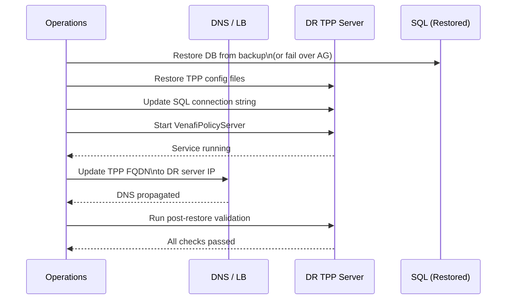

# Venafi — Backup & Restore


<div class="kb-summary">
Venafi TPP state lives in two places: the SQL Server database and the application configuration on the TPP server. Both must be backed up and restorable independently. This page covers the full backup lifecycle, restore procedure, DR failover, and post-restore validation.
</div>

---

## What to Back Up

| Component | Contains | Backup Method |
|---|---|---|
| SQL Server database | Certificate objects, policies, audit log, credentials | SQL Server native backup / Always On |
| TPP application config | `web.config`, `VenafiPolicy.xml`, custom scripts | File system backup |
| Adaptable App scripts | PowerShell application drivers | `C:\Program Files\Venafi\Scripts\` |
| CA connector credentials | Private keys and passwords for CA integration | SQL DB (encrypted) + config export |
| TLS certificate (TPP web UI) | Certificate serving the TPP HTTPS endpoint | PFX export |
| License file | `LicenseFile.xml` | File system backup |

---

## Backup Workflow



---

## SQL Server Database Backup

### Full Database Backup (T-SQL)

```sql
-- Full backup of the TPP database
BACKUP DATABASE [VenafiTPP]
TO DISK = N'\\backup-srv\Venafi\VenafiTPP_Full_20260508.bak'
WITH
    COMPRESSION,
    CHECKSUM,
    STATS = 10,
    NAME = N'VenafiTPP Full Backup';

-- Verify the backup is readable
RESTORE VERIFYONLY
FROM DISK = N'\\backup-srv\Venafi\VenafiTPP_Full_20260508.bak'
WITH CHECKSUM;
```

### Transaction Log Backup (for point-in-time recovery)

```sql
-- Run every 15–30 minutes in production
BACKUP LOG [VenafiTPP]
TO DISK = N'\\backup-srv\Venafi\VenafiTPP_Log_20260508_1400.bak'
WITH COMPRESSION, CHECKSUM;
```

### SQL Server Agent Job — Automated Backup

```sql
-- Create a SQL Agent job to run the full backup nightly at 01:00
EXEC msdb.dbo.sp_add_job
    @job_name = N'Venafi TPP - Nightly Full Backup';

EXEC msdb.dbo.sp_add_jobstep
    @job_name = N'Venafi TPP - Nightly Full Backup',
    @step_name = N'Full backup',
    @subsystem = N'TSQL',
    @command = N'BACKUP DATABASE [VenafiTPP]
                 TO DISK = N''\\backup-srv\Venafi\VenafiTPP_Full_'' +
                           CONVERT(varchar,GETDATE(),112) + ''.bak''
                 WITH COMPRESSION, CHECKSUM;';

EXEC msdb.dbo.sp_add_schedule
    @schedule_name = N'Venafi Daily 01:00',
    @freq_type = 4,
    @freq_interval = 1,
    @active_start_time = 010000;

EXEC msdb.dbo.sp_attach_schedule
    @job_name = N'Venafi TPP - Nightly Full Backup',
    @schedule_name = N'Venafi Daily 01:00';

EXEC msdb.dbo.sp_add_jobserver
    @job_name = N'Venafi TPP - Nightly Full Backup';
```

### SQL Server Always On (HA/DR alternative)

For production environments, use SQL Server Always On Availability Groups as the primary DR mechanism for the database:

```sql
-- Check AG health
SELECT
    ag.name                  AS AGName,
    ar.replica_server_name   AS Replica,
    ars.role_desc            AS Role,
    ars.synchronization_health_desc AS SyncHealth
FROM sys.availability_groups ag
JOIN sys.availability_replicas ar ON ag.group_id = ar.group_id
JOIN sys.dm_hadr_availability_replica_states ars ON ar.replica_id = ars.replica_id;
```

---

## Application Configuration Backup

### Back Up TPP Configuration Files

```powershell
$BackupDate = Get-Date -Format 'yyyy-MM-dd'
$BackupRoot = "\\backup-srv\Venafi\Config\$BackupDate"
New-Item -ItemType Directory -Path $BackupRoot -Force

# Stop TPP service for consistent config snapshot (optional — files can be copied hot)
Stop-Service VenafiPolicyServer -Force

$TPPRoot = "C:\Program Files\Venafi"

# Core configuration
Copy-Item "$TPPRoot\Config\*"                "$BackupRoot\Config\"  -Recurse -Force
Copy-Item "$TPPRoot\Website\web.config"      "$BackupRoot\"         -Force
Copy-Item "$TPPRoot\LicenseFile.xml"         "$BackupRoot\"         -Force

# Adaptable App and CA scripts
Copy-Item "$TPPRoot\Scripts\"                "$BackupRoot\Scripts\" -Recurse -Force

# IIS application pool and site configuration
& "$env:windir\system32\inetsrv\appcmd.exe" list site /xml > "$BackupRoot\IIS-sites.xml"
& "$env:windir\system32\inetsrv\appcmd.exe" list apppool /xml > "$BackupRoot\IIS-apppools.xml"

Start-Service VenafiPolicyServer

Write-Host "TPP config backup complete: $BackupRoot"
```

### Export Policy XML via TPP API

```bash
TOKEN=$(curl -s -X POST https://tpp.corp.example.com/vedauth/authorize/oauth \
  -H "Content-Type: application/json" \
  -d '{"client_id":"backup-client","username":"svc-venafi-backup","password":"<password>","scope":"configuration:manage"}' \
  | jq -r '.access_token')

# Export the full policy tree
curl -s -H "Authorization: Bearer $TOKEN" \
  "https://tpp.corp.example.com/vedsdk/config/readeffectivepolicy?ObjectDN=%5CVED%5CPolicy" \
  -o venafi-policy-export-$(date +%Y%m%d).json

curl -s -X POST https://tpp.corp.example.com/vedauth/revoke/token \
  -H "Authorization: Bearer $TOKEN"
```

---

## Certificate and Key Backup

Certificates managed by TPP are stored in the SQL database (metadata and optionally private keys). Ensure the following:

```powershell
# Verify that private key archival is enabled on the CA template in TPP
# PVWA Web UI: Policy Folder → Properties → Certificate → Key Management → Store Private Keys: Enabled

# Export a specific managed certificate (including private key) via REST
$CertDN = "\VED\Policy\Corp\Servers\server01.corp.example.com"
$Encoded = [System.Web.HttpUtility]::UrlEncode($CertDN)

$Body = @{
    CertificateDN  = $CertDN
    Format         = "PKCS #12"
    Password       = "ExportPassphrase"
    IncludeChain   = $true
    IncludePrivateKey = $true
} | ConvertTo-Json

curl -s -X POST "https://tpp.corp.example.com/vedsdk/certificates/retrieve" \
  -H "Authorization: Bearer $TOKEN" \
  -H "Content-Type: application/json" \
  -d $Body \
  --output server01.pfx
```

---

## Restore Procedure

### Step 1 — Restore the SQL Database

```sql
-- Restore from full backup (with tail-log backup if DB is still accessible)
RESTORE DATABASE [VenafiTPP]
FROM DISK = N'\\backup-srv\Venafi\VenafiTPP_Full_20260508.bak'
WITH
    MOVE N'VenafiTPP'     TO N'C:\SQLData\VenafiTPP.mdf',
    MOVE N'VenafiTPP_log' TO N'C:\SQLLogs\VenafiTPP.ldf',
    NORECOVERY,           -- leave in restoring state if applying log backups
    STATS = 10;

-- Apply transaction log backups for point-in-time recovery
RESTORE LOG [VenafiTPP]
FROM DISK = N'\\backup-srv\Venafi\VenafiTPP_Log_20260508_1400.bak'
WITH NORECOVERY;

-- Final recovery
RESTORE DATABASE [VenafiTPP] WITH RECOVERY;
```

### Step 2 — Restore Application Configuration

```powershell
$RestoreSource = "\\backup-srv\Venafi\Config\2026-05-08"
$TPPRoot       = "C:\Program Files\Venafi"

Stop-Service VenafiPolicyServer -Force

Copy-Item "$RestoreSource\Config\*"    "$TPPRoot\Config\"   -Recurse -Force
Copy-Item "$RestoreSource\web.config"  "$TPPRoot\Website\"  -Force
Copy-Item "$RestoreSource\LicenseFile.xml" "$TPPRoot\"      -Force
Copy-Item "$RestoreSource\Scripts\"    "$TPPRoot\Scripts\"  -Recurse -Force

# Restore IIS configuration
& "$env:windir\system32\inetsrv\appcmd.exe" add site /in < "$RestoreSource\IIS-sites.xml"
& "$env:windir\system32\inetsrv\appcmd.exe" add apppool /in < "$RestoreSource\IIS-apppools.xml"
```

### Step 3 — Update SQL Connection String

If the SQL Server hostname or IP changed during DR:

```powershell
# Edit the connection string in the TPP config
$ConfigFile = "C:\Program Files\Venafi\Config\VenafiPolicy.xml"
(Get-Content $ConfigFile) `
  -replace 'Data Source=old-sql-server', 'Data Source=new-sql-server' |
  Set-Content $ConfigFile
```

### Step 4 — Start TPP and Validate

```powershell
Start-Service VenafiPolicyServer

# Wait for service to stabilize
Start-Sleep -Seconds 30

# Check service status
Get-Service VenafiPolicyServer | Select-Object Status

# Verify Web SDK is responding
Invoke-WebRequest -Uri "https://tpp.corp.example.com/vedsdk/authorize/" `
  -Method GET -UseBasicParsing | Select-Object StatusCode
```

---

## DR Failover Steps

Use this procedure when the primary TPP server is unrecoverable and the DR instance must be promoted.



1. Restore SQL database on DR SQL instance (or fail over AG).
2. Deploy TPP application on DR server from backup config.
3. Update `VenafiPolicy.xml` with DR SQL server address.
4. Start `VenafiPolicyServer` service.
5. Update DNS record for `tpp.corp.example.com` to DR server IP.
6. Reconfigure any hardcoded agent URLs (VCert agents, CI/CD pipelines).

---

## Post-Restore Validation

| Check | Command / Action | Expected Result |
|---|---|---|
| TPP web UI accessible | Browse to `https://tpp.corp.example.com` | Login page displayed |
| API responds | `GET /vedsdk/authorize/` | HTTP 200 |
| Policy tree intact | Web UI → Policy tree | All Policy Folders visible |
| Certificates listed | `GET /vedsdk/certificates/` | Certificates returned |
| CA connectors functional | Web UI → Platforms → CA status | Status: Connected |
| Discovery engine operational | Web UI → Discovery | Last scan date current |
| Audit log continuous | Web UI → Monitor → Log | No gaps in log entries |
| License valid | Web UI → Administration → License | Expiry date correct |

```bash
# API health check (automate this)
TOKEN=$(curl -s -X POST https://tpp.corp.example.com/vedauth/authorize/oauth \
  -H "Content-Type: application/json" \
  -d '{"client_id":"health-check","username":"svc-monitor","password":"<pass>","scope":"certificate:read"}' \
  | jq -r '.access_token')

# Count certificates in a known policy folder
curl -s -H "Authorization: Bearer $TOKEN" \
  "https://tpp.corp.example.com/vedsdk/certificates/?ParentDN=%5CVED%5CPolicy%5CCorp%5CServers&Limit=1" \
  | jq '{TotalCount}'
```

---

## Backup Schedule Reference

| Item | Frequency | Retention | Method |
|---|---|---|---|
| SQL Full Backup | Daily at 01:00 | 30 days | SQL Agent job |
| SQL Log Backup | Every 15 minutes | 7 days | SQL Agent job |
| TPP config files | Weekly + on change | 90 days | PowerShell script |
| Policy XML export | On every policy change | Versioned, 1 year | REST API script |
| Adaptable App scripts | On change | Versioned, 1 year | Git repository |
