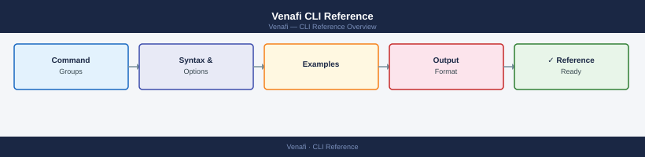
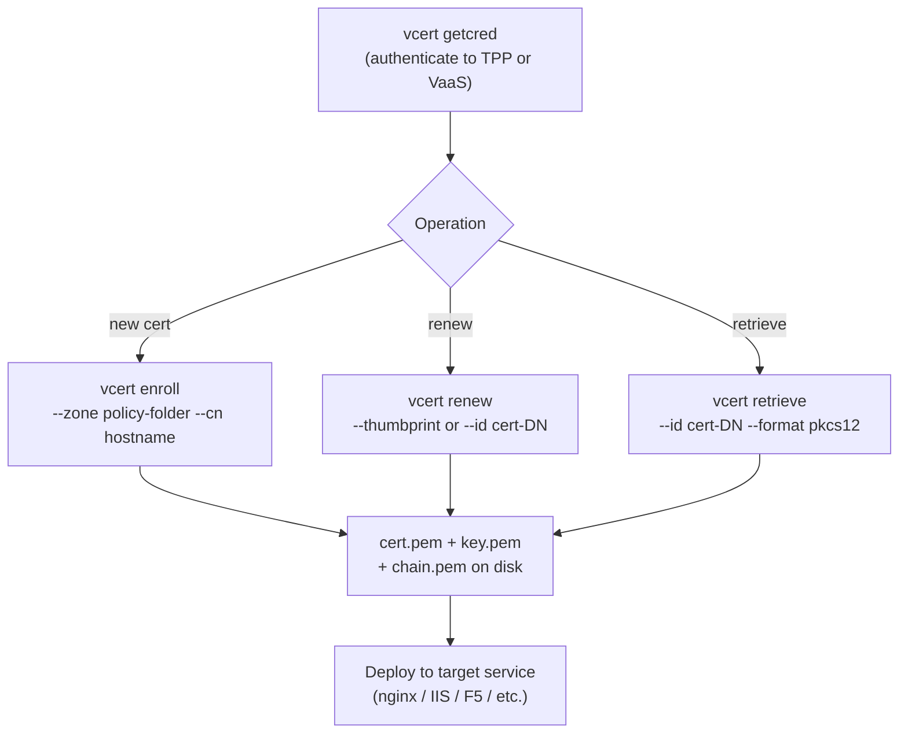

---
tags:
  - operations
  - security
---
# Venafi CLI Reference


<div class="kb-summary">
Venafi is managed via the `vcert` CLI (Trust Protection Platform and Venafi as a Service), the TPP REST API, and PowerShell cmdlets. The `vcert` CLI is the primary tool for certificate request, renewal, and retrieval automation.

*Applies to: Venafi TLS Protect*
</div>



```d2
direction: right

center: "Cli Reference" {shape: rectangle}
vcert_cli_workflow: "vcert CLI Workflow" {shape: rectangle}
vcert_cli_authentication: "vcert CLI — Authentication" {shape: rectangle}
certificate_requests: "Certificate Requests" {shape: rectangle}
certificate_renewal: "Certificate Renewal" {shape: rectangle}
certificate_retrieval: "Certificate Retrieval" {shape: rectangle}
tpp_rest_api: "TPP REST API" {shape: rectangle}

center -> vcert_cli_workflow
center -> vcert_cli_authentication
center -> certificate_requests
center -> certificate_renewal
center -> certificate_retrieval
center -> tpp_rest_api
```

## Before you begin

- **Access:** Admin credentials on all affected systems
- **Timing:** safe to run during business hours unless a step is marked ⚠ (causes interruption)
- **Dependencies:** no active upgrades or migrations on the same infrastructure
- **Logging:** capture command output — paste into the change record on completion

---

## vcert CLI Workflow



---

## vcert CLI — Authentication

```bash
# Authenticate to Venafi as a Service (VaaS)
vcert getcred --platform vaas --apiKey <api_key>

# Authenticate to Trust Protection Platform (TPP)
vcert getcred --platform tpp --url https://<tpp_fqdn>/vedsdk   --username <user> --password <pass>

# Verify credentials
vcert checkcred --platform tpp --url https://<tpp_fqdn>/vedsdk   -t <token>
```

---

## Certificate Requests

```bash
# Request a certificate (TPP)
vcert enroll --platform tpp --url https://<tpp_fqdn>/vedsdk   -t <token>   --zone "\VED\Policy\Certificates\<policy_folder>"   --cn <common_name>   --san-dns <san1> --san-dns <san2>   --key-type rsa --key-size 2048   --cert-file cert.pem --key-file key.pem --chain-file chain.pem

# Request a certificate (VaaS)
vcert enroll --platform vaas --apiKey <key>   --zone "<application>\<issuing_template>"   --cn <common_name>   --cert-file cert.pem --key-file key.pem
```

---

## Certificate Renewal

```bash
# Renew a certificate by thumbprint
vcert renew --platform tpp --url https://<tpp_fqdn>/vedsdk   -t <token>   --thumbprint <sha1_thumbprint>   --cert-file renewed.pem --key-file renewed-key.pem

# Renew by certificate DN (TPP path)
vcert renew --platform tpp --url https://<tpp_fqdn>/vedsdk   -t <token>   --id "\VED\Policy\Certificates\<policy_folder>\<cn>"   --cert-file renewed.pem
```

---

## Certificate Retrieval

```bash
# Retrieve an existing certificate
vcert retrieve --platform tpp --url https://<tpp_fqdn>/vedsdk   -t <token>   --id "\VED\Policy\Certificates\<folder>\<cn>"   --cert-file cert.pem --key-file key.pem --chain-file chain.pem

# Retrieve in PKCS#12 format
vcert retrieve --platform tpp --url https://<tpp_fqdn>/vedsdk   -t <token>   --id "\VED\Policy\Certificates\<folder>\<cn>"   --format pkcs12 --file cert.p12 --password <p12_pass>
```

---

## TPP REST API

The TPP REST API base URL is `https://<tpp_fqdn>/vedsdk`.

```bash
# Authenticate and get token
curl -X POST https://<tpp_fqdn>/vedauth/authorize/integrated   -H "Content-Type: application/json"   -d '{"Username":"<user>","Password":"<pass>","client_id":"vcert-cli","scope":"certificate:manage,delete,discover"}'

# List certificates in a policy folder
curl -X POST https://<tpp_fqdn>/vedsdk/certificates/retrieve   -H "X-Venafi-Api-Key: <token>"   -H "Content-Type: application/json"   -d '{"PolicyDN":"\\VED\\Policy\\Certificates\\<folder>"}'

# Get certificate details
curl -X GET "https://<tpp_fqdn>/vedsdk/certificates/<cert_guid>"   -H "X-Venafi-Api-Key: <token>"

# Request a new certificate
curl -X POST https://<tpp_fqdn>/vedsdk/certificates/request   -H "X-Venafi-Api-Key: <token>"   -H "Content-Type: application/json"   -d '{"PolicyDN":"\\VED\\Policy\\Certificates\\<folder>","Subject":"CN=<cn>"}'
```

---

## Certificate Inspection (openssl)

```bash
# Verify a retrieved certificate
openssl x509 -in cert.pem -noout -text | grep -E "Subject:|Issuer:|Not After"

# Check certificate matches the private key
openssl x509 -noout -modulus -in cert.pem | md5sum
openssl rsa -noout -modulus -in key.pem | md5sum

# Verify certificate chain
openssl verify -CAfile chain.pem cert.pem

# Test TLS with the certificate
openssl s_client -connect <host>:443 -servername <host>
```

---

## Verify

- Confirm the operation completed without errors in the log or management UI
- Verify the expected state change is visible (service running, object created, config applied)
- Document the outcome in the change record

## See also

- [Venafi — Procedures](../procedures/)
- [Venafi — Health Checks](../health-checks/)
- [Venafi — Scripts](../scripts/)
- [Venafi — Backup and Restore](../backup-restore/)
- [Venafi — Install and Upgrade](../install-upgrade/)
- [Venafi — Common Issues](../../troubleshooting/common-issues/)
