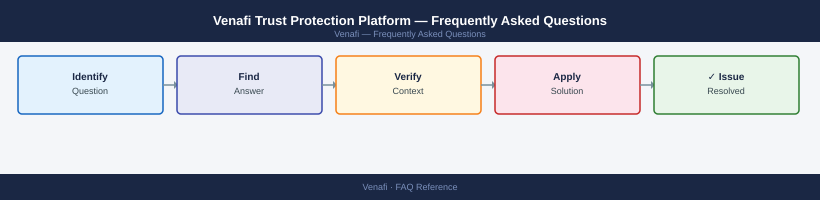

---
tags:
  - venafi
  - faq
  - operations
---
# Venafi Trust Protection Platform — Frequently Asked Questions

Common questions about Venafi Trust Protection Platform operations, configuration, and troubleshooting. For step-by-step procedures, see the <a href="index.md">Operations</a> section.

## General

**Q: What Venafi version is recommended for new deployments?**
A: Venafi TPP 23.4+ or Venafi as a Service (cloud) for new deployments. Check TPP version via Administration → About Venafi. Keep within 2 major versions for support and security patches.

**Q: How do I check the current Venafi Trust Protection Platform version?**
A: `Administration → About Venafi`

## Configuration

**Q: What is the default certificate discovery schedule and when should it change?**
A: Discovery is manual by default. Enable scheduled network scanning (TPP → Discovery → Network Scanning) weekly for your certificate inventory. Increase to daily for large, dynamic environments or when approaching audit season.

**Q: How do I enable Venafi automated certificate renewal?**
A: Configure Certificate Management → Auto-Renewal: set renewal threshold (e.g., 30 days before expiry). Install the Venafi Agent on servers for automated replacement. Configure application-specific renewal workflows (IIS, Apache, F5).

## Operations

**Q: How do I upgrade Venafi TPP without disrupting certificate operations?**
A: Back up TPP database and config. Upgrade in a maintenance window. Policy-based renewals queue during upgrade. Post-upgrade, verify engine health and resume processing. Rolling upgrades across nodes are supported in clustered deployments.

**Q: What is the correct procedure to add a new CA to Venafi?**
A: In TPP: Administration → CA Templates → Add. Provide CA type (ADCS, DigiCert, Entrust), connection parameters, and credentials. Test with a certificate request before adding to production policy folders.

## Troubleshooting

**Q: Venafi shows 'Certificate Expiring in 7 days — No Renewal Pending'. What does it mean?**
A: Auto-renewal failed or was not configured for this certificate. Manually renew via TPP or the certificate owner's workflow immediately. Investigate why auto-renewal did not trigger — check policy folder settings and agent connectivity.

**Q: Venafi discovery scan is not completing within the scheduled window — where do I start?**
A: Reduce scan scope (narrow IP range, specific ports). Increase scanner thread count in Discovery settings. Deploy additional distributed engines close to large subnets. Schedule scans during off-peak hours.

## Backup and Recovery

**Q: How often should I back up Venafi TPP?**
A: Daily database backup (SQL Server). Weekly config export via `VEDiag`. The TPP database contains all certificate metadata, keys, and policy — protect it at least as carefully as a CA database.

**Q: Can I restore a single certificate and private key from Venafi without a full restore?**
A: Yes — in TPP, navigate to the certificate object → Private Key → Download. Venafi stores private keys escrow if configured. If keys are not escrowed, a new key pair must be generated and the certificate reissued.

## See Also

- [Venafi Trust Protection Platform Operations](index.md)
- [Venafi Trust Protection Platform Troubleshooting](../../troubleshooting/index.md)
