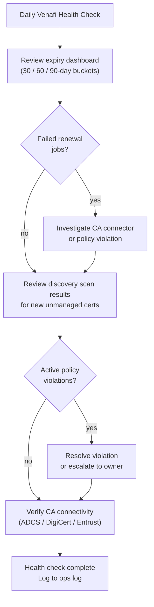

# Venafi — Health Checks

Daily operations centre on the Venafi Policy Server dashboard: review certificates expiring within 30, 60, and 90-day buckets, check for failed renewal jobs, review discovery scan results for newly found unmanaged certificates, confirm no policy violations exist, and verify CA connectivity health for each integrated CA. Certificate counts by state (active, expiring, expired, revoked) should be trended over time.

## Daily Health Check Flow

Weekly tasks include reviewing orphaned or unmanaged certificates surfaced by Edge Proxy discovery scans and assigning them to appropriate policy folders or scheduling revocation.

## Daily Checklist

- [ ] Review expiring certificates (30 / 60 / 90-day buckets)
- [ ] Check failed renewal jobs — investigate and re-trigger as needed
- [ ] Review discovery scan results for new unmanaged certificates
- [ ] Confirm no active policy violations
- [ ] Verify CA connectivity health (ADCS, DigiCert, Entrust)

## Weekly Checklist

- [ ] Review orphaned and unmanaged certificate report
- [ ] Assign discovered certificates to policy folders or schedule revocation

## Certificate Inventory

Use this section for practical certificate inventory notes, checks, and field references.

### Common Checks

- Confirm current health
- Review active alerts
- Check recent changes
- Confirm dependencies
- Check logs, events, and monitoring
- Capture current state before changes
