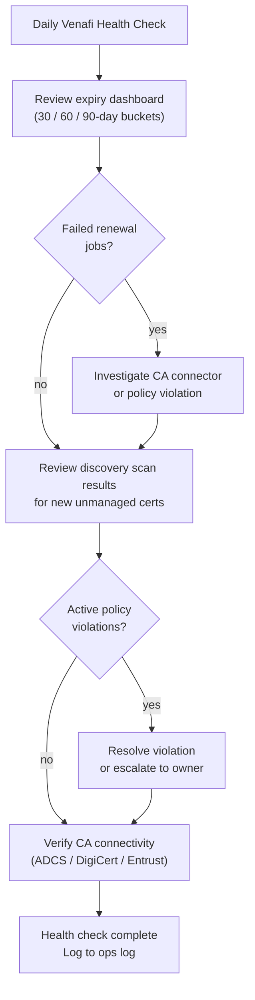

---
tags:
  - operations
  - security
---
# Venafi — Health Checks


<div class="kb-summary">
Daily operations centre on the Venafi Policy Server dashboard: review certificates expiring within 30, 60, and 90-day buckets, check for failed renewal jobs, review discovery scan results for newly found unmanaged certificates, confirm no policy violations exist, and verify CA co
</div>
```text
┌───────────────────────────── Security Venafi Operations — Health Checks ──────────────────────────────┐
│                                                                                                       │
│   ┌───────────────────────────────────────────────────────────────────────────────────────────────┐   │
│   │        Venafi health checks: routine verification of operational status and performance       │   │
│   │         Checks include: controller status, drive health, replication lag, and capacity        │   │
│   │         Frequency: daily quick checks; weekly detailed review; monthly capacity report        │   │
│   │        Configure threshold-based alerts for proactive incident prevention and awareness       │   │
│   └───────────────────────────────────────────────────────────────────────────────────────────────┘   │
│                                                                                                       │
│    Check status → review alerts → verify replication → capacity → log                                 │
│                                                                                                       │
│                  ▼                                ▼                                ▼                  │
│                                                                                                       │
│   ┌─────────────────────────────┐  ┌─────────────────────────────┐  ┌─────────────────────────────┐   │
│   │            Layer            │  │          Component          │  │            Notes            │   │
│   │             Core            │  │       Primary service       │  │        Main function        │   │
│   │          Management         │  │        Control plane        │  │         Admin access        │   │
│   │          Monitoring         │  │         Health/perf         │  │      Alerts/dashboards      │   │
│   │           Security          │  │         Auth/encrypt        │  │        Access control       │   │
│   │         Integration         │  │        APIs/plug-ins        │  │         Third-party         │   │
│   └─────────────────────────────┘  └─────────────────────────────┘  └─────────────────────────────┘   │
│                                                                                                       │
│                          ▼                                                 ▼                          │
│                                                                                                       │
│   ┌───────────────────────────────────────────────────────────────────────────────────────────────┐   │
│   │    Check area    │  How to verify   │   Pass criteria   │    Frequency     │       Tool       │   │
│   │   Controllers    │   show status    │    All healthy    │      Daily       │     CLI/GUI      │   │
│   │      Drives      │   show drives    │  No failed/pred.  │      Daily       │     CLI/GUI      │   │
│   │   Replication    │ show replication │  Lag < threshold  │      Daily       │     CLI/GUI      │   │
│   │     Capacity     │  show capacity   │     < 80% used    │      Daily       │     CLI/GUI      │   │
│   └───────────────────────────────────────────────────────────────────────────────────────────────┘   │
│                                                                                                       │
│    Physical: Security Venafi Operations infrastructure · management network · monitoring              │
│                                                                                                       │
│    Key terms:                                                                                         │
│                                                                                                       │
│    Venafi             = Security Venafi Operations platform overview and core concepts                │
│    Management         = management console and command-line interface for administration              │
│    Monitoring         = health and performance monitoring dashboards and alerting                     │
│    Automation         = REST API, scripting, and pipeline integration capabilities                    │
│    Security           = access control, authentication, and encryption configuration                  │
│    Backup             = backup and recovery procedures and schedule configuration                     │
│    Upgrade            = software version upgrades and firmware patching procedures                    │
│    Troubleshooting    = diagnostic procedures and common issue resolution steps                       │
│    Escalation         = vendor support escalation path and severity triage process                    │
│    Documentation      = vendor knowledge base and official product documentation                      │
│    Change management  = change ticket requirements for production modifications                       │
│    Audit log          = admin action logging for compliance and security review                       │
│                                                                                                       │
└───────────────────────────────────────────────────────────────────────────────────────────────────────┘
```

## Before you begin

- **Access:** Admin credentials on all affected systems
- **Timing:** safe to run during business hours unless a step is marked ⚠ (causes interruption)
- **Dependencies:** no active upgrades or migrations on the same infrastructure
- **Logging:** capture command output — paste into the change record on completion

---

## Run This Routine

1. **Venafi Trust Protection Platform service** — On the Venafi server run `Get-Service VenafiTrustProtectionPlatform | Select-Object Name, Status`; the service must show `Running`; if stopped, check the Windows Event Log under Application for startup errors before attempting a restart.
2. **Venafi web console accessibility** — Run `Invoke-WebRequest -Uri https://<venafi-server>/vedadmin -UseBasicParsing | Select-Object StatusCode`; expect `200`; a non-200 response or connection failure indicates the web tier is down or a TLS certificate issue on the server itself.
3. **Discovery job status** — In the Venafi console, navigate to **Discovery** and review the last completed discovery job; confirm it finished without errors and the discovery timestamp is within the expected schedule; failed discovery means newly issued unmanaged certificates will not be visible.
4. **Certificate expiry alerts** — Navigate to **Venafi → Dashboard** and review the certificates expiring within 30 days panel; for each certificate listed, confirm a renewal ticket exists or auto-renewal is configured; escalate any without an assigned owner.
5. **Policy compliance** — Navigate to **Venafi → Policy** and check for any active policy violations; violations indicate certificates in managed folders that do not meet the defined key length, algorithm, or CA requirements — each must be reviewed and either remediated or approved via exception.
6. **Database size** — Connect to the SQL Server instance hosting the Venafi database and run `SELECT name, size * 8 / 1024 AS size_mb FROM sys.databases WHERE name = 'VenafiTPP'`; alert if the database is consuming more than 80% of its allocated file growth limit.
7. **Certificate renewal failures** — In the Venafi console, navigate to **Reports → Renewal Activity** and filter by status `Failed` for the last 7 days; for each failure, review the error detail — common causes include CA connector credential expiry, template permission changes, or network connectivity to the issuing CA.

nnectivity health for each integrated CA. Certificate counts by state (active, expiring, expired, revoked) should be trended over time.

## Daily Health Check Flow




Weekly tasks include reviewing orphaned or unmanaged certificates surfaced by Edge Proxy discovery scans and assigning them to appropriate policy folders or scheduling revocation.

## Daily Checklist

- [ ] Review expiring certificates (30 / 60 / 90-day buckets)
- [ ] Check failed renewal jobs — investigate and re-trigger as needed
- [ ] Review discovery scan results for new unmanaged certificates
- [ ] Confirm no active policy violations
- [ ] Verify CA connectivity health (ADCS, DigiCert, Entrust)

## Weekly Checklist

- [ ] Review orphaned and unmanaged certificate report
- [ ] Assign discovered certificates to policy folders or schedule revocation

## Certificate Inventory

Use this section for practical certificate inventory notes, checks, and field references.

### Common Checks

- Confirm current health
- Review active alerts
- Check recent changes
- Confirm dependencies
- Check logs, events, and monitoring
- Capture current state before changes

---

## Verify

- Confirm the operation completed without errors in the log or management UI
- Verify the expected state change is visible (service running, object created, config applied)
- Document the outcome in the change record
