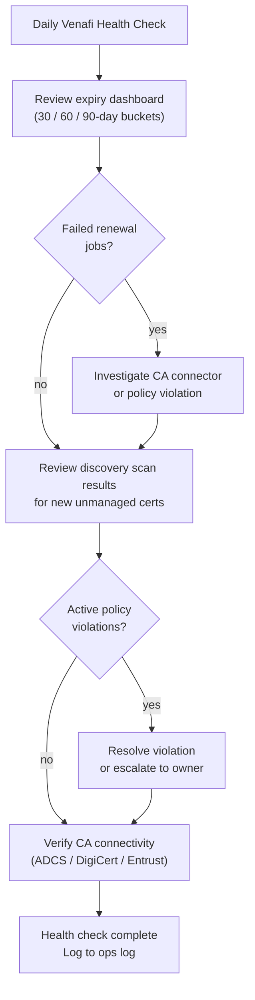

# Venafi — Health Checks


<div class="kb-summary">
Daily operations centre on the Venafi Policy Server dashboard: review certificates expiring within 30, 60, and 90-day buckets, check for failed renewal jobs, review discovery scan results for newly found unmanaged certificates, confirm no policy violations exist, and verify CA co
</div>
```text
┌───────────────────────────── Security Venafi Operations — Health Checks ──────────────────────────────┐
│                                                                                                       │
│   ┌───────────────────────────────────────────────────────────────────────────────────────────────┐   │
│   │        Venafi health checks: routine verification of operational status and performance       │   │
│   │         Checks include: controller status, drive health, replication lag, and capacity        │   │
│   │         Frequency: daily quick checks; weekly detailed review; monthly capacity report        │   │
│   │        Configure threshold-based alerts for proactive incident prevention and awareness       │   │
│   └───────────────────────────────────────────────────────────────────────────────────────────────┘   │
│                                                                                                       │
│    Check status → review alerts → verify replication → capacity → log                                 │
│                                                                                                       │
│                  ▼                                ▼                                ▼                  │
│                                                                                                       │
│   ┌─────────────────────────────┐  ┌─────────────────────────────┐  ┌─────────────────────────────┐   │
│   │            Layer            │  │          Component          │  │            Notes            │   │
│   │             Core            │  │       Primary service       │  │        Main function        │   │
│   │          Management         │  │        Control plane        │  │         Admin access        │   │
│   │          Monitoring         │  │         Health/perf         │  │      Alerts/dashboards      │   │
│   │           Security          │  │         Auth/encrypt        │  │        Access control       │   │
│   │         Integration         │  │        APIs/plug-ins        │  │         Third-party         │   │
│   └─────────────────────────────┘  └─────────────────────────────┘  └─────────────────────────────┘   │
│                                                                                                       │
│                          ▼                                                 ▼                          │
│                                                                                                       │
│   ┌───────────────────────────────────────────────────────────────────────────────────────────────┐   │
│   │    Check area    │  How to verify   │   Pass criteria   │    Frequency     │       Tool       │   │
│   │   Controllers    │   show status    │    All healthy    │      Daily       │     CLI/GUI      │   │
│   │      Drives      │   show drives    │  No failed/pred.  │      Daily       │     CLI/GUI      │   │
│   │   Replication    │ show replication │  Lag < threshold  │      Daily       │     CLI/GUI      │   │
│   │     Capacity     │  show capacity   │     < 80% used    │      Daily       │     CLI/GUI      │   │
│   └───────────────────────────────────────────────────────────────────────────────────────────────┘   │
│                                                                                                       │
│    Physical: Security Venafi Operations infrastructure · management network · monitoring              │
│                                                                                                       │
│    Key terms:                                                                                         │
│                                                                                                       │
│    Venafi             = Security Venafi Operations platform overview and core concepts                │
│    Management         = management console and command-line interface for administration              │
│    Monitoring         = health and performance monitoring dashboards and alerting                     │
│    Automation         = REST API, scripting, and pipeline integration capabilities                    │
│    Security           = access control, authentication, and encryption configuration                  │
│    Backup             = backup and recovery procedures and schedule configuration                     │
│    Upgrade            = software version upgrades and firmware patching procedures                    │
│    Troubleshooting    = diagnostic procedures and common issue resolution steps                       │
│    Escalation         = vendor support escalation path and severity triage process                    │
│    Documentation      = vendor knowledge base and official product documentation                      │
│    Change management  = change ticket requirements for production modifications                       │
│    Audit log          = admin action logging for compliance and security review                       │
│                                                                                                       │
└───────────────────────────────────────────────────────────────────────────────────────────────────────┘
```


nnectivity health for each integrated CA. Certificate counts by state (active, expiring, expired, revoked) should be trended over time.

## Daily Health Check Flow




Weekly tasks include reviewing orphaned or unmanaged certificates surfaced by Edge Proxy discovery scans and assigning them to appropriate policy folders or scheduling revocation.

## Daily Checklist

- [ ] Review expiring certificates (30 / 60 / 90-day buckets)
- [ ] Check failed renewal jobs — investigate and re-trigger as needed
- [ ] Review discovery scan results for new unmanaged certificates
- [ ] Confirm no active policy violations
- [ ] Verify CA connectivity health (ADCS, DigiCert, Entrust)

## Weekly Checklist

- [ ] Review orphaned and unmanaged certificate report
- [ ] Assign discovered certificates to policy folders or schedule revocation

## Certificate Inventory

Use this section for practical certificate inventory notes, checks, and field references.

### Common Checks

- Confirm current health
- Review active alerts
- Check recent changes
- Confirm dependencies
- Check logs, events, and monitoring
- Capture current state before changes
