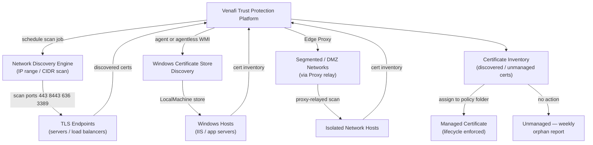
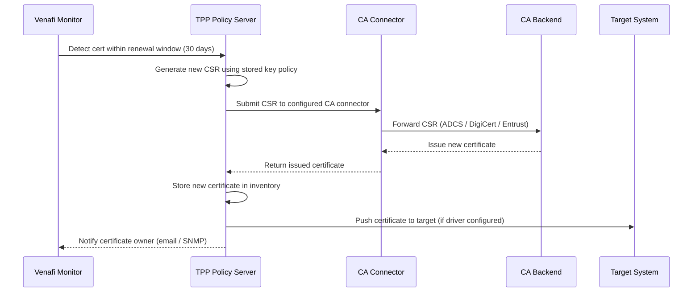

# Venafi Lifecycle


<div class="kb-summary">
Venafi TPP manages the full certificate lifecycle — discovery, policy enforcement, issuance, renewal automation, and expiry alerting. This page covers operational lifecycle procedures including upgrades and migration to TLS Protect Cloud (VaaS).
</div>
```text
┌────────────────────────── Security Venafi Operations — Install and Upgrade ───────────────────────────┐
│                                                                                                       │
│   ┌───────────────────────────────────────────────────────────────────────────────────────────────┐   │
│   │         Venafi installation and upgrade: deployment and version management procedures         │   │
│   │         Pre-upgrade: back up configuration, check compatibility, review release notes         │   │
│   │      Upgrade: rolling upgrade preserves service; non-disruptive on dual-controller arrays     │   │
│   │           Post-upgrade: verify all services running; run health check; notify users           │   │
│   └───────────────────────────────────────────────────────────────────────────────────────────────┘   │
│                                                                                                       │
│    Plan → backup config → upgrade staging → upgrade production → validate                             │
│                                                                                                       │
│                  ▼                                ▼                                ▼                  │
│                                                                                                       │
│   ┌─────────────────────────────┐  ┌─────────────────────────────┐  ┌─────────────────────────────┐   │
│   │            Layer            │  │          Component          │  │            Notes            │   │
│   │             Core            │  │       Primary service       │  │        Main function        │   │
│   │          Management         │  │        Control plane        │  │         Admin access        │   │
│   │          Monitoring         │  │         Health/perf         │  │      Alerts/dashboards      │   │
│   │           Security          │  │         Auth/encrypt        │  │        Access control       │   │
│   │         Integration         │  │        APIs/plug-ins        │  │         Third-party         │   │
│   └─────────────────────────────┘  └─────────────────────────────┘  └─────────────────────────────┘   │
│                                                                                                       │
│                          ▼                                                 ▼                          │
│                                                                                                       │
│   ┌───────────────────────────────────────────────────────────────────────────────────────────────┐   │
│   │      Layer       │    Component     │      Function     │      Notes       │       Auth       │   │
│   │       Core       │ Primary service  │   Main function   │     See docs     │       RBAC       │   │
│   │    Management    │  Control plane   │    Admin access   │     See docs     │       RBAC       │   │
│   │    Monitoring    │   Health/perf    │  Alerts/dashboard │     See docs     │       RBAC       │   │
│   │     Security     │   Auth/encrypt   │   Access control  │     See docs     │       RBAC       │   │
│   └───────────────────────────────────────────────────────────────────────────────────────────────┘   │
│                                                                                                       │
│    Physical: Security Venafi Operations infrastructure · management network · monitoring              │
│                                                                                                       │
│    Key terms:                                                                                         │
│                                                                                                       │
│    Venafi             = Security Venafi Operations platform overview and core concepts                │
│    Management         = management console and command-line interface for administration              │
│    Monitoring         = health and performance monitoring dashboards and alerting                     │
│    Automation         = REST API, scripting, and pipeline integration capabilities                    │
│    Security           = access control, authentication, and encryption configuration                  │
│    Backup             = backup and recovery procedures and schedule configuration                     │
│    Upgrade            = software version upgrades and firmware patching procedures                    │
│    Troubleshooting    = diagnostic procedures and common issue resolution steps                       │
│    Escalation         = vendor support escalation path and severity triage process                    │
│    Documentation      = vendor knowledge base and official product documentation                      │
│    Change management  = change ticket requirements for production modifications                       │
│    Audit log          = admin action logging for compliance and security review                       │
│                                                                                                       │
└───────────────────────────────────────────────────────────────────────────────────────────────────────┘
```


---
## Machine Identity Discovery Topology



---

## Certificate Discovery

Venafi Discovery scans the network for certificates on well-known TLS endpoints, Windows certificate stores, and F5/network devices. Discovery is the first step in bringing unmanaged certificates under Venafi control.

### Network Discovery

1. In Venafi TPP, go to **Discovery > Network Discovery**.
2. Create a scan job targeting an IP range or CIDR block.
3. Set target ports: 443, 8443, 636, 3389, and any other TLS ports in use.
4. Schedule scans to run nightly.
5. After scan, review discovered certificates in **Certificates > Certificate Discovery**.
6. Move discovered certificates to the appropriate policy folder to bring them under management.

### Windows Certificate Store Discovery

1. Deploy the Venafi Agent (or use agentless WMI scan) on target Windows hosts.
2. Agent reports all certificates from `LocalMachine\My`, `LocalMachine\WebHosting`, and `LocalMachine\CA` stores.
3. Discovered certificates appear in the Venafi inventory and can be associated with a policy folder.

---

## Policy Enforcement

Policy enforcement ensures all certificates in a folder meet the defined standards before issuance.

Key policy controls (configured per policy folder):

| Control | Typical Value |
|---|---|
| Allowed CA | Internal ADCS or DigiCert (not both) |
| Key algorithm | RSA-4096 or ECDSA P-256 minimum |
| Hash algorithm | SHA-256 minimum |
| Minimum validity | 30 days |
| Maximum validity | 2 years (internal), 1 year (external) |
| SANs required | Yes — CN alone rejected |
| Wildcard allowed | Internal: yes with approval; External: no |
| Auto-issuance | Internal Production: yes; External: manual approval |

Policy violations are surfaced in the Venafi UI and via API. Non-compliant certificates generate alerts and block automated renewal until the violation is resolved.

---

## Automated Renewal Sequence



---

## Renewal Automation

Venafi TPP monitors certificate validity and triggers renewal at the configured renewal window (typically 30 days before expiry). Renewal can be fully automated or require approval.

### Automated Renewal Flow

1. Venafi detects a certificate within the renewal window.
2. Venafi generates a new CSR using the stored key algorithm settings.
3. CSR submitted to the configured CA connector.
4. CA issues the new certificate.
5. Venafi stores the new certificate and (if an agent/driver is configured) pushes the certificate to the target system automatically.
6. If automatic installation is not configured, a notification is sent to the certificate owner.

```powershell
# Trigger an immediate renewal via REST API
$apiKey = "<your-api-key>"
$certDN = "\\VED\\Policy\\Internal\\Production\\Servers\\app01.corp.example.com"

$body = @{ CertificateDN = $certDN } | ConvertTo-Json
Invoke-RestMethod -Uri "https://venafi.corp.example.com/vedsdk/Certificates/Renew" `
  -Headers @{ "X-Venafi-API-Key" = $apiKey } `
  -Method Post -ContentType "application/json" -Body $body
```

---

## Expiry Alerting

Venafi sends email notifications to certificate contacts at configurable thresholds.

Default alert schedule (configured in Administration > Notification Rules):
- 30 days before expiry: notification to certificate owner
- 14 days before expiry: escalation to team DL
- 7 days before expiry: escalation to manager + security team
- Day of expiry: critical alert

```powershell
# Query certificates expiring within 30 days via REST API
$body = @{
    Limit  = 200
    Filter = @{
        ValidTo = @{
            Value    = (Get-Date).AddDays(30).ToString("yyyy-MM-ddTHH:mm:ss")
            Operator = "Less"
        }
    }
} | ConvertTo-Json -Depth 5

Invoke-RestMethod -Uri "https://venafi.corp.example.com/vedsdk/Certificates" `
  -Headers @{ "X-Venafi-API-Key" = $apiKey } `
  -Method Post -ContentType "application/json" -Body $body |
  Select-Object -ExpandProperty Certificates |
  Select-Object DN, CN, ValidTo, Issuer |
  Sort-Object ValidTo
```

---

## TPP Upgrade Procedure

Venafi upgrades must be tested in a non-production environment first. Check the Venafi compatibility matrix for supported SQL Server, Windows Server, and CA integration versions before upgrading.

### Pre-Upgrade Checklist

- [ ] Review Venafi release notes and compatibility matrix
- [ ] Take full SQL Server database backup
- [ ] Take VM snapshot of both TPP nodes
- [ ] Verify CA connector compatibility with new TPP version
- [ ] Notify certificate owners of maintenance window

### Upgrade Steps

```powershell
# 1. Stop Venafi services on the secondary node first
Stop-Service -Name "Venafi*" -Force  # run on secondary TPP node

# 2. Run the installer on the primary node
# (Download from Venafi support portal; run as Administrator)

# 3. Validate primary node after upgrade
# - Log in to TPP UI
# - Check CA connector health
# - Issue a test certificate

# 4. Upgrade the secondary node
# Run installer on secondary node

# 5. Verify load balancer routes to both nodes
# Test-NetConnection -ComputerName venafi-vip.corp.example.com -Port 443
```

Post-upgrade validation:
- Validate all CA connectors (Administration > CA Templates)
- Trigger a manual renewal on a test certificate
- Verify Edge Proxy re-registers after upgrade
- Check syslog/SIEM event forwarding is intact

---

## TPP to VaaS Migration

Migration from on-premises TPP to Venafi as a Service (TLS Protect Cloud) is a significant project. High-level steps:

1. Export policy tree configuration from TPP.
2. Re-create policy folders and CA integrations in VaaS.
3. Re-onboard managed certificates to VaaS (via discovery or bulk import).
4. Update automation integrations (REST API base URL changes from TPP to VaaS endpoint).
5. Decommission TPP after all certificates are confirmed managed in VaaS.

Refer to Venafi Professional Services for migration tooling and assistance.

---

## EOL Tracking

Review the Venafi support lifecycle page quarterly:
`https://support.venafi.com/hc/en-us/articles/360024784232`

Plan upgrades at least 6 months before the current version reaches End of Standard Support. Versions on Extended Support receive security fixes only.
