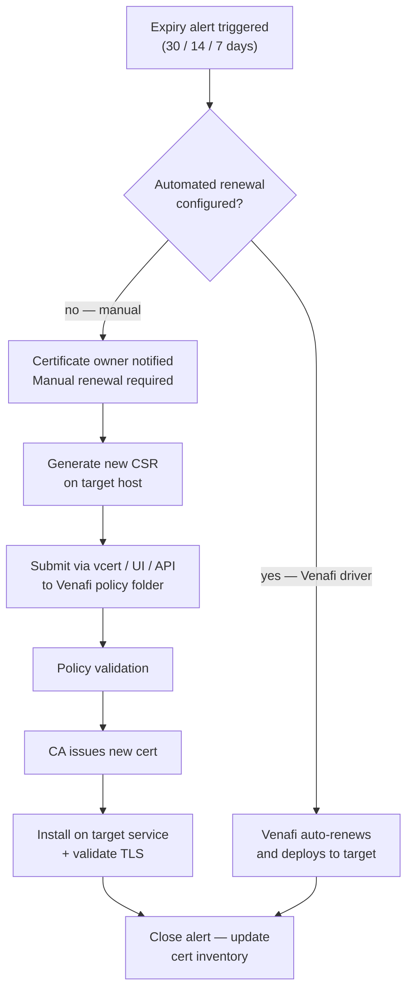

---
tags:
  - operations
  - security
---
# Venafi — Procedures


<div class="kb-summary">
Operational procedures for certificate renewal, automation, and reporting.

*Applies to: Venafi TLS Protect*
</div>
```text
┌───────────────────────── Security Venafi Operations — Operational Procedures ─────────────────────────┐
│                                                                                                       │
│   ┌───────────────────────────────────────────────────────────────────────────────────────────────┐   │
│   │             Venafi operational procedures: standard tasks for day-2 administration            │   │
│   │           Covers: provisioning, expansion, maintenance, DR testing, and decommission          │   │
│   │           Pre/post checks required for all maintenance activities affecting storage           │   │
│   │            All procedures require approved change management tickets in production            │   │
│   └───────────────────────────────────────────────────────────────────────────────────────────────┘   │
│                                                                                                       │
│    Open change → pre-check → execute → verify → post-check → close                                    │
│                                                                                                       │
│                  ▼                                ▼                                ▼                  │
│                                                                                                       │
│   ┌─────────────────────────────┐  ┌─────────────────────────────┐  ┌─────────────────────────────┐   │
│   │            Layer            │  │          Component          │  │            Notes            │   │
│   │             Core            │  │       Primary service       │  │        Main function        │   │
│   │          Management         │  │        Control plane        │  │         Admin access        │   │
│   │          Monitoring         │  │         Health/perf         │  │      Alerts/dashboards      │   │
│   │           Security          │  │         Auth/encrypt        │  │        Access control       │   │
│   │         Integration         │  │        APIs/plug-ins        │  │         Third-party         │   │
│   └─────────────────────────────┘  └─────────────────────────────┘  └─────────────────────────────┘   │
│                                                                                                       │
│                          ▼                                                 ▼                          │
│                                                                                                       │
│   ┌───────────────────────────────────────────────────────────────────────────────────────────────┐   │
│   │    Procedure     │    Pre-check     │       Steps       │      Verify      │    Post-check    │   │
│   │    Provision     │  Capacity free?  │   Create volume   │   Host access    │   Monitor I/O    │   │
│   │      Expand      │   Pool space?    │    Grow volume    │    FS resize     │   Verify size    │   │
│   │     Snapshot     │   Policy set?    │   Take snapshot   │   Snap listed    │   Consistency    │   │
│   │     Failover     │  Repl. in sync?  │    Break repl.    │    App online    │    Verify RTO    │   │
│   └───────────────────────────────────────────────────────────────────────────────────────────────┘   │
│                                                                                                       │
│    Physical: Security Venafi Operations infrastructure · management network · monitoring              │
│                                                                                                       │
│    Key terms:                                                                                         │
│                                                                                                       │
│    Venafi             = Security Venafi Operations platform overview and core concepts                │
│    Management         = management console and command-line interface for administration              │
│    Monitoring         = health and performance monitoring dashboards and alerting                     │
│    Automation         = REST API, scripting, and pipeline integration capabilities                    │
│    Security           = access control, authentication, and encryption configuration                  │
│    Backup             = backup and recovery procedures and schedule configuration                     │
│    Upgrade            = software version upgrades and firmware patching procedures                    │
│    Troubleshooting    = diagnostic procedures and common issue resolution steps                       │
│    Escalation         = vendor support escalation path and severity triage process                    │
│    Documentation      = vendor knowledge base and official product documentation                      │
│    Change management  = change ticket requirements for production modifications                       │
│    Audit log          = admin action logging for compliance and security review                       │
│                                                                                                       │
└───────────────────────────────────────────────────────────────────────────────────────────────────────┘
```


## Before you begin

- **Access:** Admin credentials on all affected systems
- **Timing:** safe to run during business hours unless a step is marked ⚠ (causes interruption)
- **Dependencies:** no active upgrades or migrations on the same infrastructure
- **Logging:** capture command output — paste into the change record on completion

---

## Renewal and Reporting Workflow



---

## Renewal

Use this section for certificate renewal procedures and field references.

### Common Checks

- Confirm current health
- Review active alerts
- Check recent changes
- Confirm dependencies
- Check logs, events, and monitoring
- Capture current state before changes

### Change Notes

- Confirm change approval
- Confirm maintenance window
- Confirm rollback plan
- Capture current state
- Make one change at a time
- Validate after the change

---

## Automation

Use this section for Venafi automation procedures and field references.

### Common Checks

- Confirm current health
- Review active alerts
- Check recent changes
- Confirm dependencies
- Check logs, events, and monitoring
- Capture current state before changes

### Change Notes

- Confirm change approval
- Confirm maintenance window
- Confirm rollback plan
- Capture current state
- Make one change at a time
- Validate after the change

---

## Reporting

Use this section for Venafi reporting procedures and field references.

### Common Checks

- Confirm current health
- Review active alerts
- Check recent changes
- Confirm dependencies
- Check logs, events, and monitoring
- Capture current state before changes

### Change Notes

- Confirm change approval
- Confirm maintenance window
- Confirm rollback plan
- Capture current state
- Make one change at a time
- Validate after the change

---

## Request a Certificate via Venafi

Use the Venafi console to request a new certificate for a workload or service. The request is validated against the policy folder before being submitted to the configured CA.

1. Log in to the **Venafi Console** (TPP: `https://tpp.corp.example.com/vedadmin` or TLS Protect Cloud).
2. Navigate to **Certificates → Request**.
3. Select the correct **policy folder** for the target environment (e.g., `\VED\Policy\Production\Web`).
4. Fill in the certificate details:
   - **Common Name (CN)**: primary FQDN (e.g., `api.corp.example.com`).
   - **Subject Alternative Names (SANs)**: add all additional FQDNs or IP addresses.
   - **Key Algorithm / Size**: RSA 2048 or ECC P-256 as per policy.
5. Select the **Certificate Authority** from the drop-down (must be approved for the policy folder).
6. Click **Submit**.
7. Monitor the request status — once the CA issues the certificate, status changes to **Issued**.
8. Click **Download** → choose format (PEM, PFX, or JKS depending on target platform).

```bash
# Request via vcert CLI (alternative to UI)
vcert enroll --url https://tpp.corp.example.com \
    --token $VENAFI_TOKEN \
    --zone "Production\\Web" \
    --cn "api.corp.example.com" \
    --san-dns "api.corp.example.com" \
    --san-dns "api-internal.corp.example.com" \
    --format pem \
    --file api-cert.pem
```

---

## Renew an Expiring Certificate

Renew a certificate that is approaching its expiry date. Venafi can automate this for managed applications; use the manual process when automation is not configured.

### Manual Renewal via Console

1. Log in to the **Venafi Console** → **Certificates**.
2. Apply a filter: **Expiration** → less than 30 days.
3. Select one or more certificates requiring renewal.
4. Click **Renew** (or right-click → Renew).
5. Confirm the CN, SANs, and CA are correct → **Approve**.
6. Venafi re-requests the certificate from the CA using the existing key or a new key pair (depending on policy).
7. Once issued, Venafi pushes the new certificate to all configured application bindings.
8. Verify the new expiry date in the certificate details pane.

```bash
# Trigger renewal via vcert CLI
vcert renew --url https://tpp.corp.example.com \
    --token $VENAFI_TOKEN \
    --thumbprint <certificate-thumbprint>
```

Confirm the application is serving the renewed certificate using `openssl s_client -connect <host>:443` and checking the `Not After` date.

---

## Configure a Discovery Job (Agentless)

Network Discovery scans IP ranges for TLS certificates on open ports without requiring an agent on the target hosts, enabling inventory of unmanaged certificates.

1. Log in to the **Venafi Console** → **Certificates → Discovery**.
2. Click **New Network Scan** → give the job a descriptive name (e.g., `Prod-DMZ-Scan`).
3. Configure the scan settings:
   - **IP Ranges**: enter CIDR ranges or individual IPs to scan (e.g., `10.0.10.0/24`).
   - **Ports**: add all relevant TLS ports — `443, 8443, 636, 993, 995, 3389, 5671`.
   - **Scan Frequency**: set a schedule (weekly or monthly for most environments).
4. Click **Save** → **Run Now** to trigger an immediate scan.
5. Monitor job progress under **Discovery → Active Jobs**.
6. Once complete, review **Discovered Certificates** — certificates not currently managed by Venafi appear here.
7. For each discovered certificate, choose **Onboard to Policy** → assign to the correct policy folder and CA.

Newly onboarded certificates will be included in Venafi's lifecycle management and expiry alerting from that point forward.

---

## Set Up Certificate Push to IIS / Apache

Configure Venafi to automatically provision (push) issued certificates to an application server, removing the manual install step.

1. Log in to the **Venafi Console** → **Applications**.
2. Click **Add** → select the target platform:
   - **Microsoft IIS** for Windows web servers.
   - **Apache** for Linux-based Apache HTTPD.
   - **F5 BIG-IP** for load balancers.
3. Enter the application details:
   - **Hostname / IP**: address of the target server.
   - **Credentials**: service account with permission to manage certificates on the target (e.g., IIS admin, SSH key for Apache).
   - **Install Location**: for IIS, specify the site binding; for Apache, specify the certificate and key file paths.
4. Click **Test Connection** — Venafi will attempt to reach the target using the provided credentials.
5. Navigate to the relevant certificate → **Edit** → **Applications** tab → associate the certificate with the new application.
6. Click **Provision** to push the current certificate to the application immediately.
7. Verify the application is serving the new certificate.

Future renewals will automatically push the new certificate to all associated applications without manual intervention.

---

## Audit Certificate Policy Compliance

Use Venafi's compliance reporting to identify certificates that violate organisational policy (weak keys, wrong CA, self-signed) and generate audit evidence.

1. Log in to the **Venafi Console** → **Reporting → Compliance**.
2. Select the **Policy** to audit (e.g., `\VED\Policy\Production`).
3. Review the compliance summary — violations are grouped by rule:
   - **Weak Key Size**: RSA < 2048 or ECC < P-256.
   - **Self-Signed**: certificates not issued by an approved CA.
   - **Wrong CA**: issued by a CA not listed in the policy folder's allowed CA list.
   - **Expired**: certificates past their `Not After` date still in service.
   - **Short Validity**: certificates issued with a validity period exceeding policy maximum.
4. Click into each violation category to see the list of non-compliant certificates with Subject, Expiry, and Owner fields.
5. Assign remediation tasks to certificate owners directly from the report.
6. Click **Generate PDF** to export the full compliance report for audit evidence submission.

Schedule automated compliance reports via **Reporting → Scheduled Reports** to receive a weekly or monthly email with the compliance summary for each policy folder.

---

## Verify

- Confirm the operation completed without errors in the log or management UI
- Verify the expected state change is visible (service running, object created, config applied)
- Document the outcome in the change record
