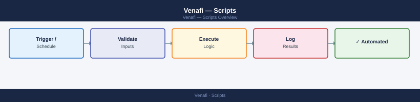

---
tags:
  - operations
  - security
---
# Venafi — Scripts


<div class="kb-summary">
Automation scripts for Venafi cover certificate expiry reporting, automated renewal via VCert, discovery scan triggering, policy compliance reporting, and ADCS template alignment checking.

*Applies to: Venafi TLS Protect*
</div>



 Scripts are maintained in PowerShell (Windows environments) and Python (cross-platform / Linux runners).

All scripts authenticate via API token (not username/password) and should store credentials in a secrets manager or environment variable — never hardcoded.

| Script | Language | Purpose |
|---|---|---|
| `venafi-expiry-report.ps1` | PowerShell | Export certificates expiring within N days to CSV |
| `venafi-auto-renew.py` | Python | Trigger renewal for certificates past 80% validity via VCert |
| `venafi-discovery-trigger.ps1` | PowerShell | Initiate an Edge Proxy discovery scan via REST API |
| `venafi-policy-compliance.ps1` | PowerShell | Report certificates violating key algorithm or validity standards |
| `venafi-adcs-template-check.ps1` | PowerShell | Verify ADCS template assignments align with Venafi policy folder settings |

**Example: expiry report (PowerShell)**

```powershell
$token = $env:VENAFI_TOKEN
$tppUrl = "https://tpp.example.com"
$expireBefore = (Get-Date).AddDays(30).ToString("yyyy-MM-ddTHH:mm:ssZ")
$uri = "$tppUrl/vedsdk/certificates?ValidToLess=$expireBefore"
$certs = Invoke-RestMethod -Uri $uri -Headers @{ "X-Venafi-Token" = $token }
$certs.Certificates | Export-Csv -Path "expiring-certs.csv" -NoTypeInformation
```

```d2
direction: right

center: "Scripts" {shape: rectangle}
verify: "Verify" {shape: rectangle}

center -> verify
```

## Before you begin

- **Access:** Admin credentials on all affected systems
- **Timing:** safe to run during business hours unless a step is marked ⚠ (causes interruption)
- **Dependencies:** no active upgrades or migrations on the same infrastructure
- **Logging:** capture command output — paste into the change record on completion

---

---

## Verify

- Confirm the operation completed without errors in the log or management UI
- Verify the expected state change is visible (service running, object created, config applied)
- Document the outcome in the change record

## See also

- [Venafi — Procedures](../procedures/)
- [Venafi — Health Checks](../health-checks/)
- [Venafi — CLI Reference](../cli-reference/)
- [Venafi — Backup and Restore](../backup-restore/)
- [Venafi — Install and Upgrade](../install-upgrade/)
- [Venafi — Common Issues](../../troubleshooting/common-issues/)
