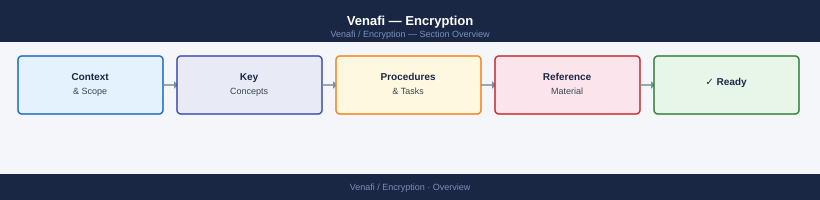

---
tags:
  - security
---
# Venafi — Encryption

HSM integration protects the CA private keys and Venafi service credentials. Keys for high-value services (CA certificates, wildcard certificates, code signing) must be stored in an HSM or managed within CyberArk with controlled retrieval.

*Applies to: Venafi TLS Protect*

## Before you begin

- **Access:** Admin credentials on all affected systems
- **Change management:** security changes require CAB approval in most environments
- **Rollback plan:** document current state before any security control change
- **Testing:** validate in a non-production environment first where possible

---

## Encryption Controls

| Control | Detail |
|---|---|
| HSM integration | Private key protection for CA trust anchors and Venafi credentials; PKCS#11 interface to on-premises HSM or cloud KMS (e.g., AWS CloudHSM, Thales Luna) |
| Certificate pinning | Policy enforcement for pinned certificate use cases; Venafi policy folders enforce Subject and SAN constraints to prevent mis-issuance |
| TLS enforcement | All Venafi Trust Protection Platform (TPP) web interfaces enforce TLS 1.2 minimum; TLS 1.0/1.1 disabled in IIS bindings and TPP `appsettings.json` |
| Key protection tiers | CA signing keys: HSM-resident only; issued end-entity private keys: encrypted at rest in SQL using AES-256 column encryption; never stored in clear text |
| Certificate lifecycle encryption | Private keys generated for managed certificates are transmitted only over mTLS to the requesting system or injected via encrypted payload in the provisioning workflow |
| Credential storage for service accounts | Venafi service account credentials (SDK API keys, IIS app pool identity) stored in CyberArk PAM; rotated on 90-day schedule via CPM |
| Database encryption | TPP SQL database configured with Transparent Data Encryption (TDE); backup files encrypted with a separate key managed outside the database server |

## HSM Configuration Reference

| Parameter | Value |
|---|---|
| Interface | PKCS#11 (Luna Network HSM) or CNG provider (Thales) |
| Key type for CA root | RSA-4096 or ECDSA P-384; generated and non-exportable |
| Key type for issuing CA | RSA-2048 minimum; P-256 preferred for new deployments |
| HSM slot assignment | Dedicated slot per environment (prod / non-prod); separate partition credentials |
| Failover | Active-passive HSM cluster with synchronised key material |
| Audit | HSM audit logs forwarded to SIEM alongside TPP event logs |

## Key Rotation and Lifecycle

| Item | Rotation Cadence | Responsibility |
|---|---|---|
| Venafi API keys (user / application) | 90 days | Venafi admin via Access Management UI |
| IIS application pool identity password | 90 days (CPM-managed) | CyberArk CPM + Venafi admin |
| TPP encryption key for SQL | Annual; or on suspected compromise | DBA + Venafi admin; requires TPP service restart |
| HSM partition PIN | On personnel change or annual | Security team |
| Issuing CA certificate | Per CA validity period (typically 5 years) | PKI team; requires re-enrollment of all issued certificates |

## See also

- [Venafi — Access Control](../access-control/)
- [Venafi — Authentication](../authentication/)
- [Venafi — Security Hardening](../hardening/)
- [Venafi — Common Issues](../../troubleshooting/common-issues/)
