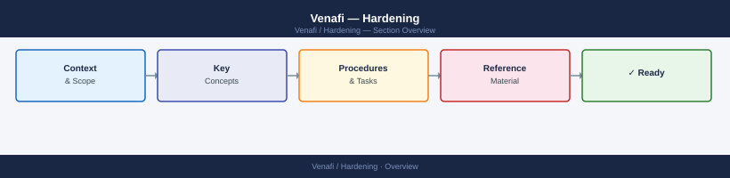

---
tags:
  - security
---
# Venafi — Hardening


<div class="kb-summary">
All certificate lifecycle events are captured in the Venafi audit log and should be forwarded to a SIEM via the Log Server. Admin and service accounts should be reviewed quarterly.

*Applies to: Venafi TLS Protect*
</div>



```d2
direction: down

hardening_controls: "Hardening Controls" {shape: rectangle}
hardening_checklist: "Hardening Checklist" {shape: rectangle}

hardening_controls -> hardening_checklist: hardens
```

## Before you begin

- **Access:** Admin credentials on all affected systems
- **Change management:** security changes require CAB approval in most environments
- **Rollback plan:** document current state before any security control change
- **Testing:** validate in a non-production environment first where possible

---

## Hardening Controls

| Control | Detail |
|---|---|
| Audit log | All lifecycle events logged; forward to SIEM via Log Server |
| Certificate pinning | Policy enforcement for pinned certificate use cases |
| Admin account review | Quarterly review of Venafi admin and service accounts |
| Admin account separation | Dedicated named admin accounts only; no shared `admin` credential; break-glass account stored in CyberArk with dual-approval workflow |
| MFA for console access | SAML 2.0 SSO with MFA enforced for all Venafi Trust Protection Platform (TPP) web console logins; local fallback accounts disabled except break-glass |
| Service account least privilege | Venafi SDK / REST API service accounts granted only the policy folder permissions required for their function; no global admin role for automation accounts |
| API access controls | API keys scoped per application; key expiry set to 90 days maximum in TPP `Access Management`; unused API keys revoked on detection |
| TLS version enforcement | TLS 1.2 minimum on all TPP web endpoints; configured in IIS bindings and confirmed via `appsettings.json`; SSLv3 / TLS 1.0 / TLS 1.1 explicitly disabled |
| Network ACLs | TPP web console (443) accessible only from approved admin VLANs and automation subnets; direct database port (1433) blocked from all external hosts |
| Log forwarding | TPP Log Server configured to forward to SIEM (Splunk/QRadar) via syslog-TLS; alert on failed login bursts and policy override events |
| Patch management | TPP hotfixes applied within 30 days of release; OS patches applied monthly; patching performed in non-prod first with a 7-day soak period |
| Outbound CA connectivity | TPP connections to upstream CAs (DigiCert, Entrust, internal EJBCA) restricted by egress firewall rule to approved IP ranges on port 443 only |

## Hardening Checklist

| Item | Status Indicator | Notes |
|---|---|---|
| SSO + MFA enforced for web console | Verify via TPP `Configuration > Certificates > Permissions` and IDP configuration | No local password logins for standard admins |
| Break-glass account in CyberArk | Confirm account in CyberArk PAM with dual-approval access policy | Rotate password after each use |
| API key expiry ≤ 90 days | Review in `Access Management > Application Integrations` | Alert on keys nearing expiry |
| TLS 1.0/1.1 disabled | Run `nmap --script ssl-enum-ciphers` against TPP hostname | Must show TLS 1.2+ only |
| SIEM log forwarding active | Confirm log events appearing in SIEM within 5 minutes of a test certificate request | Check Log Server service status if delayed |
| Network ACL — admin VLAN only | Verify firewall rule restricting port 443 to approved source ranges | Quarterly review with network team |
| Service account permission audit | Export TPP permission report; cross-reference with CMDB service account register | Revoke excess permissions on finding |
| Database port blocked externally | Confirm SQL port 1433 not reachable from DMZ or internet via firewall rule review | TPP app server should be the only permitted SQL client |
| Quarterly account review completed | Evidence in change ticket; stale accounts deactivated | Accounts inactive > 90 days should be disabled |
| HSM partition PIN changed on personnel change | Confirm with security team; document in HSM runbook | Required after any HSM admin departure |

## See also

- [Venafi — Access Control](../access-control/)
- [Venafi — Authentication](../authentication/)
- [Venafi — Encryption](../encryption/)
- [Venafi — Common Issues](../../troubleshooting/common-issues/)
