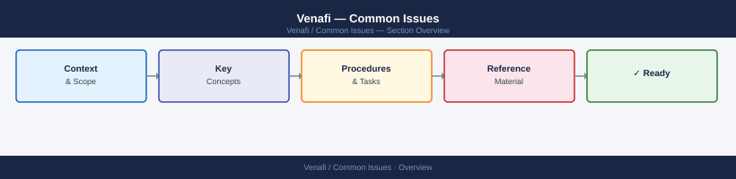
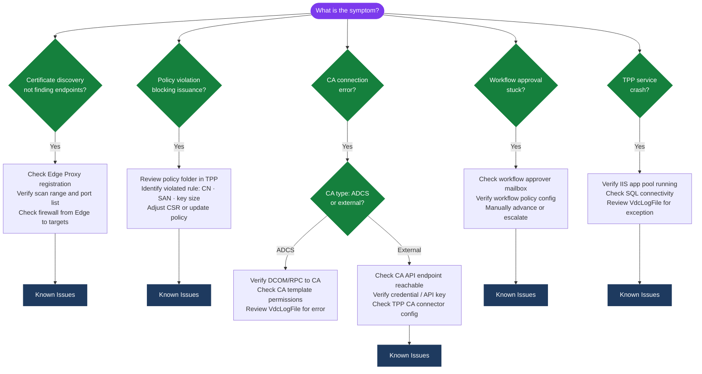

---
tags:
  - security
  - troubleshooting
search:
  boost: 1.5
---
# Venafi — Common Issues


<div class="kb-summary">
Known issues and resolution steps for frequent Venafi problems.

*Applies to: Venafi TLS Protect*
</div>



| Symptom | First Check |
|---|---|
| Certificate renewal stuck in pending | Check CA connector health; verify CA is reachable; check approval workflow |
| TPP web UI unreachable | Verify IIS app pool running; check SQL connectivity; review VdcLogFile |
| Discovery scan finds no certificates | Check scan range, port list, and Edge Proxy registration |
| LDAP/AD auth failing in Venafi | Test LDAP bind from TPP server; verify service account password not expired |
| Syslog events not appearing in SIEM | Check Log Server service; verify syslog target IP/port; check firewall |

```d2
direction: down

symptom: Identify Symptom {shape: diamond}
diagnostic_flow: "Diagnostic Flow" {shape: rectangle}
known_issues: "Known Issues" {shape: rectangle}
verify_resolution: "Verify resolution" {shape: rectangle}
resolution: Resolve or Escalate {shape: oval}

symptom -> diagnostic_flow: investigate
symptom -> known_issues: investigate
symptom -> verify_resolution: investigate
diagnostic_flow -> resolution
known_issues -> resolution
verify_resolution -> resolution
```

## Diagnostic Flow



---

## Before you begin

- **Access:** Admin credentials on all affected systems
- **Gather first:** recent error message text, event timestamps, and affected object names
- **Scope:** confirm whether the issue affects a single object, host, cluster, or site
- **Escalation:** open a vendor support ticket before running any destructive step
- **Logging:** document each command and output — required if escalation is needed

---

## Known Issues

Add known issues here as they come up.

---

## Verify resolution

- Confirm the original symptom no longer occurs
- Check logs for any residual errors related to the issue
- Monitor for 10–15 minutes to confirm the fix is stable

## See also

- [Venafi — Diagnostics](../diagnostics/)
- [Venafi — Escalation](../escalation/)
- [Venafi — Procedures](../../operations/procedures/)
