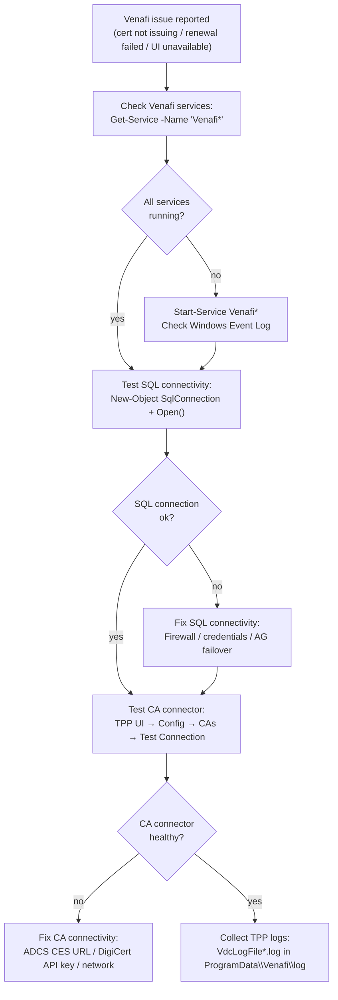

# Venafi — Diagnostics


<div class="kb-summary">
Use this page for practical Venafi troubleshooting notes, checks, commands, change notes, and field references.
</div>

## Venafi Diagnostic Flow



## Common Checks

- Confirm current health
- Review active alerts
- Check recent changes
- Confirm dependencies
- Check logs, events, and monitoring
- Capture current state before changes

## Incident Notes

Capture:

- Symptom
- Start time
- Impact
- System or service name
- Error message
- What changed
- What was checked
- Next action

## Change Notes

- Confirm change approval
- Confirm maintenance window
- Confirm rollback plan
- Capture current state
- Make one change at a time
- Validate after the change

## Useful Commands

```powershell
# Quick health check: verify core Venafi services are running
Get-Service -Name "Venafi*" | Select-Object Name, Status, StartType

# Verify SQL connectivity
$sql = New-Object System.Data.SqlClient.SqlConnection
$sql.ConnectionString = "Server=sql01.corp.example.com;Database=VenafiDB;Integrated Security=True"
$sql.Open()
Write-Host "SQL connection: $($sql.State)"
$sql.Close()
```
