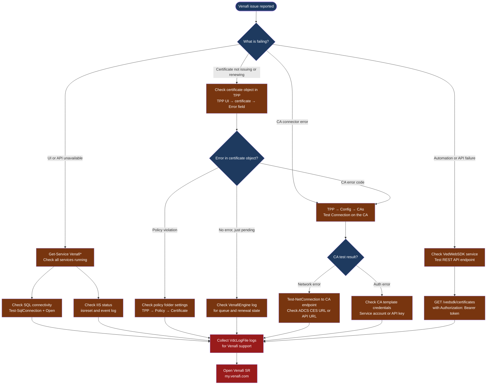

---
tags:
  - security
  - troubleshooting
search:
  boost: 1.5
---
# Venafi — Diagnostics

<div class="kb-summary">
Venafi TLS Protect diagnostic commands: check Windows service status, test SQL Server connectivity, inspect TPP and VdcLogFile logs, diagnose CA connector failures, test certificate issuance via REST API, and collect the diagnostic bundle for Venafi support cases.

*Applies to: Venafi TLS Protect (TPP) on Windows Server*
</div>

```text
┌──────────────────────────────────────── Venafi — Diagnostics ─────────────────────────────────────────┐
│                                                                                                       │
│   ┌───────────────────────────────────────────────────────────────────────────────────────────────┐   │
│   │   Start here: Get-Service Venafi* → SQL connectivity → CA connector → VdcLogFile logs        │    │
│   │   Cert not issuing: check CA connector status in TPP UI → Config → CAs → Test Connection     │    │
│   │   Renewal failed: check certificate object in TPP for error field; then check VdcLogFile     │    │
│   └───────────────────────────────────────────────────────────────────────────────────────────────┘   │
│                                                                                                       │
│   ┌──────────────────────────────────────────────┐  ┌─────────────────────────────────────────────┐   │
│   │             Venafi TPP Services              │  │           CA Connectors and Logs            │   │
│   │   Get-Service -Name Venafi*                  │  │   TPP UI → Config → CA Templates           │    │
│   │   VedWebSDK (REST API service)               │  │   TPP UI → Config → CAs → Test Connection  │    │
│   │   VenafiEngine (policy engine)               │  │   C:\ProgramData\Venafi\log\VdcLogFile*.log │   │
│   │   VenafiLog (audit/event logging)            │  │   C:\inetpub\logs\LogFiles\ (IIS web log)  │    │
│   └──────────────────────────────────────────────┘  └─────────────────────────────────────────────┘   │
│                                                                                                       │
│  Physical Infrastructure:                                                                             │
│  Venafi TPP servers (Windows) · SQL Server database · CA connectors (ADCS / DigiCert / Entrust)       │
│                                                                                                       │
│  Key terms:                                                                                           │
│  TPP           = Trust Protection Platform; the Venafi server component; runs on Windows IIS          │
│  VedWebSDK     = REST API service for Venafi; required for automation and UI                          │
│  VenafiEngine  = Policy engine that enforces certificate policies and triggers renewals               │
│  CA connector  = integration with a CA (ADCS, DigiCert, Entrust); issues certificates via TPP         │
│  VdcLogFile    = Primary Venafi application log; records all engine activity and CA responses         │
│  Policy folder = TPP object tree node defining certificate policies for child certificate objects     │
│  CertificateDN = Distinguished Name in the TPP object tree (e.g., \VED\Policy\Org\...)                │
│                                                                                                       │
└───────────────────────────────────────────────────────────────────────────────────────────────────────┘
```



## Before you begin

- **Access:** Venafi TPP admin role; Windows admin on the TPP server; SQL Server read access to the VenafiDB
- **Gather first:** the certificate DN (Distinguished Name in the object tree), the exact error message from the certificate object or log, and whether the issue affects one certificate or all issuance through a specific CA
- **Scope:** confirm whether the issue is a single certificate, all certificates issued by one CA connector, or all Venafi functionality
- **CA connector dependency:** most issuance failures trace to the CA connector — always test the connector before deep log diving

---

## Step 1 — Check Venafi Windows services

```powershell
# On the Venafi TPP server
Get-Service -Name "Venafi*" | Select-Object Name, Status, StartType
# Expected services:
#   VedWebSDK:      Running (REST API and web UI backend)
#   VenafiEngine:   Running (certificate lifecycle policy engine)
#   VenafiLog:      Running (audit and event logging)

# Start any stopped service
Start-Service -Name "VenafiEngine"
Start-Service -Name "VedWebSDK"

# Windows Application Event Log for Venafi errors
Get-EventLog -LogName Application -Source "Venafi*" -Newest 50 |
  Format-Table TimeGenerated, EntryType, Message -Wrap

# IIS application pool for Venafi
Import-Module WebAdministration
Get-WebConfiguration "system.applicationHost/applicationPools/add" |
  Where-Object { $_.name -match "Venafi" } | Select-Object name, state
# Expected: state = Started; managedRuntimeVersion = v4.0
```

---

## Step 2 — Test SQL Server connectivity

Venafi TPP stores all certificate metadata and the object tree in SQL Server. Loss of SQL connectivity stops all TPP functions.

```powershell
# Quick connectivity test to the Venafi SQL database
$sql = New-Object System.Data.SqlClient.SqlConnection
$sql.ConnectionString = "Server=<sql-server-fqdn>;Database=VenafiDB;Integrated Security=True;Connect Timeout=10"
try {
  $sql.Open()
  Write-Host "SQL connection: $($sql.State)"
  $sql.Close()
} catch {
  Write-Host "SQL connection FAILED: $($_.Exception.Message)"
}

# Test TCP port to SQL Server (default port 1433)
Test-NetConnection -ComputerName <sql-server-fqdn> -Port 1433
# Expected: TcpTestSucceeded: True

# Check SQL Server Agent jobs on the VenafiDB (from SQL Server)
# SSMS → SQL Server Agent → Jobs → look for Venafi maintenance jobs
# Failed SQL Agent jobs can cause log table bloat leading to performance issues
```

---

## Step 3 — Check the certificate object for errors

```powershell
# Query a certificate object via the REST API
$headers = @{ Authorization = "Bearer <access-token>" }
$cert = Invoke-RestMethod -Uri "https://<tpp-server>/vedsdk/certificates/<certificate-dn>" `
  -Headers $headers -SkipCertificateCheck
$cert | Select-Object CertificateDN, Status, Error, RenewalDetails

# Get an access token first
$body = @{
  client_id    = "vcert-sdk"
  username     = "<service-account>"
  password     = "<password>"
  scope        = "certificate:manage"
} | ConvertTo-Json
$token = (Invoke-RestMethod -Uri "https://<tpp-server>/vedauth/authorize/integrated" `
  -Method Post -Body $body -ContentType "application/json" -SkipCertificateCheck).access_token

# List certificates with errors
Invoke-RestMethod -Uri "https://<tpp-server>/vedsdk/certificates?Status=Enrollment+Failed&Limit=50" `
  -Headers @{ Authorization = "Bearer $token" } -SkipCertificateCheck |
  Select-Object CertificateDN, Status, Error
```

---

## Step 4 — Check CA connector status

```powershell
# Test CA connectivity via REST API (queries the CA Templates object)
Invoke-RestMethod -Uri "https://<tpp-server>/vedsdk/Config/FindObjectsOfClass" `
  -Method Post `
  -Headers @{ Authorization = "Bearer $token" } `
  -Body (@{ Class = "CA"; ObjectDN = "\VED\Policy" } | ConvertTo-Json) `
  -ContentType "application/json" -SkipCertificateCheck |
  Select-Object -ExpandProperty Objects | Select-Object DN, Name

# Via TPP UI (the Test Connection button hits the CA API directly):
# Navigate to: Configuration → CA Templates → select the CA → Test Connection
# Result: "Connection Successful" or the specific error from the CA

# Test ADCS CES endpoint reachability (if using Microsoft ADCS)
$cesUrl = "https://<adcs-server>/certsrv/mscep_admin/"
Invoke-WebRequest -Uri $cesUrl -UseDefaultCredentials -SkipCertificateCheck
# Expected: HTTP 200 (may show certificate enrollment form)

# Test DigiCert API reachability (if using DigiCert)
Invoke-RestMethod -Uri "https://www.digicert.com/services/v2/order/certificate" `
  -Headers @{ "X-DC-DEVKEY" = "<api-key>" }
```

---

## Step 5 — Inspect TPP log files

```powershell
# Primary Venafi engine log
$logDir = "C:\ProgramData\Venafi\log"
Get-ChildItem $logDir -Filter "VdcLogFile*.log" | Sort-Object LastWriteTime -Descending | Select-Object -First 3

# Read the most recent log file and filter for errors
$latestLog = Get-ChildItem $logDir -Filter "VdcLogFile*.log" |
  Sort-Object LastWriteTime -Descending | Select-Object -First 1
Get-Content $latestLog.FullName -Tail 500 |
  Select-String -Pattern "Error|Exception|Failed|WARNING|CA.*reject" -CaseSensitive:$false

# IIS log for REST API calls (access.log equivalent)
$iisLog = "C:\inetpub\logs\LogFiles\"
Get-ChildItem $iisLog -Recurse -Filter "*.log" |
  Sort-Object LastWriteTime -Descending | Select-Object -First 3
# Look for: 500 errors, 401 auth failures

# Search VdcLogFile for a specific certificate
$certCommonName = "app.corp.example.com"
Select-String -Path "$logDir\VdcLogFile*.log" -Pattern $certCommonName |
  Select-Object -Last 50
```

---

## Step 6 — Test certificate issuance via REST API

```powershell
# Request a new certificate via Venafi REST API (quick issuance test)
$body = @{
  PolicyDN   = "\VED\Policy\Org\Test"
  ObjectName = "test-cert-$(Get-Date -Format yyyyMMddHHmm)"
  Subject    = "CN=test.corp.example.com"
  CertificateType = "Server Certificate"
} | ConvertTo-Json

$response = Invoke-RestMethod -Uri "https://<tpp-server>/vedsdk/certificates/request" `
  -Method Post `
  -Headers @{ Authorization = "Bearer $token" } `
  -Body $body -ContentType "application/json" -SkipCertificateCheck

Write-Host "Certificate DN: $($response.CertificateDN)"
Write-Host "Request ID: $($response.CertId)"

# Poll for issuance (check status)
$status = Invoke-RestMethod -Uri "https://<tpp-server>/vedsdk/certificates/$($response.CertificateDN)" `
  -Headers @{ Authorization = "Bearer $token" } -SkipCertificateCheck
Write-Host "Status: $($status.CertificateStatus)"
```

---

## Step 7 — Collect diagnostic bundle for Venafi support

```powershell
# Create diagnostic directory
$diagDir = "C:\Temp\Venafi-Diag-$(Get-Date -Format yyyyMMdd-HHmm)"
New-Item -ItemType Directory $diagDir

# Copy all Venafi log files
Copy-Item "C:\ProgramData\Venafi\log\*" $diagDir -Force

# Windows event log export
Get-EventLog -LogName Application -Source "Venafi*" -Newest 200 |
  Export-Csv "$diagDir\venafi-applog.csv"
Get-EventLog -LogName System -Newest 100 |
  Export-Csv "$diagDir\system-eventlog.csv"

# IIS config and logs
Copy-Item "C:\Windows\System32\inetsrv\config\applicationHost.config" $diagDir

# Venafi version
Get-ItemProperty -Path "HKLM:\SOFTWARE\Venafi\Platform" | Export-Csv "$diagDir\version.csv"

# Compress
Compress-Archive -Path $diagDir -DestinationPath "$diagDir.zip"
Write-Host "Diagnostic bundle: $diagDir.zip"
# Upload to Venafi support portal at my.venafi.com
```

---

## Log locations

| Component | Path | What to look for |
|---|---|---|
| Engine / CA activity | `C:\ProgramData\Venafi\log\VdcLogFile*.log` | CA errors, policy failures, renewal events |
| IIS web access | `C:\inetpub\logs\LogFiles\` | 500 errors, 401 auth failures |
| Windows Event Log | `Get-EventLog Application -Source Venafi*` | Service crashes, startup errors |
| SQL Server | SQL Server error log and VenafiDB | Database connectivity and query errors |

---

## See also

- [Venafi — Common Issues](common-issues/)
- [Venafi — Escalation](escalation/)
- [Venafi — Procedures](../../operations/procedures/)

## Verify resolution

- `Get-Service -Name "Venafi*"` shows all Venafi services in `Running` state
- SQL connectivity test succeeds from each TPP server
- CA connector Test Connection in TPP UI returns "Connection Successful"
- A test certificate request via REST API (`/vedsdk/certificates/request`) completes with `Status = Enrolled`
- The original failing certificate object in TPP shows `Status = Active` and the Error field is empty
