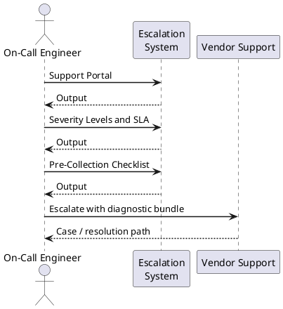
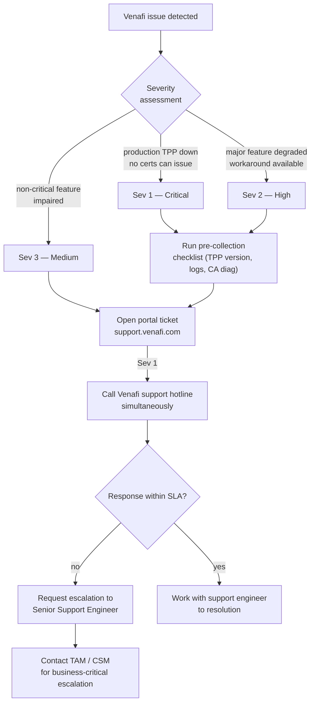

---
tags:
  - security
  - troubleshooting
search:
  boost: 1.5
---
# Venafi Vendor Support

<div class="kb-summary">
Procedures for raising support cases with Venafi, collecting diagnostic data, and escalating critical incidents.

*Applies to: Venafi TLS Protect*
</div>

---



## Before you begin

- **Access:** Admin credentials on all affected systems
- **Gather first:** recent error message text, event timestamps, and affected object names
- **Scope:** confirm whether the issue affects a single object, host, cluster, or site
- **Escalation:** open a vendor support ticket before running any destructive step
- **Logging:** document each command and output — required if escalation is needed

---

## Support Portal

| Item | Detail |
|---|---|
| Support portal | https://support.venafi.com |
| Knowledge base | https://support.venafi.com/hc/en-us |
| Version compatibility matrix | https://support.venafi.com/hc/en-us/articles/360024789251 |
| EOL / Support lifecycle | https://support.venafi.com/hc/en-us/articles/360024784232 |
| Community forum | https://community.venafi.com |

Log in with your Venafi support account credentials. Support entitlement (Premier, Premier Plus) determines available SLA tiers and access to named technical account managers.

---

## Severity Levels and SLA

| Severity | Description | Initial Response (Premier) |
|---|---|---|
| Sev 1 — Critical | Production TPP down; no certificates can be issued or renewed | 1 hour (phone + portal) |
| Sev 2 — High | Major feature degraded; workaround available | 4 hours |
| Sev 3 — Medium | Non-critical feature impaired | 1 business day |
| Sev 4 — Low | General questions, feature requests, documentation | 2 business days |

For Sev 1: open the portal ticket AND call the Venafi support hotline simultaneously. Phone number is listed in the support portal after authentication.

---

## Pre-Collection Checklist

Collect the following before opening any support case to reduce round-trips:

### TPP Version and Environment

```powershell
# TPP version (run on TPP Policy Server)
Get-ItemProperty "HKLM:\Software\Venafi\Platform" | Select-Object ProductVersion

# Installed hotfixes
Get-WmiObject Win32_QuickFixEngineering | Sort-Object InstalledOn -Descending | Select-Object -First 10

# OS and hardware details
Get-ComputerInfo | Select-Object WindowsProductName, OsVersion, CsProcessors, CsTotalPhysicalMemory
```

### Log Collection

```powershell
# TPP application logs (primary location)
$logPath = "$env:ProgramData\Venafi\log\"
Get-ChildItem $logPath -Filter "VdcLogFile*.log" | Sort-Object LastWriteTime -Descending | Select-Object -First 5

# Collect last 24 hours of logs
$cutoff = (Get-Date).AddHours(-24)
Get-ChildItem $logPath -Filter "VdcLogFile*.log" |
  Where-Object { $_.LastWriteTime -gt $cutoff } |
  ForEach-Object { Copy-Item $_.FullName "C:\Temp\VenafiLogs\" }

# Windows Event Log — Application source (Venafi)
Get-WinEvent -FilterHashtable @{ LogName = "Application"; ProviderName = "Venafi*" } -MaxEvents 500 |
  Select-Object TimeCreated, LevelDisplayName, Message |
  Export-Csv "C:\Temp\Venafi_EventLog.csv" -NoTypeInformation
```

### CA Connector Diagnostics

```powershell
# Test CA connector connectivity from TPP server
# For ADCS (CES endpoint):
Invoke-WebRequest -Uri "https://adcs.corp.example.com/ADPolicyProvider_CEP_UsernamePassword/service.svc/CEP" `
  -UseDefaultCredentials

# For external CA (DigiCert, Entrust):
Test-NetConnection -ComputerName "www.digicert.com" -Port 443
```

---

## Required Information for SR

Include all of the following in the initial SR submission:

- TPP version (e.g., `23.4.1.xxx`)
- Windows Server OS version on TPP nodes
- SQL Server version and edition
- CA type and version (e.g., ADCS on Server 2022, DigiCert connector version)
- Approximate total managed certificate count
- Error message with exact timestamp
- Steps to reproduce (if applicable)
- Business impact and affected certificates/services
- Log files from the pre-collection checklist (attach to ticket)

---

## Escalation Path

1. Open portal ticket at support.venafi.com with full pre-collection data.
2. For Sev 1: call support hotline (number in portal after authentication).
3. If no response within SLA: request escalation to Senior Support Engineer via portal.
4. If business-critical escalation needed beyond support: contact your Venafi Technical Account Manager (TAM) or Customer Success Manager (CSM).

## Escalation Decision Flow



---

## Verify resolution

- Confirm the original symptom no longer occurs
- Check logs for any residual errors related to the issue
- Monitor for 10–15 minutes to confirm the fix is stable

## See also

- [Venafi — Common Issues](../common-issues/)
- [Venafi — Diagnostics](../diagnostics/)
- [Venafi — Procedures](../../operations/procedures/)
