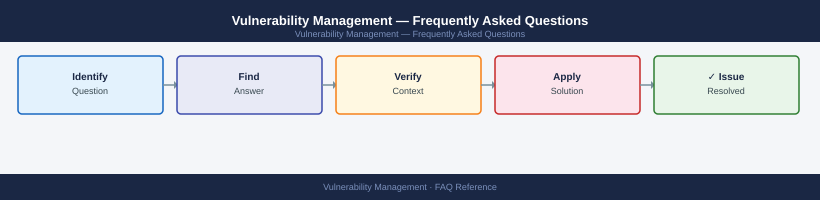

---
tags:
  - vulnerability-management
  - faq
  - operations
---
# Vulnerability Management — Frequently Asked Questions

<div class="kb-summary">
Common questions about Vulnerability Management operations, configuration, and troubleshooting. For step-by-step procedures, see the <a href="index.md">Operations</a> section.
</div>



```d2
direction: right

hub: "Operations\nOperations" {shape: hexagon}
general: "General" {shape: rectangle}
configuration: "Configuration" {shape: rectangle}
operations: "Operations" {shape: rectangle}
troubleshooting: "Troubleshooting" {shape: rectangle}
backup_and_recovery: "Backup and Recovery" {shape: rectangle}

hub -> general
hub -> configuration
hub -> operations
hub -> troubleshooting
hub -> backup_and_recovery
```

## General

**Q: How do I check the current vulnerability scanner version and plugin currency?**
A: Tenable.sc: Admin → About; Nessus: Settings → About. Check plugin feed date: should be within 24 hours. Qualys: VM → Appliances → Last Update. Outdated plugins miss new CVEs.

**Q: How do I check the current Vulnerability Management version?**
A: `Tenable.sc: Admin → About → Version & Plugin Feed Date`

## Configuration

**Q: What is the default scan frequency and when should it change?**
A: Weekly internal scans and monthly external scans are a common baseline. Increase internal scan frequency to daily for internet-facing or critical assets. Immediately re-scan after patching to verify remediation.

**Q: How do I enable credentialed scanning for more accurate results?**
A: Configure a scan credential (Windows: domain admin service account; Linux: SSH key with sudo). In Tenable: Credentials → Add. Run a credentialed scan — this finds 2-3x more vulnerabilities than unauthenticated scans (local software, registry checks).

## Operations

**Q: How do I upgrade the vulnerability scanner without creating scan gaps?**
A: Schedule upgrade outside scan windows. For Tenable.sc, upgrade the Security Center appliance, then Nessus scanners one at a time. Scans continue from active scanners during the upgrade. Verify plugin currency post-upgrade.

**Q: What is the correct procedure to add a new network segment to scan scope?**
A: Add the IP range to a scan policy. Place a scanner with network access to the segment. Run a discovery scan first to enumerate live hosts. Then run a full vulnerability scan. Add new assets to your asset tracking tool.

## Troubleshooting

**Q: Scanner shows many 'Info' level findings on production servers. What does it mean?**
A: Info findings are not vulnerabilities — they are informational (open ports, service banners). Filter them from remediation reports. Focus on Critical/High CVEs first. Review Info findings during quarterly baseline assessments only.

**Q: Scans are causing performance impact on production servers — where do I start?**
A: Reduce scan concurrency (scanner threads). Schedule scans during off-peak hours. Use 'Safe Checks' mode in Nessus (disables potentially disruptive checks). Exclude database servers from aggressive scan policies.

## Backup and Recovery

**Q: How long should I retain vulnerability scan data?**
A: Retain scan reports for 12 months minimum (PCI-DSS requirement). Archive trend data for 3 years for programme metrics. Export scan results to your GRC tool for evidence correlation with patch compliance records.

**Q: Can I revert a false-positive acceptance if re-scanned vulnerability is real?**
A: Yes — in Tenable.sc/Qualys, accepted risks can be reopened. Navigate to Accepted Risks → find the entry → Reopen. Investigate whether the accepted risk was valid — re-evaluate original justification if the vulnerability appears again.

## See Also

- [Vulnerability Management Operations](index.md)
- [Vulnerability Management Troubleshooting](../../troubleshooting/index.md)
