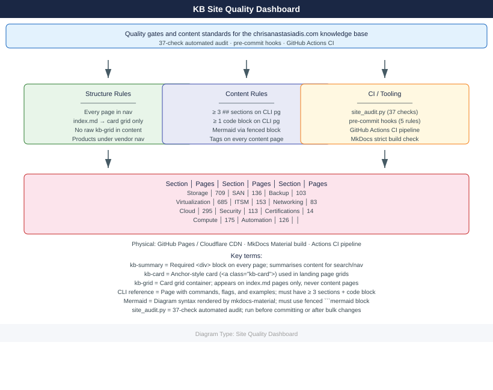

# Site Quality Dashboard

<div class="kb-summary">
Quality gates and content standards for the chrisanastasiadis.com knowledge base.
</div>



Generated: 2026-07-13

## Current state

| Item | Count |
|---|---:|
| Total markdown pages | 2,851 |
| Sections | 11 |
| Pages with kb-summary | 2,571 |
| Pages with full-width ASCII diagram | 155 |
| Pages with SVG diagrams | 1,450 |
| Pages with Mermaid diagrams | 44 |
| Pages with tags | 2,819 |
| Audit score | 54 / 55 |
| MkDocs strict build warnings | 0 |

## Pages by section

| Section | Pages |
|---|---:|
| Storage | 709 |
| Virtualization | 685 |
| Cloud | 295 |
| Compute | 175 |
| ITSM | 153 |
| SAN | 136 |
| Automation | 126 |
| Security | 113 |
| Backup | 103 |
| Networking | 83 |
| Certifications | 14 |

## Quality rules

- Every page should be reachable from the left nav.
- Landing pages (`index.md`) must have a card grid linking to sub-pages using `<a class="kb-card">` anchor style only — no `<div class="kb-card">`.
- Keep the left nav light — section landing pages are the entry point.
- Product pages stay under their vendor/platform landing page.
- No raw HTML card blocks (`kb-grid`, `kb-card`) in content pages — card grids belong on index pages only.
- All CLI reference pages must have at least 3 `##` sections and at least one fenced code block.
- Mermaid flowcharts are added via fenced ` ```mermaid ` blocks — do not use raw HTML `<div class="mermaid">`.
- Every content page must have at least one product tag and one domain tag.
- Run `python3 scripts/site_audit.py` before bulk changes and after.

## Useful commands

```bash
python3 scripts/site_audit.py          # full 37-check audit
python3 scripts/site_audit.py --full   # include all issue details
mkdocs build --strict                  # strict build check
mkdocs serve                           # local preview
```

```text title="Expected output"
SUMMARY: 55/55 checks clean
INFO - Building documentation...
INFO - Documentation built in 12.3 seconds
INFO - Serving on http://127.0.0.1:8000
```
