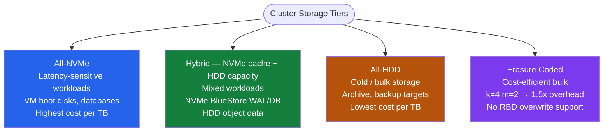

# Ceph — Design Standards

<div class="kb-summary">
Ceph cluster design: node and disk sizing, OSD-to-MON-to-MGR ratios, network separation (public vs cluster), CRUSH hierarchy for fault domains, and capacity planning rules.
</div>

```text
┌─────────────────────────────────────── Ceph — Design Standards ───────────────────────────────────────┐
│                                                                                                       │
│   ┌───────────────────────────────────────────────────────────────────────────────────────────────┐   │
│   │   Minimum production: 3 nodes × 4 OSDs; use 5 MONs for large clusters; 2 MGRs always         │    │
│   │   Network: public network (client I/O) and cluster network (replication) must be separate     │   │
│   │   CRUSH: define host-level failure domain; upgrade to rack if > 3 nodes per rack              │   │
│   └───────────────────────────────────────────────────────────────────────────────────────────────┘   │
│                                                                                                       │
│   ┌─────────────────────────────┐  ┌─────────────────────────────┐  ┌─────────────────────────────┐   │
│   │       Node Sizing           │  │      Network Design          │  │      Daemon Counts          │  │
│   │      ─────────────          │  │      ─────────────           │  │      ─────────────          │  │
│   │  Min: 3 OSD nodes           │  │  Public: client ↔ OSD       │  │  MON: 3 (up to 5+ nodes)   │    │
│   │  1 OSD per disk             │  │  Cluster: OSD ↔ OSD repl.   │  │  MGR: 2 (active/standby)   │    │
│   │  1 SSD/NVMe for WAL/DB      │  │  10 GbE public minimum      │  │  MDS: 1+ if CephFS          │   │
│   │  RAM: 4-6 GB per OSD        │  │  25 GbE+ cluster recommended│  │  RGW: 2+ if object storage  │   │
│   └─────────────────────────────┘  └─────────────────────────────┘  └─────────────────────────────┘   │
│                                                                                                       │
│  Key terms:                                                                                           │
│                                                                                                       │
│  OSD          = Object Storage Daemon; one per physical disk; minimum 3 OSD nodes for production      │
│  MON          = Monitor daemon; maintains cluster maps; 3 MONs required (5 for large clusters)        │
│  MGR          = Manager daemon; runs metrics, dashboard, orchestrator; always deploy 2 (active/standby)│
│  MDS          = Metadata Server; required only if using CephFS; deploy 1+ per CephFS filesystem       │
│  RGW          = RADOS Gateway; deploy 2+ for object storage HA; requires separate pool config         │
│  CRUSH        = Controlled Replication Under Scalable Hashing; data placement algorithm               │
│  Failure domain = CRUSH hierarchy level for fault isolation; host (default), rack, AZ                 │
│  WAL/DB SSD   = NVMe device used as BlueStore WAL and RocksDB metadata store; boosts OSD performance  │
│  Public network = Client-facing network; minimum 10 GbE; 25 GbE+ recommended for production           │
│  Cluster network= OSD-to-OSD replication network; separate from public network; no client access      │
│  FTT          = Failure To Tolerate; replication size 3 = FTT 1; requires min 3 OSD nodes             │
│  BlueStore    = Default Ceph OSD storage backend; stores data directly on block device via RocksDB    │
│                                                                                                       │
└───────────────────────────────────────────────────────────────────────────────────────────────────────┘
```



## Cluster Sizing

| Scale | OSD Nodes | Total OSDs | MONs | MGRs | Notes |
|---|---|---|---|---|---|
| Small | 3 | 10–30 | 3 | 2 | All daemons may share nodes; separate MON/OSD recommended |
| Medium | 6–10 | 60–120 | 3–5 | 2 | Dedicated MON/MGR nodes; rack-level failure domain |
| Large | 12+ | 200+ | 5 | 2 | Dedicated MON/MGR nodes mandatory; consider multi-site |

**MON/MGR placement rules:**
- Small clusters (≤ 5 nodes): MON and MGR may share OSD nodes.
- Medium+ clusters: dedicate at least 3 nodes for MON + MGR to prevent MON quorum loss during OSD node failure.
- Never place more than 1 MON on the same physical host (violates quorum fault tolerance).
- MGR active/standby must be on different hosts. Both must be running at all times.

## Node Hardware Recommendations

| Role | vCPU | RAM | NIC | Disk |
|---|---|---|---|---|
| MON / MGR node | 4+ | 32 GB | 1× 10 GbE (public) | 100 GB OS + 100 GB MON DB SSD |
| OSD node (HDD) | 2 per OSD | 4–6 GB per OSD + 16 GB base | 2× 25 GbE (public + cluster) | 1× NVMe WAL/DB per 4–6 HDDs; HDDs for data |
| OSD node (NVMe) | 4 per OSD | 4 GB per OSD + 16 GB base | 2× 25 GbE or 1× 100 GbE | 1 NVMe per OSD; no separate WAL/DB device needed |
| MDS node | 8+ | 64 GB+ | 1× 10 GbE | 100 GB OS SSD |
| RGW node | 8+ | 32 GB | 2× 10 GbE | 100 GB OS SSD |

## Replication vs Erasure Coding

| Property | Replicated (size=3) | Erasure Coded (k=4, m=2) |
|---|---|---|
| Raw overhead | 3× | 1.5× |
| Minimum OSDs | 3 | k+m = 6 |
| Write IOPS impact | Low | Higher (encoding CPU cost) |
| Read IOPS | Full random read from any replica | Decode overhead on partial reads |
| RBD support | Full (including overwrites) | Partial (requires BlueStore + EC overwrites enabled) |
| CephFS support | Yes | Data pool only (metadata pool must be replicated) |
| Recovery cost | Copy full objects | Rebuild from k shards — less data transferred |
| Use case | VM disks, databases, latency-sensitive | Cold storage, backups, bulk object store |

## CRUSH Map Design

**Failure domain selection:**

| Cluster size | Recommended failure domain | Rationale |
|---|---|---|
| 3 nodes | `host` | Only 3 failure domains available |
| 6–12 nodes (2–4 per rack) | `rack` | Rack power/switch failure isolated |
| 12+ nodes, multi-AZ | `datacenter` | AZ-level fault tolerance |

```bash
# Create rack-level CRUSH rule
ceph osd crush rule create-replicated rack_replicated default rack firstn

# Assign pool to rack rule
ceph osd pool set rbd-pool crush_rule rack_replicated

# Mixed media — separate CRUSH roots for SSD and HDD pools
# Add SSD OSDs to a separate root
ceph osd crush add-bucket ssd-root root
ceph osd crush set-bucket-item ssd-root ssd-host1
ceph osd crush rule create-replicated ssd_rule ssd-root host firstn

# Assign weight (in TB) to each OSD
ceph osd crush reweight osd.5 3.64      # 4 TB HDD = 3.64 usable TB

# View full CRUSH tree with weights
ceph osd crush tree --show-shadow
ceph osd df tree
```

## PG Count Formula

```text
PGs per pool = (Total OSDs × 100) / pool_size
```

Round the result up to the next power of 2. Keep total PGs per OSD ≤ 250 across all pools.

| OSDs | Pool size | Raw result | Rounded (power of 2) |
|---|---|---|---|
| 30 | 3 | 1000 | 1024 |
| 60 | 3 | 2000 | 2048 |
| 120 | 3 | 4000 | 4096 |
| 30 | 2 | 1500 | 2048 |

**PG autoscaler** (default on in Octopus+) handles PG count automatically:

```bash
# Check autoscaler status
ceph osd pool autoscale-status

# Enable autoscaler on a specific pool
ceph osd pool set rbd-pool pg_autoscale_mode on

# Set target ratio (autoscaler calculates PGs based on % of cluster)
ceph osd pool set rbd-pool target_size_ratio 0.4   # 40% of cluster capacity

# Disable autoscaler globally (use manual PG counts)
ceph config set global osd_pool_default_pg_autoscale_mode off
```

## Network Design

```text
Two networks required:
  Public network:   10.0.1.0/24   → client-to-OSD traffic (reads, writes)
  Cluster network:  10.0.2.0/24   → OSD-to-OSD replication and recovery

Why separate?
  Without a cluster network, recovery/replication traffic consumes client I/O bandwidth.
  Recovery after a disk failure can generate 100–500 Mbps per OSD.

Bandwidth guidelines:
  Public:  10 GbE minimum per OSD node; 25 GbE for NVMe-heavy clusters
  Cluster: 25 GbE minimum; 100 GbE for dense NVMe nodes (50+ OSDs per node)
```

| Network | Minimum | Recommended | Notes |
|---|---|---|---|
| Public (client I/O) | 10 GbE | 25 GbE | Carries client reads/writes to OSDs |
| Cluster (replication) | 10 GbE | 25 GbE; 100 GbE for NVMe nodes | Carries OSD-to-OSD replication; no client traffic |
| MTU | 1500 | 9000 (jumbo frames) | Enable jumbo frames on cluster network for replication throughput |
| Bonding | Optional | Recommended (LACP) | 2× NICs bonded for redundancy on both networks |

```bash
# Verify Ceph is using separate networks (from ceph.conf or cephadm config)
ceph config get osd public_network
ceph config get osd cluster_network

# Set cluster network (if not already configured)
ceph config set global public_network 10.0.1.0/24
ceph config set global cluster_network 10.0.2.0/24
```

## Capacity Planning

```text
Replicated pool (size=3):
  Raw capacity needed = usable × 3
  Safety threshold: never exceed 85% full (ceph warns at nearfull ratio)
  Full threshold: cluster stops writes at 95% (full ratio)

Erasure-coded pool (k=4, m=2):
  Raw capacity needed = usable × 1.5
  Better efficiency but slightly more complex recovery

OSD count formula:
  OSDs = Usable capacity target (TB) × replication factor / disk size (TB)
  Example: 100 TB usable, replica=3, 8 TB disks: (100 × 3) / 8 = 37.5 → 40 OSDs

PG count formula:
  PGs per pool = (Total OSDs × 100) / pool size (round to power of 2)
  Total PGs across all pools: aim for 100–200 per OSD
```

```bash
# Check cluster capacity and usage
ceph df
ceph df detail

# Check per-OSD usage
ceph osd df

# Adjust nearfull and full thresholds
ceph config set global mon_osd_nearfull_ratio 0.80
ceph config set global mon_osd_full_ratio 0.90
ceph config set global mon_osd_backfillfull_ratio 0.85
```

## CRUSH Hierarchy Design

```bash
# Standard CRUSH hierarchy: datacenter → room → rack → host → OSD
# Minimum failure domain: host (3 hosts = 3 failure domains for replica=3)

# Example CRUSH rule for host-level failure domain
ceph osd crush rule create-replicated replicated_rule default host firstn

# Rack-level failure domain (better fault isolation)
ceph osd crush rule create-replicated rack_rule default rack firstn

# Assign pool to rack-level rule
ceph osd pool set rbd-pool crush_rule rack_rule

# Verify OSD placement
ceph osd crush tree
ceph osd df tree
```

## Upgrade and Maintenance Standards

```bash
# Check cluster compatibility before upgrade
ceph versions                     # lists all daemon versions in cluster
ceph osd require-osd-release quincy  # set minimum OSD release gate

# Drain OSDs on a node before maintenance (graceful)
ceph osd set noout               # prevent OSDs from being marked out during maint
# --- perform maintenance ---
ceph osd unset noout             # re-enable after returning node to service

# Full set of maintenance flags
ceph osd set norecover           # pause all recovery
ceph osd set norebalance         # pause rebalancing
ceph osd set nobackfill          # pause backfill
ceph osd unset norecover
ceph osd unset norebalance
ceph osd unset nobackfill
```

| Flag | Effect | When to use |
|---|---|---|
| `noout` | Prevents OSDs from being marked out | Node maintenance, short outages |
| `norecover` | Stops recovery operations | Prevents I/O saturation during maintenance |
| `norebalance` | Stops rebalancing after OSD addition | Adding multiple OSDs in a batch |
| `nobackfill` | Stops backfill to new OSDs | Controlled rollout of new nodes |
| `pause` | Pauses all client I/O | Emergency cluster freeze |

## cephadm Orchestration Commands

```bash
# View all running daemons
ceph orch ps

# Deploy additional MON
ceph orch apply mon --placement="host1,host2,host3"

# Add OSDs from a specific host/device
ceph orch daemon add osd host1:/dev/sdb

# Remove an OSD gracefully (marks out, waits for clean, then removes)
ceph orch osd rm osd.12 --replace

# Check orchestrator status
ceph orch status
ceph orch ls
```
