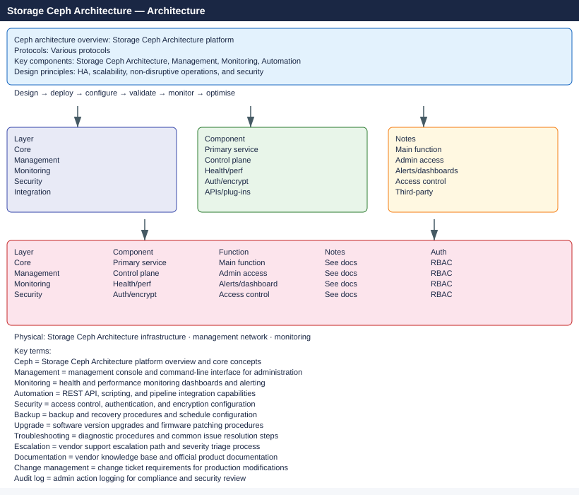

---
tags:
  - architecture
  - ceph
---
# Ceph — Architecture

<!-- diagram:ceph-architecture -->

<div class="kb-summary">
Ceph architecture: RADOS object store, daemon roles (OSD/MON/MGR/MDS), CRUSH map for data placement, replication vs erasure coding pools, and client access protocols.

*Applies to: Red Hat Ceph Storage · Upstream Ceph*
</div>




```text
  RADOS  = Reliable Autonomic Distributed Object Store — Ceph's foundational storage layer
  OSD    = Object Storage Daemon; one per disk; handles placement, replication, recovery
  MON    = Monitor daemon; maintains cluster maps (OSD, CRUSH, PG); requires quorum
  MGR    = Manager daemon; provides metrics, dashboard, and orchestration APIs
  MDS    = Metadata Server; manages CephFS namespace operations and directory layout
  CRUSH  = Controlled Replication Under Scalable Hashing; client-computed data placement
  PG     = Placement Group; logical data shard; PGs map to OSD sets via CRUSH rules
  RBD    = RADOS Block Device; thin-provisioned block storage with snapshot/clone support
  CephFS = POSIX-compliant distributed filesystem; requires MDS; supports snapshots
  RGW    = RADOS Gateway; S3 and Swift-compatible object storage REST API frontend
```

```d2
direction: right

ROOT: "ROOT" {shape: rectangle}
HIW: "How It Works" {shape: rectangle}
DS: "Design Standards" {shape: rectangle}
INT: "Integrations" {shape: rectangle}
H1: "RADOS / OSD / PG / CRUSH" {shape: rectangle}
D1: "Sizing / EC / CRUSH map" {shape: rectangle}
I1: "ODF / CSI / Prometheus" {shape: rectangle}

ROOT -> HIW
ROOT -> DS
ROOT -> INT
HIW -> H1
DS -> D1
INT -> I1
```

<div class="kb-grid">
  <a class="kb-card" href="how-it-works/">
    <span class="kb-card-title">How It Works</span>
    <span class="kb-card-desc">RADOS I/O path, OSD peering, CRUSH algorithm, PG distribution</span>
  </a>
  <a class="kb-card" href="design-standards/">
    <span class="kb-card-title">Design Standards</span>
    <span class="kb-card-desc">Cluster sizing, OSD-to-MON ratio, network separation, CRUSH rules</span>
  </a>
  <a class="kb-card" href="integrations/">
    <span class="kb-card-title">Integrations</span>
    <span class="kb-card-desc">OpenStack Cinder/Nova, Kubernetes CSI, ODF, Prometheus, NFS/Ganesha</span>
  </a>
</div>
