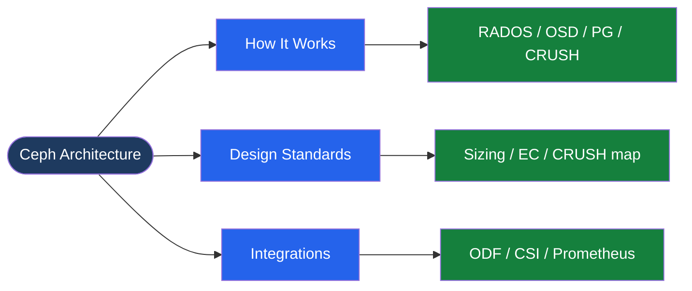

---
tags:
  - architecture
  - ceph
---
# Ceph — Architecture

<!-- diagram:ceph-architecture -->

<div class="kb-summary">
Ceph architecture: RADOS object store, daemon roles (OSD/MON/MGR/MDS), CRUSH map for data placement, replication vs erasure coding pools, and client access protocols.

*Applies to: Red Hat Ceph Storage · Upstream Ceph*
</div>

```text
┌────────────────────────────── Storage Ceph Architecture — Architecture ───────────────────────────────┐
│                                                                                                       │
│   ┌───────────────────────────────────────────────────────────────────────────────────────────────┐   │
│   │                 Ceph architecture overview: Storage Ceph Architecture platform                │   │
│   │                                  Protocols: Various protocols                                 │   │
│   │         Key components: Storage Ceph Architecture, Management, Monitoring, Automation         │   │
│   │          Design principles: HA, scalability, non-disruptive operations, and security          │   │
│   └───────────────────────────────────────────────────────────────────────────────────────────────┘   │
│                                                                                                       │
│    Design → deploy → configure → validate → monitor → optimise                                        │
│                                                                                                       │
│                  ▼                                ▼                                ▼                  │
│                                                                                                       │
│   ┌─────────────────────────────┐  ┌─────────────────────────────┐  ┌─────────────────────────────┐   │
│   │            Layer            │  │          Component          │  │            Notes            │   │
│   │             Core            │  │       Primary service       │  │        Main function        │   │
│   │          Management         │  │        Control plane        │  │         Admin access        │   │
│   │          Monitoring         │  │         Health/perf         │  │      Alerts/dashboards      │   │
│   │           Security          │  │         Auth/encrypt        │  │        Access control       │   │
│   │         Integration         │  │        APIs/plug-ins        │  │         Third-party         │   │
│   └─────────────────────────────┘  └─────────────────────────────┘  └─────────────────────────────┘   │
│                                                                                                       │
│                          ▼                                                 ▼                          │
│                                                                                                       │
│   ┌───────────────────────────────────────────────────────────────────────────────────────────────┐   │
│   │      Layer       │    Component     │      Function     │      Notes       │       Auth       │   │
│   │       Core       │ Primary service  │   Main function   │     See docs     │       RBAC       │   │
│   │    Management    │  Control plane   │    Admin access   │     See docs     │       RBAC       │   │
│   │    Monitoring    │   Health/perf    │  Alerts/dashboard │     See docs     │       RBAC       │   │
│   │     Security     │   Auth/encrypt   │   Access control  │     See docs     │       RBAC       │   │
│   └───────────────────────────────────────────────────────────────────────────────────────────────┘   │
│                                                                                                       │
│    Physical: Storage Ceph Architecture infrastructure · management network · monitoring               │
│                                                                                                       │
│    Key terms:                                                                                         │
│                                                                                                       │
│    Ceph               = Storage Ceph Architecture platform overview and core concepts                 │
│    Management         = management console and command-line interface for administration              │
│    Monitoring         = health and performance monitoring dashboards and alerting                     │
│    Automation         = REST API, scripting, and pipeline integration capabilities                    │
│    Security           = access control, authentication, and encryption configuration                  │
│    Backup             = backup and recovery procedures and schedule configuration                     │
│    Upgrade            = software version upgrades and firmware patching procedures                    │
│    Troubleshooting    = diagnostic procedures and common issue resolution steps                       │
│    Escalation         = vendor support escalation path and severity triage process                    │
│    Documentation      = vendor knowledge base and official product documentation                      │
│    Change management  = change ticket requirements for production modifications                       │
│    Audit log          = admin action logging for compliance and security review                       │
│                                                                                                       │
└───────────────────────────────────────────────────────────────────────────────────────────────────────┘
```


```text
  RADOS  = Reliable Autonomic Distributed Object Store — Ceph's foundational storage layer
  OSD    = Object Storage Daemon; one per disk; handles placement, replication, recovery
  MON    = Monitor daemon; maintains cluster maps (OSD, CRUSH, PG); requires quorum
  MGR    = Manager daemon; provides metrics, dashboard, and orchestration APIs
  MDS    = Metadata Server; manages CephFS namespace operations and directory layout
  CRUSH  = Controlled Replication Under Scalable Hashing; client-computed data placement
  PG     = Placement Group; logical data shard; PGs map to OSD sets via CRUSH rules
  RBD    = RADOS Block Device; thin-provisioned block storage with snapshot/clone support
  CephFS = POSIX-compliant distributed filesystem; requires MDS; supports snapshots
  RGW    = RADOS Gateway; S3 and Swift-compatible object storage REST API frontend
```



<div class="kb-grid">
  <a class="kb-card" href="how-it-works/">
    <span class="kb-card-title">How It Works</span>
    <span class="kb-card-desc">RADOS I/O path, OSD peering, CRUSH algorithm, PG distribution</span>
  </a>
  <a class="kb-card" href="design-standards/">
    <span class="kb-card-title">Design Standards</span>
    <span class="kb-card-desc">Cluster sizing, OSD-to-MON ratio, network separation, CRUSH rules</span>
  </a>
  <a class="kb-card" href="integrations/">
    <span class="kb-card-title">Integrations</span>
    <span class="kb-card-desc">OpenStack Cinder/Nova, Kubernetes CSI, ODF, Prometheus, NFS/Ganesha</span>
  </a>
</div>
