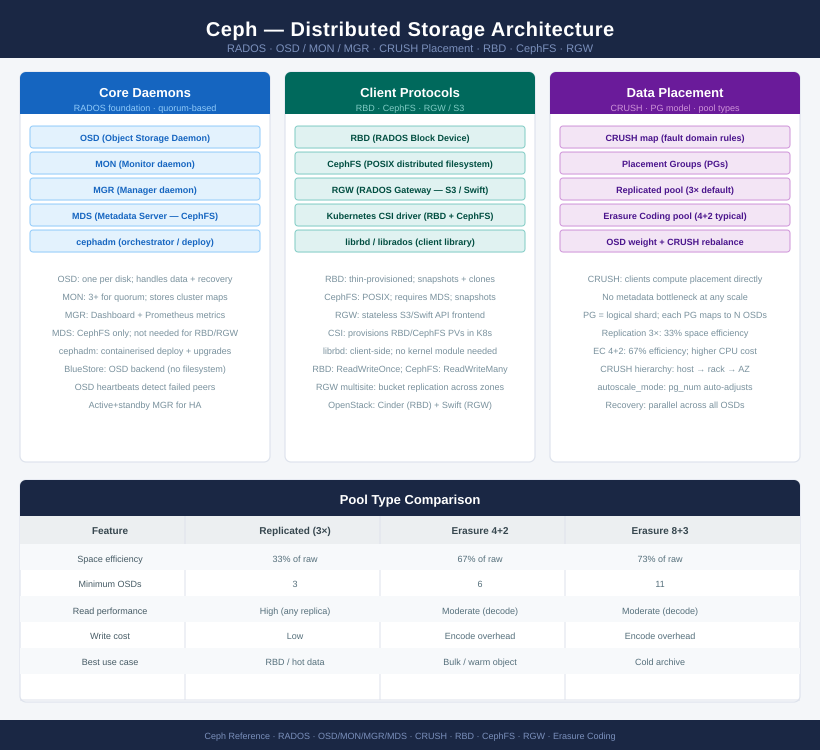

# Ceph — Architecture

<!-- diagram:ceph-architecture -->

<div class="kb-summary">
Ceph architecture: RADOS object store, daemon roles (OSD/MON/MGR/MDS), CRUSH map for data placement, replication vs erasure coding pools, and client access protocols.
</div>



```text
┌────────────────────────────────────────── Ceph Architecture ──────────────────────────────────────────┐
│                                                                                                       │
│   ┌───────────────────────────────────────────────────────────────────────────────────────────────┐   │
│   │                                   Ceph Architecture Overview                                  │   │
│   │          Three sub-sections: How It Works (RADOS I/O), Design Standards, Integrations         │   │
│   │         CRUSH: clients compute placement directly; no metadata bottleneck at any scale        │   │
│   │          PG model: each pool divided into PGs; each PG maps to N OSDs via CRUSH rule          │   │
│   └───────────────────────────────────────────────────────────────────────────────────────────────┘   │
│                                                                                                       │
│                 ▼                               ▼                                 ▼                   │
│                                                                                                       │
│   ┌────────────────────────────┐  ┌────────────────────────────┐  ┌───────────────────────────────┐   │
│   │        How It Works        │  │      Design Standards      │  │          Integrations         │   │
│   │        RADOS I/O path      │  │       Node/disk sizing     │  │          Kubernetes CSI       │   │
│   │      OSD peering model     │  │      Network separation    │  │         OpenStack Cinder      │   │
│   │       CRUSH algorithm      │  │       CRUSH hierarchy      │  │          RGW S3 clients       │   │
│   │          Pool types        │  │      Capacity planning     │  │        CephFS NFS export      │   │
│   └────────────────────────────┘  └────────────────────────────┘  └───────────────────────────────┘   │
│                                                                                                       │
│  Key terms:                                                                                           │
│                                                                                                       │
│  RADOS     = Reliable Autonomic Distributed Object Store; Ceph's foundational storage layer           │
│  OSD       = Object Storage Daemon; one per disk; handles data placement, replication, recovery       │
│  MON       = Monitor daemon; maintains cluster maps (OSD, CRUSH, PG); requires quorum                 │
│  MGR       = Manager daemon; provides metrics, dashboard, and orchestration APIs                      │
│  MDS       = Metadata Server; manages CephFS namespace operations and directory layout                │
│  CRUSH     = Controlled Replication Under Scalable Hashing; client-computed data placement            │
│  PG        = Placement Group; logical data shard; PGs map to OSD sets via CRUSH rules                 │
│  RBD       = RADOS Block Device; thin-provisioned block storage with snapshot/clone support           │
│  CephFS    = POSIX-compliant distributed filesystem; requires MDS; supports snapshots                 │
│  RGW       = RADOS Gateway; S3 and Swift-compatible object storage REST API frontend                  │
│  EC pool   = Erasure Coding pool; more space-efficient than 3× replication; higher CPU cost           │
│  CRUSH rule= Policy defining fault domain (host, rack, AZ) for data placement decisions               │
│                                                                                                       │
```
<div class="kb-grid">
  <a class="kb-card" href="how-it-works/">
    <span class="kb-card-title">How It Works</span>
    <span class="kb-card-desc">RADOS I/O path, OSD peering, CRUSH algorithm, PG distribution</span>
  </a>
  <a class="kb-card" href="design-standards/">
    <span class="kb-card-title">Design Standards</span>
    <span class="kb-card-desc">Cluster sizing, OSD-to-MON ratio, network separation, CRUSH rules</span>
  </a>
  <a class="kb-card" href="integrations/">
    <span class="kb-card-title">Integrations</span>
    <span class="kb-card-desc">OpenStack Cinder/Nova, Kubernetes CSI, VMware vSphere (via VBS), S3 clients</span>
  </a>
</div>
