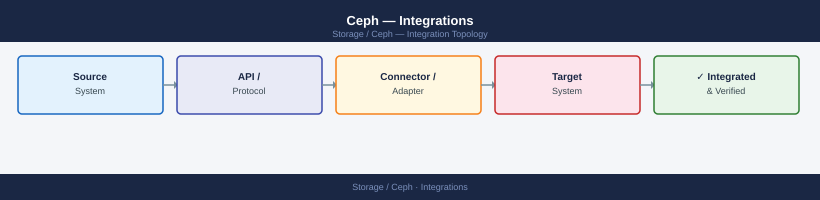
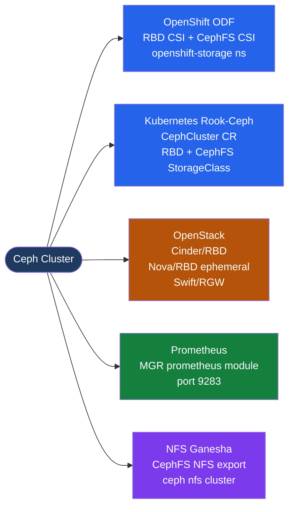

---
tags:
  - architecture
  - ceph
---
# Ceph — Integrations

<div class="kb-summary">
Ceph integrations: Kubernetes CSI (Rook-Ceph), OpenShift ODF, OpenStack Cinder/Glance/Swift, Prometheus MGR module, and NFS/Ganesha CephFS export.

*Applies to: Red Hat Ceph Storage · Upstream Ceph*
</div>





```d2
direction: right

center: "Ceph" {shape: hexagon}
openshift_odf: "OpenShift ODF" {shape: rectangle}
kubernetes_rookceph: "Kubernetes / Rook-Ceph" {shape: rectangle}
openstack_integration: "OpenStack Integration" {shape: rectangle}
prometheus_integration: "Prometheus Integration" {shape: rectangle}
rgw_s3compatible_object_storage: "RGW (S3-Compatible Object Storage)" {shape: rectangle}
cephfs_shared_filesystem: "CephFS (Shared Filesystem)" {shape: rectangle}

center -> openshift_odf
center -> kubernetes_rookceph
center -> openstack_integration
center -> prometheus_integration
center -> rgw_s3compatible_object_storage
center -> cephfs_shared_filesystem
```

## OpenShift ODF

OpenShift Data Foundation (ODF) is Red Hat's converged storage layer for OpenShift. It deploys Ceph internally via the Rook operator in the `openshift-storage` namespace.

| StorageClass | Access Mode | Backend | Use Case |
|---|---|---|---|
| `ocs-storagecluster-ceph-rbd` | RWO | Ceph RBD | VM disks, database PVCs, stateful apps |
| `ocs-storagecluster-cephfs` | RWX | CephFS | Shared config, CI artifacts, pipelines |
| `ocs-storagecluster-ceph-rgw` | Object (S3) | RGW | Noobaa-backed or direct S3 workloads |

**Install ODF via OperatorHub:**
1. OpenShift console → OperatorHub → search "OpenShift Data Foundation"
2. Install ODF operator into `openshift-storage` namespace
3. Create `StorageSystem` → `StorageCluster` CR to provision Ceph

```bash
# Access Ceph toolbox inside OpenShift ODF
oc rsh -n openshift-storage $(oc get pod -n openshift-storage -l app=rook-ceph-tools -o name)

# Once inside the toolbox
ceph status
ceph osd df
ceph df

# Check ODF StorageCluster health
oc get storagecluster -n openshift-storage
oc describe storagecluster ocs-storagecluster -n openshift-storage

# Check CSI pods
oc get pods -n openshift-storage | grep csi

# List ODF-backed PVCs in all namespaces
oc get pvc -A | grep ocs-storagecluster
```

## Kubernetes / Rook-Ceph

Rook is the Kubernetes operator that manages the full Ceph lifecycle: deployment, configuration, upgrades, and failure handling.

```yaml
# CephCluster custom resource — defines the cluster layout
apiVersion: ceph.rook.io/v1
kind: CephCluster
metadata:
  name: rook-ceph
  namespace: rook-ceph
spec:
  dataDirHostPath: /var/lib/rook
  mon:
    count: 3
    allowMultiplePerNode: false
  mgr:
    count: 2
  storage:
    useAllNodes: true
    useAllDevices: false
    deviceFilter: "^sd[b-z]"   # use all sdX disks except sda (OS)
```

```yaml
# CephBlockPool — defines the RBD pool
apiVersion: ceph.rook.io/v1
kind: CephBlockPool
metadata:
  name: rbd-pool
  namespace: rook-ceph
spec:
  failureDomain: host
  replicated:
    size: 3
```

```yaml
# StorageClass for RBD (RWO block storage)
apiVersion: storage.k8s.io/v1
kind: StorageClass
metadata:
  name: rook-ceph-block
provisioner: rook-ceph.rbd.csi.ceph.com
parameters:
  clusterID: rook-ceph
  pool: rbd-pool
  imageFormat: "2"
  imageFeatures: layering
  csi.storage.k8s.io/provisioner-secret-name: rook-csi-rbd-provisioner
  csi.storage.k8s.io/provisioner-secret-namespace: rook-ceph
reclaimPolicy: Delete
allowVolumeExpansion: true
```

```yaml
# CephFilesystem — defines MDS-backed CephFS
apiVersion: ceph.rook.io/v1
kind: CephFilesystem
metadata:
  name: myfs
  namespace: rook-ceph
spec:
  metadataPool:
    replicated:
      size: 3
  dataPools:
    - replicated:
        size: 3
  metadataServer:
    activeCount: 1
    activeStandby: true
```

```yaml
# StorageClass for CephFS (RWX shared filesystem)
apiVersion: storage.k8s.io/v1
kind: StorageClass
metadata:
  name: rook-cephfs
provisioner: rook-ceph.cephfs.csi.ceph.com
parameters:
  clusterID: rook-ceph
  fsName: myfs
  pool: myfs-data0
  csi.storage.k8s.io/provisioner-secret-name: rook-csi-cephfs-provisioner
  csi.storage.k8s.io/provisioner-secret-namespace: rook-ceph
reclaimPolicy: Delete
allowVolumeExpansion: true
```

PVC provisioning creates an RBD image (for block) or CephFS subvolume (for filesystem) automatically. No manual `ceph` commands required.

## OpenStack Integration

Ceph provides block, image, and object backends for OpenStack.

```bash
# --- Cinder block storage (VM disks) ---
# /etc/cinder/cinder.conf
# [DEFAULT]
# enabled_backends = ceph
# [ceph]
# volume_driver = cinder.volume.drivers.rbd.RBDDriver
# rbd_pool = volumes
# rbd_ceph_conf = /etc/ceph/ceph.conf
# rbd_user = cinder
# rbd_secret_uuid = <libvirt secret UUID>

# Create Ceph user for Cinder
ceph auth get-or-create client.cinder \
  mon 'profile rbd' \
  osd 'profile rbd pool=volumes, profile rbd pool=vms, profile rbd-read-only pool=images'

# --- Glance image store ---
# /etc/glance/glance-api.conf
# [glance_store]
# stores = rbd
# default_store = rbd
# rbd_store_pool = images
# rbd_store_user = glance
# rbd_store_ceph_conf = /etc/ceph/ceph.conf

ceph auth get-or-create client.glance \
  mon 'profile rbd' \
  osd 'profile rbd pool=images'
```

| Service | Ceph Backend | Pool | Benefit |
|---|---|---|---|
| Cinder | RBD | `volumes` | Thin provisioning, snapshots, live resize |
| Nova (ephemeral) | RBD | `vms` | Live migration without shared NFS; disk stays in Ceph |
| Glance | RBD | `images` | Fast copy-on-write cloning from image to Cinder volume |
| Swift / Object | RGW | N/A | S3/Swift endpoint; no separate Swift cluster needed |

**Live migration with Ceph RBD**: when Nova ephemeral disks are stored in Ceph (`rbd_ephemeral_storage=True`), live migration copies no disk data — only VM memory is transferred. This makes migration instant regardless of disk size.

## Prometheus Integration

The Ceph MGR includes a built-in Prometheus exporter module.

```bash
# Enable the Prometheus MGR module
ceph mgr module enable prometheus

# Verify it's listening
ceph mgr module ls | grep prometheus
curl http://<mgr-host>:9283/metrics | head -40
```

**Prometheus scrape config:**

```yaml
# prometheus.yml
scrape_configs:
  - job_name: ceph
    static_configs:
      - targets:
          - mgr-host1:9283
          - mgr-host2:9283   # standby MGR (will return empty if not active)
    scrape_interval: 30s
    scrape_timeout: 10s
```

**Key metrics:**

| Metric | Description | Alert threshold |
|---|---|---|
| `ceph_health_status` | 0=OK, 1=WARN, 2=ERR | Alert on ≥ 1 for > 5 min |
| `ceph_osd_up` | 1 if OSD is up | Alert on any OSD down > 5 min |
| `ceph_osd_in` | 1 if OSD is in the cluster | Alert if in=0 unexpectedly |
| `ceph_pg_active` | Count of active PGs | Alert if drops below total expected |
| `ceph_cluster_total_bytes` | Raw total cluster capacity | Capacity planning |
| `ceph_cluster_total_used_bytes` | Raw used bytes | Alert at 80% utilization |
| `ceph_pool_rd` / `ceph_pool_wr` | Read/write IOPS per pool | Workload characterization |
| `ceph_osd_op_r_latency_sum` | OSD read latency | Alert if p99 > 10 ms |
| `ceph_mon_quorum_status` | 1 = MON in quorum | Alert if any MON leaves quorum |

## RGW (S3-Compatible Object Storage)

```bash
# Deploy RGW with cephadm
ceph orch apply rgw myorg --realm=default --zone=default --placement="2 host1 host2"

# Create S3 user
radosgw-admin user create --uid=s3user --display-name="S3 User" --access-key=AKID --secret=SECRET

# List buckets for a user
radosgw-admin bucket list --uid=s3user

# S3 endpoint: http://rgw.ceph.local:7480 (HTTP) or HTTPS with TLS

# Test with AWS CLI
aws s3 ls --endpoint-url http://rgw.ceph.local:7480 \
  --aws-access-key-id AKID --aws-secret-access-key SECRET

# Set bucket quota
radosgw-admin quota set --uid=s3user --quota-scope=bucket --max-size=10G
radosgw-admin quota enable --uid=s3user --quota-scope=bucket
```

## CephFS (Shared Filesystem)

```bash
# Create CephFS filesystem
ceph fs new myfs cephfs-meta cephfs-data

# Mount via kernel driver (Linux clients)
mount -t ceph ceph-mon1,ceph-mon2,ceph-mon3:/ /mnt/cephfs \
  -o name=admin,secretfile=/etc/ceph/admin.secret

# Mount via FUSE (userspace; slower but more portable)
ceph-fuse -m ceph-mon1:6789 /mnt/cephfs
```

## NFS / Ganesha

NFS-Ganesha provides an NFS v4.1 export layer over CephFS, enabling non-Linux clients (ESXi, Windows via NFS client) to access Ceph storage.

```bash
# Enable NFS MGR module
ceph mgr module enable nfs

# Create NFS cluster (deploys Ganesha containers via cephadm)
ceph nfs cluster create my-nfs "2 nfs-host1 nfs-host2"

# List NFS clusters
ceph nfs cluster ls

# Create export: expose root of CephFS filesystem over NFS
ceph nfs export create cephfs my-nfs /export myfs

# Create export for a sub-path
ceph nfs export create cephfs my-nfs /export/apps myfs --path=/apps

# List active exports
ceph nfs export ls my-nfs

# Mount from a Linux client
mount -t nfs4 -o proto=tcp nfs-host1:/export /mnt/nfs-cephfs

# Check Ganesha service status
ceph orch ps | grep nfs
```

| Parameter | Value | Notes |
|---|---|---|
| NFS version | v4.1 | v4.0 and v3 also supported with extra config |
| Placement | 2+ Ganesha nodes | Active/active; client mounts either node |
| Export path | `/export/<name>` | Maps to CephFS path; sub-path exports supported |
| Auth | `sys` (default) or Kerberos | Kerberos requires `sec=krb5` mount option |
| HA | RAFT quorum (built-in) | Ganesha grace period handles failover transparently |

## See also

- [Ceph — How It Works](../how-it-works/)
- [Ceph — Deploy](../../deploy/)
