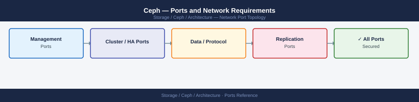

---
tags:
  - ceph
  - networking
  - firewall
  - ports
  - storage
---
# Ceph — Ports and Network Requirements

<div class="kb-summary">
Firewall port reference for Ceph. Covers monitor (MON) messaging, OSD data and heartbeat traffic, MDS (CephFS), RADOS Gateway (RGW/S3), Dashboard, Prometheus metrics, and cephadm SSH orchestration.

*Applies to: Ceph Reef (18.x) / Squid (19.x)*
</div>


## Before you begin

- Ceph uses two networks: **public** (client-facing, MON, OSD client I/O) and **cluster** (OSD replication and heartbeat, ideally a separate NIC)
- If the cluster network is on separate NICs with no firewall between OSD nodes, no rules are needed there — only open ports on the public network boundary
- The OSD port range (6800–7300) is large because each OSD daemon uses 3 consecutive ports (check `ss -tlnp | grep ceph-osd` to see actual allocations)
- Firewall rules between cluster nodes on the cluster network should be absent — add only on the boundary to the client/admin zone

---

## Monitor (MON) — Client Zone to Cluster

| Port | Protocol | Source | Purpose |
|---|---|---|---|
| 3300 | TCP | All clients, OSDs, MDSs, RGW | msgr2 — Ceph native messenger v2 (preferred for Reef+) |
| 6789 | TCP | Legacy clients, tools that don't support msgr2 | msgr1 — legacy Ceph messenger v1 (keep open if mixed versions) |

MON must be reachable on these ports from all cluster daemons (OSDs, MDSs, RGWs) and all clients.

---

## OSD — Client Zone (Public Network)

| Port | Protocol | Source | Purpose |
|---|---|---|---|
| 6800–7300 | TCP | Clients, MON, other OSDs | OSD data and heartbeat — each OSD uses 3 consecutive ports from this range |

Each OSD daemon binds to 3 ports:
- **front**: client I/O (reads/writes) — on public network
- **back**: replication/heartbeat — on cluster network (if separate) or same range
- **v2**: msgr2 port for modern clients

With 30 OSDs on a node, that node uses ports 6800–6889 (example). Actual assignments visible via `ceph osd find <id>`.

---

## OSD — Cluster Network (Replication)

| Port | Protocol | Between | Purpose |
|---|---|---|---|
| 6800–7300 | TCP | OSD ↔ OSD | Replication data, PG recovery, scrub |

If a dedicated cluster network is used (recommended), no external firewall exists here. If OSDs share the public network, the same port range handles both client I/O and replication.

---

## MDS (CephFS Metadata Server)

| Port | Protocol | Source | Purpose |
|---|---|---|---|
| 6800–7300 | TCP | CephFS clients, other MDSs | MDS client sessions and MDS-to-MDS communication |

---

## RADOS Gateway (RGW / S3 Compatible API)

| Port | Protocol | Source | Purpose |
|---|---|---|---|
| 7480 | TCP | S3 clients, application servers | HTTP — S3 and Swift compatible object API (default) |
| 443 | TCP | S3 clients (when TLS configured) | HTTPS — S3 over TLS |

The port is configurable in ceph.conf (`rgw frontends`). Port 80 is sometimes used instead of 7480 — check deployment config.

---

## CephFS — NFS via NFS Ganesha (Optional)

When CephFS is exported via NFS Ganesha:

| Port | Protocol | Source | Purpose |
|---|---|---|---|
| 2049 | TCP/UDP | NFS clients | NFS v3/v4 file access |
| 111 | TCP/UDP | NFS clients | rpcbind (NFSv3 portmapper) |

---

## Ceph Dashboard (MGR Plugin)

| Port | Protocol | Source | Purpose |
|---|---|---|---|
| 8443 | TCP | Admin workstations | Dashboard HTTPS (default — recommended) |
| 8080 | TCP | Admin workstations | Dashboard HTTP (disable in production) |

---

## Prometheus Monitoring Integration (MGR Plugin)

| Port | Protocol | Source | Destination | Purpose |
|---|---|---|---|---|
| 9283 | TCP | Prometheus server | MGR node | Ceph Prometheus exporter (metrics scrape) |
| 9093 | TCP | Ceph MGR | Alertmanager | Alert forwarding to Alertmanager |
| 9094 | TCP | Ceph MGR | Alertmanager | Alertmanager cluster port |
| 9100 | TCP | Prometheus server | Each cluster node | Node Exporter (OS-level metrics — if deployed) |

---

## cephadm SSH Orchestration

cephadm uses SSH to deploy and manage daemons on cluster nodes.

| Port | Protocol | Source | Destination | Purpose |
|---|---|---|---|---|
| 22 | TCP | Admin node (cephadm bootstrap host) | All cluster nodes | SSH — daemon deployment, configuration |
| 22 | TCP | Jump host | Admin node | Admin access to run ceph orch commands |

---

## Firewall Zone Summary

| From | To | Ports | Notes |
|---|---|---|---|
| All cluster daemons | MON nodes | 3300, 6789 | MON must be reachable from all nodes |
| Admin clients | MON nodes | 3300, 6789 | For CLI and RADOS clients |
| Clients (block/file/object) | OSD nodes | 6800-7300 | Public network boundary |
| OSD nodes | OSD nodes (cluster net) | 6800-7300 | Replication — no firewall if dedicated NIC |
| S3/RGW clients | RGW nodes | 7480 or 443 | Object API |
| NFS clients | Ganesha nodes | 2049, 111 | CephFS NFS export (if enabled) |
| Admin workstations | MGR node | 8443 | Dashboard |
| Prometheus | MGR node | 9283 | Metrics scrape |
| Admin node | All nodes | 22 | cephadm SSH |

---

## Verify

```bash
# From a client — test MON reachability
nc -zv <mon-ip> 3300
nc -zv <mon-ip> 6789

# From a client — test S3/RGW endpoint
curl -sk -o /dev/null -w "%{http_code}" http://<rgw-ip>:7480/

# From admin workstation — test Dashboard
curl -sk -o /dev/null -w "%{http_code}" https://<mgr-ip>:8443/

# From Ceph admin node — check daemon endpoints
ceph orch ps
ss -tlnp | grep ceph

# From Ceph admin node — verify Prometheus metrics
curl -s http://<mgr-ip>:9283/metrics | head -20

# From admin node — verify OSD port allocation for a specific OSD
ceph osd find 0
```


```text title="Expected output"
Connection to 10.20.30.45 3300 [tcp/*] succeeded!
Connection to 10.20.30.45 6789 [tcp/*] succeeded!
200
200
NAME                                 HOST           ADDR           PORT        DAEMON TYPE   VERSION   STATUS   REFRESHED   AGE   MEM USE   MEM LIM   CPU USE
osd.0                                ceph-osd-01    10.20.31.10    6800/1234   osd           17.2.5    running   2m ago     3d    512.0M   4.0G     1.2
osd.1                                ceph-osd-02    10.20.31.11    6801/1235   osd           17.2.5    running   2m ago     3d    498.0M   4.0G     0.8
mon.a                                ceph-mon-01    10.20.30.45    6789        mon           17.2.5    running   1m ago     5d    256.0M   2.0G     0.3
mgr.ceph-mgr-01.abcdef               ceph-mgr-01    10.20.30.46    6800        mgr           17.2.5    running   1m ago     5d    384.0M   3.0G     0.5
...
LISTEN     0      128                 10.20.31.10:6800            0.0.0.0:*        users:(("ceph-osd",pid=4521,fd=45))
LISTEN     0      128                 10.20.31.11:6801            0.0.0.0:*        users:(("ceph-osd",pid=4522,fd=46))
LISTEN     0      128                 10.20.30.45:6789            0.0.0.0:*        users:(("ceph-mon",pid=3210,fd=32))
LISTEN     0      128                 10.20.30.46:6800            0.0.0.0:*        users:(("ceph-mgr",pid=3890,fd=28))
# HELP ceph_cluster_total_bytes Ceph cluster total bytes
# TYPE ceph_cluster_total_bytes gauge
ceph_cluster_total_bytes 1099511627776
# HELP ceph_cluster_used_bytes Ceph cluster used bytes
# TYPE ceph_cluster_used_bytes gauge
ceph_cluster_used_bytes 274877906944
# HELP ceph_osd_up OSD up status
# TYPE ceph_osd_up gauge
ceph_osd_up{ceph_daemon="osd.0"} 1
{
  "osd": 0,
  "ip": "10.20.31.10:6800/1234",
  "host": "ceph-osd-01"
}
```

!!! warning "Common errors"
    **`nc: connect to 10.20.30.45 port 3300 (tcp) failed: Connection refused`** — Verify the MON daemon is running with `ceph orch ps` and check firewall rules allow port 3300 inbound.
    **`curl: (7) Failed to connect to 10.20.30.46 port 8443: Connection refused`**
---

## See also

- [Ceph — Architecture](../how-it-works/)
- [Ceph — Deploy](../../deploy/)
- [Ceph — Operations](../../operations/)
- [Ceph — Troubleshooting](../../troubleshooting/)
