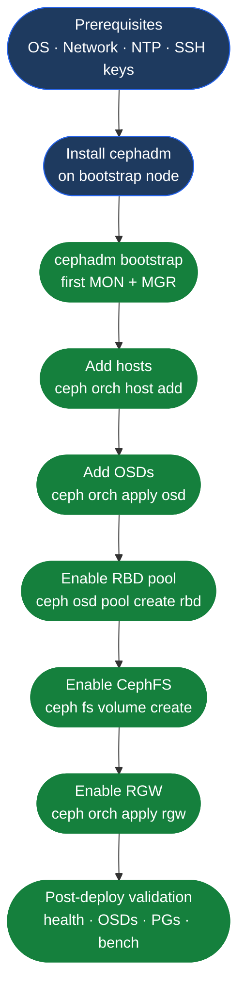

---
tags:
  - ceph
  - deployment
---
# Ceph — Deploy

<!-- diagram:ceph-deploy -->

<div class="kb-summary">
Ceph deployment with cephadm: bootstrap on first node, add MONs and OSDs, create initial pools, configure network, and validate cluster health before production use.

*Applies to: Ceph Reef / Squid*
</div>



```text
┌─────────────────────────────────────────── Ceph Deployment ───────────────────────────────────────────┐
│                                                                                                       │
│   ┌───────────────────────────────────────────────────────────────────────────────────────────────┐   │
│   │                                  Ceph Deployment with cephadm                                 │   │
│   │                   cephadm manages Ceph daemons as containers (Podman/Docker)                  │   │
│   │            Sequence: bootstrap first MON → add hosts → add MONs → add OSDs → pools            │   │
│   │              Bootstrap: cephadm bootstrap --mon-ip <ip> --cluster-network <CIDR>              │   │
│   │                 Validation: HEALTH_OK + all OSDs up+in + PGs all active+clean                 │   │
│   └───────────────────────────────────────────────────────────────────────────────────────────────┘   │
│                                                                                                       │
│    Key terms:                                                                                         │
│    cephadm   = Ceph Admin tool; deploys and manages Ceph daemons as containers                        │
│    Bootstrap = First command; creates initial MON + MGR on one node                                   │
│    noout flag= Prevent OSDs from being marked out during maintenance                                  │
│                                                                                                       │
```

## Prerequisites

### Supported OS Platforms

| OS | Min Version | Python | Container Runtime |
|---|---|---|---|
| RHEL / Rocky / AlmaLinux | 9.x | 3.9+ | Podman 4+ (default) |
| Ubuntu | 22.04 LTS | 3.10+ | Docker or Podman |
| CentOS Stream | 9 | 3.9+ | Podman 4+ |
| Debian | 12 (Bookworm) | 3.11+ | Docker or Podman |

### Firewall Ports

| Port | Protocol | Service | Direction |
|---|---|---|---|
| 6789 | TCP | MON (client/peer) | All nodes ↔ all nodes |
| 3300 | TCP | MON (v2 protocol) | All nodes ↔ all nodes |
| 6800–7300 | TCP | OSD (replication, heartbeat) | OSD nodes ↔ OSD nodes |
| 8443 | TCP | Ceph Dashboard (HTTPS) | Admin → bootstrap node |
| 9283 | TCP | Prometheus exporter (MGR) | Prometheus → MGR nodes |
| 8080 | TCP | RGW (object gateway) | Clients → RGW nodes |

```bash
# RHEL/Rocky — open required ports
firewall-cmd --permanent --add-port=6789/tcp
firewall-cmd --permanent --add-port=3300/tcp
firewall-cmd --permanent --add-port=6800-7300/tcp
firewall-cmd --permanent --add-port=8443/tcp
firewall-cmd --permanent --add-port=9283/tcp
firewall-cmd --reload

# Verify NTP synchronisation before bootstrapping
chronyc tracking | grep "System time"
timedatectl | grep synchronized
# Maximum tolerated drift between nodes: 0.05 s
```

### SSH Key Distribution

```bash
# Generate keypair on bootstrap node (if not present)
ssh-keygen -t ed25519 -f ~/.ssh/ceph_deploy -N ""

# Copy to all nodes that will join the cluster
for host in ceph-node1 ceph-node2 ceph-node3; do
    ssh-copy-id -i ~/.ssh/ceph_deploy.pub root@${host}
done

# Verify passwordless access
for host in ceph-node1 ceph-node2 ceph-node3; do
    ssh -i ~/.ssh/ceph_deploy root@${host} hostname
done
```

## Bootstrap

```bash
# On the first host (becomes initial MON + MGR)
# Download cephadm for the target release (Reef = current stable)
curl --silent --remote-name --location \
  https://github.com/ceph/ceph/raw/quincy/src/cephadm/cephadm
chmod +x cephadm
./cephadm install   # installs cephadm into /usr/sbin/cephadm

# Bootstrap first MON + MGR
# --mon-ip        : IP on the public (client-facing) network
# --cluster-network: OSD replication CIDR (separate from public network)
cephadm bootstrap \
  --mon-ip 10.0.1.10 \
  --cluster-network 10.0.2.0/24 \
  --initial-dashboard-user admin \
  --initial-dashboard-password 'ChangeMe!'

# Output includes:
#   Ceph Dashboard: https://10.0.1.10:8443
#   Grafana:        https://10.0.1.10:3000
#   Prometheus:     http://10.0.1.10:9095

# Shell completion and ceph.conf are written to /etc/ceph/
ls /etc/ceph/
# ceph.conf  ceph.client.admin.keyring  ceph.pub
```

## Add Hosts

```bash
# Copy the cluster's SSH public key to each new node
ssh-copy-id -f -i /etc/ceph/ceph.pub root@ceph-node2
ssh-copy-id -f -i /etc/ceph/ceph.pub root@ceph-node3

# Add hosts — labels control which daemons are placed here
ceph orch host add ceph-node2 10.0.1.11 --labels mon,mgr,osd
ceph orch host add ceph-node3 10.0.1.12 --labels mon,mgr,osd

# Verify all hosts are visible and reachable
ceph orch host ls
# Expected columns: HOST  ADDR  LABELS  STATUS

# Add MONs — 3 minimum; 5 for clusters > 10 nodes
ceph orch apply mon 3
# Or pin to specific hosts:
ceph orch apply mon --placement "ceph-node1 ceph-node2 ceph-node3"

# Verify MON quorum — all 3 (or 5) must be in quorum
ceph mon stat
# Expected: 3 mons at ..., election epoch N, quorum 0,1,2 ...
```

## Add OSDs

```bash
# Option A — auto-detect and claim all available (empty, unpartitioned) devices
ceph orch apply osd --all-available-devices

# Option B — add specific devices per host
ceph orch daemon add osd ceph-node1:/dev/sdb
ceph orch daemon add osd ceph-node1:/dev/sdc
ceph orch daemon add osd ceph-node2:/dev/sdb
ceph orch daemon add osd ceph-node2:/dev/sdc
ceph orch daemon add osd ceph-node3:/dev/sdb

# List devices cephadm can see (available = not yet used)
ceph orch device ls

# Verify OSDs appear with correct weight (1 TB ≈ weight 1.0)
ceph osd tree
# Expected: all OSDs show "up  in" state

ceph osd stat
# Expected: X osds: X up (since epoch N), X in (since epoch N)

# Check OSD utilisation and weight
ceph osd df
```

## Enable RBD Pool

```bash
# Create dedicated RBD block storage pool
# PG count: start with 128 for < 5 OSDs; scale up later with autoscale
ceph osd pool create rbd 128 128
ceph osd pool application enable rbd rbd
rbd pool init rbd

# Verify pool exists and is healthy
ceph osd lspools | grep rbd
ceph osd pool stats rbd
```

## Enable CephFS

```bash
# Create a CephFS volume (creates data + metadata pools automatically)
ceph fs volume create myfs

# Place MDS daemons (at least 2: 1 active, 1 standby)
ceph orch apply mds myfs --placement "3 ceph-node1 ceph-node2 ceph-node3"

# Verify filesystem and MDS daemons
ceph fs status
# Expected: active MDS count = 1, standby count ≥ 1

ceph mds stat
# Active: myfs:1 {0=myfs.ceph-node1=up:active} standby: 2

# Mount via kernel client (test)
mount -t ceph 10.0.1.10:6789:/ /mnt/cephfs \
  -o name=admin,secretfile=/etc/ceph/ceph.client.admin.keyring
```

## Enable RGW (Object Gateway)

```bash
# Deploy RGW daemons — two for HA
# realm and zone are logical groupings for multi-site; "default" works for single-site
ceph orch apply rgw default default \
  --placement "2 ceph-node1 ceph-node2" \
  --port 8080

# Verify RGW daemons are running
ceph orch ls | grep rgw
ceph orch ps | grep rgw
# Expected: rgw.default.default.ceph-node1  running

# RGW creates its pools automatically; verify
ceph osd lspools | grep default
# default.rgw.buckets.index  default.rgw.buckets.data  etc.

# Quick S3 connectivity test (requires s3cmd or awscli configured)
radosgw-admin user create --uid=test --display-name="Test User" \
  --access-key=TESTKEY --secret=TESTSECRET
s3cmd --access_key=TESTKEY --secret_key=TESTSECRET \
  --host=10.0.1.10:8080 --no-ssl ls
```

## Post-Deploy Validation

| Check | Command | Expected Result |
|---|---|---|
| Cluster health | `ceph health` | `HEALTH_OK` |
| OSD count | `ceph osd stat` | All OSDs `up` and `in` |
| PG state | `ceph pg stat` | All PGs `active+clean` |
| MON quorum | `ceph mon stat` | All MONs in quorum |
| Capacity visible | `ceph df` | Total capacity matches disk inventory |
| Dashboard | `https://<mon-ip>:8443` | Login works, graphs populate |
| Prometheus | `http://<mon-ip>:9095` | Metrics endpoint responds |

```bash
# Full cluster health
ceph health detail
ceph status
# Must be HEALTH_OK with all OSDs up+in and MON quorum established

# Baseline I/O performance test with rados bench
# Write test — 30 s, 4 MB objects
rados bench -p rbd 30 write --no-cleanup
# Read test (sequential)
rados bench -p rbd 30 seq
# Cleanup bench objects
rados bench -p rbd 30 cleanup

# RBD block I/O test
rbd create --size 10G rbd/bench-test
rbd bench --io-type write --io-size 4K --io-threads 16 --io-total 1G rbd/bench-test
rbd bench --io-type read  --io-size 4K --io-threads 16 --io-total 1G rbd/bench-test
rbd rm rbd/bench-test

# Verify CRUSH is placing data across all hosts (no single-host concentration)
ceph osd perf
ceph pg dump pools   # check per-pool distribution
```
