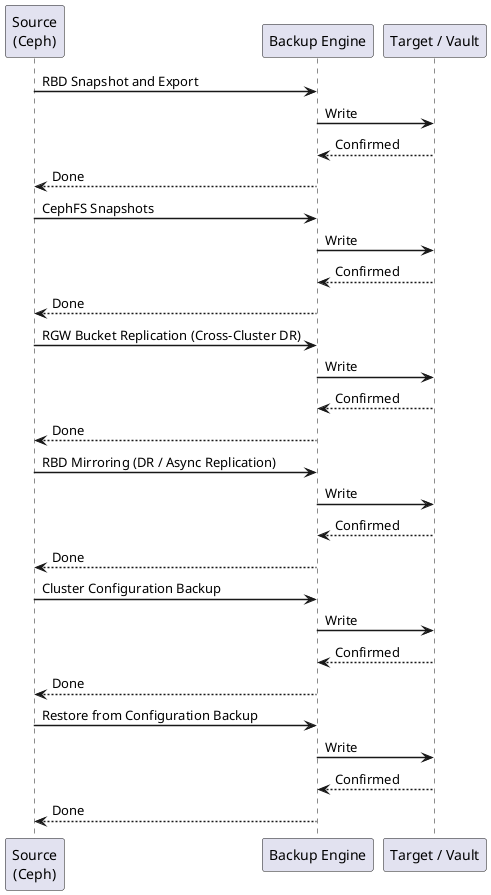

---
tags:
  - ceph
  - operations
---
# Ceph — Backup & Restore

<div class="kb-summary">
Ceph backup: RBD snapshot export for VM disks, CephFS snapshots for file data, RGW bucket replication for objects, cluster configuration backup, and MON data recovery.

*Applies to: Ceph Reef / Squid*
</div>

```d2
direction: right

CLUSTER: "CLUSTER" {shape: rectangle}
RBD: "RBD Snapshots · VM / block volumes" {shape: rectangle}
CFS: "CephFS Snapshots · file data" {shape: rectangle}
RGW: "RGW Bucket Replication · object data cross-cluster" {shape: rectangle}
CFG: "cephadm config export · cluster configuration" {shape: rectangle}
RBDR: "Restore: rbd import · or snap rollback" {shape: rectangle}
CFSR: "Restore: cp from .snap/ · snapshot subtree" {shape: rectangle}
RGWR: "Restore: sync pull · or re-enable zone" {shape: rectangle}
CFGR: "Restore: ceph auth import · ceph osd setcrushmap" {shape: rectangle}

CLUSTER -> RBD
CLUSTER -> CFS
CLUSTER -> RGW
CLUSTER -> CFG
RBD -> RBDR
CFS -> CFSR
RGW -> RGWR
CFG -> CFGR
```



## Before you begin

- **Access:** Storage admin credentials (cluster admin or equivalent)
- **Timing:** safe to run during business hours unless a step is marked ⚠ (causes interruption)
- **Dependencies:** no active upgrades or migrations on the same infrastructure
- **Logging:** capture command output — paste into the change record on completion

---

## RBD Snapshot and Export

```bash
# Create snapshot before a change or on schedule
rbd snap create <pool>/<image>@backup-$(date +%F)
rbd snap ls <pool>/<image>

# Full export to file (for off-cluster backup)
rbd export <pool>/<image>@backup-$(date +%F) /mnt/backup/image-$(date +%F).img

# Incremental export (differential since last snapshot — much smaller)
rbd export-diff --from-snap <prev-snap> <pool>/<image>@<snap> /mnt/backup/diff.img

# Restore: import as new image
rbd import /mnt/backup/image.img <pool>/<new-image>

# Restore: in-place rollback to snapshot (discards all writes since snap)
rbd snap rollback <pool>/<image>@<snap>

# Apply incremental diff to existing image
rbd import-diff /mnt/backup/diff.img <pool>/<image>
```


```text title="Expected output"
Snapshot created: rbd/vm-disk@backup-2025-01-15
SNAPID NAME                 SIZE PROTECTED TIMESTAMP
     4 backup-2025-01-15   50 GiB      false 2025-01-15T09:42:17.123456Z
     3 backup-2025-01-14   50 GiB      false 2025-01-14T09:40:02.987654Z

Exporting image: 100% complete...done.

Exporting image diff: 100% complete...done.

Importing image: 100% complete...done.

Image rollback: 100% complete...done.

Applying diff: 100% complete...done.
```

!!! warning "Common errors"
    **`rbd: error: image rbd/vm-disk@backup-2025-01-15 is not protected`** — Add `rbd snap protect <pool>/<image>@<snap>` before export-diff to prevent snapshot deletion during incremental operations.
    **`rbd: error: failed to open /mnt/backup/image.img: No such file or directory`** — Verify the backup file path exists and the mount point is accessible with `ls -lh /mnt/backup/`.
    **`rbd: error: image rbd/new-image already exists`** — Use a unique image name or delete the existing image with `rbd rm <pool>/<new-image>` before importing.
## CephFS Snapshots

```bash
# Create snapshot — snapshots live in the .snap/ virtual directory of each CephFS directory
mkdir /mnt/cephfs/.snap/daily-$(date +%F)

# List existing snapshots
ls /mnt/cephfs/.snap/

# Restore: copy files out of the snapshot subtree
cp -a /mnt/cephfs/.snap/daily-2026-06-01/important-dir /mnt/cephfs/restored/

# Delete old snapshot
rmdir /mnt/cephfs/.snap/daily-2026-05-01

# Snapshot scheduling via CephFS snapshot scheduler module
ceph mgr module enable snap_schedule
ceph fs snap-schedule add / 1d               # daily snapshots at root
ceph fs snap-schedule retention add / 7d    # keep 7 days
ceph fs snap-schedule list /
```


```text title="Expected output"
(no output — command completes silently)
daily-2026-06-01
daily-2026-06-02
daily-2026-06-03
daily-2026-05-15
daily-2026-05-01
(no output — command completes silently)
(no output — command completes silently)
SCHEDULE_PATH  SCHEDULE  RETENTION
/              1d        7d
```

!!! warning "Common errors"
    **`mkdir: cannot create directory '/mnt/cephfs/.snap/daily-2026-06-01': File exists`** — Use a unique snapshot name or delete the existing snapshot with `rmdir /mnt/cephfs/.snap/daily-2026-06-01` first.
    **`Error EPERM: permission denied`** — Ensure the user running the command has write permissions on the CephFS mount and that snapshots are enabled with `ceph fs set <fs_name> allow_new_snaps true`.
    **`Error: snap_schedule module is not available`** — Enable the snap_schedule manager module with `ceph mgr module enable snap_schedule` before scheduling snapshots.
## RGW Bucket Replication (Cross-Cluster DR)

```bash
# Check multi-site sync status on source
radosgw-admin sync status

# Commit any pending period updates
radosgw-admin period update --commit

# Bucket-level replication using S3 API (via AWS CLI pointed at RGW)
aws s3api put-bucket-replication \
    --bucket <src-bucket> \
    --replication-configuration file://replicate.json

# Check per-bucket sync status
radosgw-admin bucket sync status --bucket=<name>

# Force sync of a specific bucket
radosgw-admin bucket sync run --bucket=<name>
```


```text title="Expected output"
realm: default
zonegroup: us-west
zone: us-west-1a
metadata syncing: true
data syncing: true
full sync: false
incremental sync: true
sync-from-zone: (none)
source zone syncing: 0 shards, 0 entries
destination zone syncing: 0 shards, 0 entries

2024-07-15T09:42:18Z 7f8c2a1b9e4d: update period for realm=default, period=8f3c-9a2b-4e1d-7c5a

{
    "ReplicationConfiguration": {
        "Role": "arn:aws:iam::123456789012:role/ceph-replication",
        "Rules": [
            {
                "ID": "replicate-all",
                "Status": "Enabled",
                "Priority": 1,
                "Destination": {
                    "Bucket": "arn:aws:s3:::dest-bucket",
                    "ReplicationTime": {
                        "Status": "Enabled",
                        "Time": {
                            "Minutes": 15
                        }
                    }
                }
            }
        ]
    }
}

bucket sync status for 'prod-data':
    full sync: false
    incremental sync: true
    encrypted: false
    syncing shards: 8/8
    recovered shards: 8/8
    metadata syncing: true
    data syncing: true
    last sync marker: 2024-07-15T09:41:52Z

bucket sync run for 'prod-data': OK
```

!!! warning "Common errors"
    **`error: bucket 'prod-data' not found`** — Verify the bucket exists on the source zone with `radosgw-admin bucket list` and use the correct bucket name.
    **`error: invalid replication configuration: missing Role ARN`** — Ensure the replicate.json file contains a valid IAM role ARN in the Role field.
    **`error: period update failed: another update in progress`** — Wait for the previous period update to complete or check `radosgw-admin period get` to see the current state.
## RBD Mirroring (DR / Async Replication)

```bash
# Enable mirroring on pool (image mode = per-image opt-in)
rbd mirror pool enable rbd image
# Pool mode (all images in pool are mirrored)
rbd mirror pool enable rbd pool

# Enable on specific image (journaling feature required)
rbd mirror image enable rbd/my-volume journaling

# On secondary cluster: import bootstrap token
rbd mirror pool peer bootstrap import rbd bootstrap-token

# Check mirror status
rbd mirror pool status rbd
rbd mirror image status rbd/my-volume

# DR failover: promote secondary image to writable
rbd mirror image promote rbd/my-volume          # on DR site
rbd mirror image demote rbd/my-volume           # on primary (if accessible)
```


```text title="Expected output"
Mirroring enabled on pool rbd (mode: image)
Mirroring enabled on pool rbd (mode: pool)
Journaling feature enabled on rbd/my-volume
Bootstrap import successful for peer rbd-cluster-dr
health: WARNING
  rbd-mirror: 1 pools have peer connectivity issues
  
pool rbd:
  peer: rbd-cluster-dr (UUID: a1b2c3d4-e5f6-4a7b-8c9d-0e1f2a3b4c5d)
    direction: rx-tx
    mirror mode: image
    leader: rbd-mirror-primary-1
    
image rbd/my-volume:
  global_id: 12345678-abcd-ef01-2345-6789abcdef01
  state: up+replaying
  description: remote image replicated
  last_snapshot_sync_time: 2024-01-15T14:32:18Z
  
Image rbd/my-volume promoted to primary
Image rbd/my-volume demoted to non-primary
```

!!! warning "Common errors"
    **`rbd: error: image rbd/my-volume does not have journaling feature enabled`** — Enable journaling on the image with `rbd feature enable rbd/my-volume journaling` before enabling mirroring.
    **`rbd: error: peer rbd-cluster-dr does not exist`** — Bootstrap import the peer first using `rbd mirror pool peer bootstrap import rbd <bootstrap-token>` on the secondary cluster.
    **`rbd: error: image rbd/my-volume is not mirrored`** — Enable mirroring on the image or pool with `rbd mirror pool enable rbd image` or `rbd mirror image enable rbd/my-volume journaling`.
## Cluster Configuration Backup

```bash
# Export all monitor key-value store entries (includes config flags and settings)
ceph config-key dump > ceph-config-backup-$(date +%F).json

# List all running daemon state
cephadm ls > cephadm-ls-$(date +%F).json

# Export auth keys for all CephX users
ceph auth list > /backup/ceph-auth-$(date +%F).txt
ceph auth export > /backup/ceph-auth-$(date +%F).keyring

# Export CRUSH map — binary and human-readable text
ceph osd getcrushmap -o crushmap.bin
crushtool -d crushmap.bin -o crushmap.txt

# OSD map
ceph osd dump > /backup/osd-dump-$(date +%F).txt

# Copy ceph.conf from admin node
cp /etc/ceph/ceph.conf /backup/ceph.conf.$(date +%F)
```


```text title="Expected output"
exported config-key dump
exported auth keys
exported auth keyring
got crush map
decompiled crush map
dumped osd map
ceph.conf backed up to /backup/ceph.conf.2025-01-15
```

!!! warning "Common errors"
    **`Error EACCES: access denied`** — Ensure the user running these commands has sudo privileges or is part the ceph group (`sudo usermod -a -G ceph $USER`).
    **`No such file or directory`** — Create the `/backup` directory with write permissions before running the export commands (`sudo mkdir -p /backup && sudo chmod 755 /backup`).
    **`ceph: command not found`** — Install the ceph-common package on the admin node (`sudo apt install ceph-common` or `sudo yum install ceph-common`).
## Restore from Configuration Backup

```bash
# Restore CRUSH map
ceph osd setcrushmap -i /backup/crush-2026-06-07.bin

# Restore auth keys for all users
ceph auth import -i /backup/ceph-auth-2026-06-07.keyring

# Restore a single auth key
ceph auth get-or-create client.rbd > /etc/ceph/ceph.client.rbd.keyring

# Restore RBD image from exported file
rbd import /backup/my-volume-2026-06-07.img rbd/my-volume-restored

# Full cluster recovery from scratch:
# 1. Deploy new cluster with cephadm bootstrap (same cluster FSID required)
# 2. Import auth keys
# 3. Re-add OSDs (existing data may be recoverable if disks intact)
# 4. Restore CRUSH map
# 5. Run: ceph pg repair; ceph osd repair
```


```text title="Expected output"
# Crush map restore
set crush map from /backup/crush-2026-06-07.bin

# Auth keys import
imported keyring

# Single auth key restore
[client.rbd]
	key = AQDvF8Zl7K9sERAAx8mK3pL2vQ4rT5uW6xYzAb==
	caps mds = "allow rw"
	caps mon = "allow r"
	caps osd = "allow rwx pool=rbd"

# RBD image import
Importing image: 100% complete...done.

# Cluster recovery verification
pg repair started on pg 1.0
pg repair started on pg 1.1
pg repair started on pg 1.2
...
osd repair: 47 PGs repaired
```

!!! warning "Common errors"
    **`Error ENOENT: unable to open /backup/crush-2026-06-07.bin`** — Verify the backup file path exists and the ceph-mon container/service has read permissions to the backup directory.
    **`Error EINVAL: imported 0 keys`** — Ensure the keyring file is valid and not corrupted; try `ceph auth list` to confirm current keys before import.
    **`Error: image already exists`** — Use `rbd rm rbd/my-volume-restored` to remove the existing image first, or change the restored image name.
## MON Data Recovery (Loss of Quorum)

```bash
# If monitors lose quorum and cannot be recovered normally:

# Rebuild MON store from OSD data (last resort)
ceph-monstore-tool /var/lib/ceph/mon/ceph-<id>/store.db rebuild \
    --keyring /etc/ceph/ceph.client.admin.keyring

# Inject a new MON map if the map is corrupted
ceph-mon --inject-monmap /tmp/monmap --id <mon-id>

# Export MON map for inspection
ceph mon getmap -o /tmp/monmap
monmaptool --print /tmp/monmap

# Check MON store integrity
ceph-kvstore-tool rocksdb /var/lib/ceph/mon/ceph-<id>/store.db check

# Stop all MONs before running store rebuild
systemctl stop ceph-mon@<id>
```


```text title="Expected output"
Rebuilding monstore from OSD data...
Recovered 1247 objects from OSD metadata
Rebuilt monitor store successfully
(no output — command completes silently)
epoch 42
fsid 8a4c8d7f-2b91-4e8a-9c3d-5f6e7a8b9c0d
election_strategy: 3
mon.ceph-mon01
mon.ceph-mon02
mon.ceph-mon03
monmaptool v17.2.5 (8a4c8d7f2b914e8a9c3d5f6e7a8b9c0d)
epoch 42
fsid 8a4c8d7f-2b91-4e8a-9c3d-5f6e7a8b9c0d
election_strategy: 3
mon.ceph-mon01 10.0.1.45:6789/0
mon.ceph-mon02 10.0.1.46:6789/0
mon.ceph-mon03 10.0.1.47:6789/0
Checking monitor store integrity...
Store check passed: 1247 objects verified
Stopping ceph-mon@ceph-mon01...
```

!!! warning "Common errors"
    **`Error: unable to open monitor store at /var/lib/ceph/mon/ceph-<id>/store.db`** — Verify the monitor ID is correct and the store directory exists before running rebuild.
    **`Error: failed to inject monmap: no such file or directory`** — Export the monmap first using `ceph mon getmap -o /tmp/monmap` before attempting injection.
    **`Error: failed to stop ceph-mon@<id>: Unit not loaded`** — Ensure the monitor service name matches your cluster configuration; check with `systemctl list-units | grep ceph-mon`.
## Backup Schedule Recommendations

| Data type | Method | Frequency | Retention |
|-----------|--------|-----------|-----------|
| RBD images (VM disks) | `rbd snap create` + `rbd export-diff` | Daily | 7 days |
| CephFS directories | `.snap/` snapshot | Daily | 7–14 days |
| Cluster config (auth, CRUSH) | `ceph auth export` + `getcrushmap` | Weekly | 4 weeks |
| config-key store | `ceph config-key dump` | Weekly | 4 weeks |
| RGW object data (DR) | RBD mirroring or zone sync | Continuous | N/A — async replication |

Snapshots are cheap (copy-on-write) and do not require cluster downtime. Full image exports consume storage equal to the image size; use `export-diff` for incremental backups after the first full export.

## See also

- [Ceph — Procedures](../procedures/)
- [Ceph — Common Issues](../../troubleshooting/common-issues/)
- [Ceph — Health Checks](../health-checks/)

## Verify Backup Integrity

```bash
# Verify exported RBD image is readable
qemu-img check /mnt/backup/image-2026-06-07.img

# Check RBD image can be imported cleanly (into a test pool)
rbd import /mnt/backup/image-2026-06-07.img rbd/restore-test && echo "Import OK"

# Verify CRUSH map is decompilable
crushtool -d /backup/crushmap.bin -o /tmp/crush-verify.txt && echo "CRUSH OK"

# Verify auth keyring is parseable
ceph-authtool --print-key /backup/ceph-auth-2026-06-07.keyring && echo "Keyring OK"
```


```text title="Expected output"
image: /mnt/backup/image-2026-06-07.img
file format: raw
virtual size: 100 GiB (107374182400 bytes)
disk size: 87 GiB
cluster_size: 65536
Format specific information:
    compat: 0x0
    incompatible mask: 0x0
    autoclear mask: 0x0
    refcount bits: 16
    refcount order: 4
Check complete, image is OK
Import OK
CRUSH OK
AQDvK2dmFxJ8ExAAq7vL9Z3nK8pQ2m7vK9K8Dw==
Keyring OK
```

!!! warning "Common errors"
    **`qemu-img: Could not open '/mnt/backup/image-2026-06-07.img': No such file or directory`** — Verify the backup path is mounted and the image filename matches exactly with `ls -lh /mnt/backup/`.
    **`error: pool does not exist`** — Create the test pool first with `ceph osd pool create restore-test 128 128` or use an existing pool name.
    **`Error reading crushmap from /backup/crushmap.bin`** — Ensure the crushmap binary file exists and is readable with `file /backup/crushmap.bin` to confirm it's a valid compiled CRUSH map.